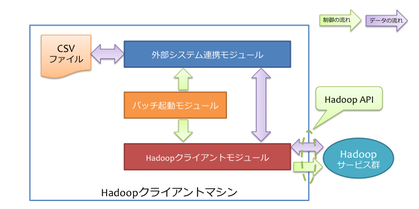

==================
システム構成の検討
==================

この文書では、Asakusa Frameworkの運用環境におけるシステム構成例について説明します。

用語の定義
==========

本書では、マシン構成に関しての用語を以下のように定義します。

マシン
  それぞれのコンピューターを表します。
  仮想化されたコンピューターであっても構いません。

モジュール
  特定の役割を持ったソフトウェアです。
  いくつかのコンポーネントを組み合わせて構成します。

コンポーネント
  Asakusa Frameworkのそれぞれのコンポーネントです。
  Asakusa Frameworkコア [#]_ や、YAESS、WindGateなどがコンポーネントの単位となります。

..  [#] 現在のところ、Direct I/Oに関するライブラリやツールはすべてAsakusa Frameworkコアに含まれています。

モジュール
----------

以下は本ガイドで紹介するモジュール群です。
それぞれのマシンに機能を割り当て、それを実現するモジュールを配置していく形になります。

Hadoopクライアントモジュール
  Hadoopのジョブ起動や、Hadoopのファイルシステムにアクセスを行うモジュールです [#]_ [#]_ 。

外部システム連携モジュール
  外部システムとHadoopクラスター間でデータをやり取りするためのモジュールです [#]_ 。

バッチ起動モジュール
  Asakusa Frameworkで開発したAsakusaバッチアプリケーションを起動するためのモジュールです。

ひとつのマシン上に複数のモジュールを配置することもできます。
モジュールが異なるマシン上に存在する場合、SSHやRPCなどの適切なプロトコルを利用して処理を行います。

..  [#] Hadoopの動作上、Hadoopのジョブを起動するノードからもデータストアへのアクセスが行われます。
    共有ディスクなどを利用する場合は、このHadoopクライアントモジュールを配置したマシンについてもHadoopスレーブノードと同様の方法で対象のデータストアを参照できる必要があります。
..  [#] Hadoopのマスターノードやスレーブノード上にクライアントモジュールを配置することもできます。
..  [#] 外部システム連携モジュールはシステム上に複数用意することもできます。

コンポーネント
--------------

以下は本書でデプロイする対象のコンポーネント群です。
モジュールごとに利用するコンポーネントは異なります。
モジュールを配置したマシンごとに必要なコンポーネントをデプロイしていく形になります。

Asakusaバッチアプリケーション
  Asakusa Frameworkで作成したアプリケーションです。
  Hadoopクライアントモジュール、外部システム連携モジュール、バッチ起動モジュールのそれぞれが利用します。

Asakusa Frameworkコア
  Asakusa Framework本体です。
  Hadoopクライアントモジュール、外部システム連携モジュール、バッチ起動モジュールのそれぞれが利用します。

WindGate
  :doc:`WindGate <../windgate/index>` 本体です。
  外部システム連携モジュールが利用します。

WindGate Hadoopブリッジ
  WindGateがHadoopと通信するために中継するソフトウェアです。
  Hadoopクライアントモジュールが利用します。

  外部システム連携モジュールとHadoopクライアントモジュールが同じマシン上に配置されている場合、WindGate Hadoopブリッジは不要です。
  この場合、WindGateはHadoopブリッジを経由せず、Hadoopファイルシステムに直接アクセスします。

YAESS
  :doc:`YAESS <../yaess/index>` 本体です。
  バッチ起動モジュールが利用します。

YAESS Hadoopブリッジ
  YAESSがHadoopと通信するために中継するソフトウェアです。
  Hadoopクライアントモジュールが利用します。

Direct I/Oのシステム構成
========================

Direct I/Oを用いた場合のシステム構成について、いくつか例を見ていきます。

シンプルな構成例
----------------

Direct I/Oを利用したシンプルな構成例を以下に示します。

上記の構成では、Hadoopクライアントモジュールとバッチ起動モジュールをそれぞれ同じマシン（Hadoopクライアントマシン）上に配置しています。
各モジュール間の通信は単一のマシン内で行われ、HadoopクライアントモジュールはHadoop APIを介してHadoopクラスター上のサービスにアクセスします。

下図は、この構成でHadoopクライアントマシンが利用するコンポーネントの一覧です。

バッチ起動を外部から行う場合の構成例
------------------------------------

バッチの起動を行う「ゲートウェイマシン」をHadoopクライアントマシンとは別に用意した場合の構成例を以下に示します。

ゲートウェイマシンはHadoopクライアントマシン上の各種HadoopブリッジとSSHを利用して通信します。
そのため、あらかじめゲートウェイマシンからHadoopクライアントマシンにSSH経由（公開鍵認証）でアクセスできるようにしておく必要があります。

下図は、この構成でゲートウェイマシンが利用するコンポーネントの一覧です。

同様に、下図はHadoopクライアントマシンが利用するコンポーネントの一覧です。

..  hint::
    この構成の利点は、ゲートウェイマシンとHadoopクライアントマシンに異なるセキュリティレベルを設定できる点です。
    ゲートウェイマシン *から* Hadoopクライアントマシンに対してSSHでログイン出来ればよく、HadoopクラスターやHadoopクライアントマシンに不正侵入されても、そこからゲートウェイマシンに侵入するにはもう一手間必要です。

WindGateのシステムの構成
========================

WindGateを用いた場合のシステム構成について、いくつか例を見ていきます。

WindGate/CSVによるシンプルな構成例
----------------------------------

WindGateをローカルのCSVファイルと連携する構成における、シンプルな構成例を以下に示します。

上記の構成では、Hadoopクライアントモジュール、外部システム連携モジュール、バッチ起動モジュールをそれぞれ同じマシン（Hadoopクライアントマシン）上に配置しています。
各モジュール間の通信はマシン内で行われ、HadoopクライアントモジュールはHadoop APIを介してHadoopクラスター上のサービスにアクセスします。

下図は、この構成でHadoopクライアントマシンが利用するコンポーネントの一覧です。

..  figure:: images/deployment-with-windgate-figure2.png

..  hint::
    Hadoopクライアントモジュールと外部システム連携モジュールが同一のマシン上に存在するため、WindGate Hadoopブリッジは不要です。

..  hint::
    WindGateはローカルファイル上のCSVファイルに対する入出力の仕組みを提供します。
    WindGateのCSV機能を利用する外部システムは、WindGate(外部システム連携モジュール)がデプロイされているマシン上に対して処理対象となるCSVファイルを配置したり、取り込む仕組みを用意する必要があります。

WindGate/RDBMSによるHadoopブリッジを使った構成例
------------------------------------------------

WindGateをRDBMSと連携し、かつHadoopクライアントモジュールと外部システム連携モジュールが異なる場合の構成例を以下に示します。

上記の構成では、前述のHadoopクライアントマシンのほかに、ゲートウェイマシンを導入しています。
ゲートウェイマシンはデータベースとJDBCを利用して通信し、Hadoopクライアントマシン上の各種HadoopブリッジとはSSHを利用して通信しています。
そのため、以下の準備があらかじめ必要です。

* ゲートウェイマシンからデータベースにJDBC経由でアクセスできるようにする
* ゲートウェイマシンからHadoopクライアントマシンにSSH経由（公開鍵認証）でアクセスできるようにする

下図は、この構成でゲートウェイマシンが利用するコンポーネントの一覧です。

..  figure:: images/deployment-with-windgate-figure4.png

同様に、下図はHadoopクライアントマシンが利用するコンポーネントの一覧です。

..  figure:: images/deployment-with-windgate-figure5.png

..  hint::
    この構成の利点は、ゲートウェイマシンとHadoopクライアントマシンに異なるセキュリティレベルを設定できる点です。
    ゲートウェイマシン *から* Hadoopクライアントマシンに対してSSHでログイン出来ればよく、HadoopクラスターやHadoopクライアントマシンに不正侵入されても、そこからゲートウェイマシンに侵入するにはもう一手間必要です。
    データベースやバッチの起動部分を保護するという点では重要な意味合いがあります。
