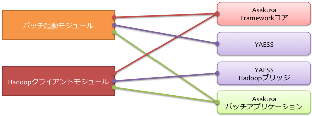
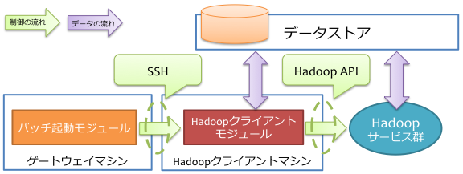
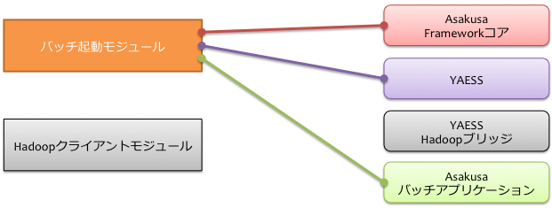
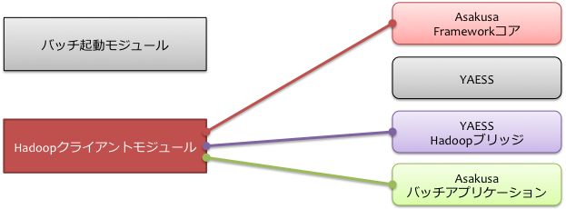

==================================
デプロイメントガイド for DirectI/O
==================================

この文書では、ジョブのデータ入出力にDirect I/Oを用いる構成における、Asakusa Frameworkとバッチアプリケーションを運用環境にデプロイする手順について解説します。

用語の定義
==========
本書では、マシン構成に関しての用語を以下のように定義します。

  マシン
    それぞれのコンピューターを表します。
    仮想化されたコンピューターであっても構いません。

  モジュール
    特定の役割を持ったソフトウェアです。
    いくつかのコンポーネントを組み合わせて構成します。

  コンポーネント
    Asakusa Frameworkのそれぞれのコンポーネントです。
    Asakusa Frameworkコアや、YAESSなど [#]_ がコンポーネントの単位となります。

..  [#] 現在のところ、Direct I/Oに関するライブラリやツールはすべてAsakusa Frameworkコアに含まれています。

モジュール
----------
以下は本ガイドで紹介するモジュール群です。
それぞれのマシンに機能を割り当て、それを実現するモジュールを配置していく形になります。

  Hadoopクライアントモジュール
    Hadoopのジョブ起動や、Direct I/Oのデータストアにアクセスを行うモジュールです [#]_ 。

    Hadoopのマスターノードやスレーブノード上にクライアントモジュールを配置することもできます。

  バッチ起動モジュール
    Asakusa Frameworkで開発したAsakusaバッチアプリケーションを起動するためのモジュールです。

    このモジュールには :doc:`YAESS <../yaess/index>` を配置し、外部システム連携モジュールやHadoopクライアントモジュールにジョブ実行を依頼します。

ひとつのマシン上に複数のモジュールを配置することもできます。
モジュールが異なるマシン上に存在する場合、SSHやRPCなどの適切なプロトコルを利用して処理を行います。

..  [#] Hadoopの動作上、Hadoopのジョブを起動するノードからもデータストアへのアクセスが行われます。
    共有ディスクなどを利用する場合は、このHadoopクライアントモジュールを配置したマシンについても
    Hadoopスレーブノードと同様の方法で対象のデータストアを参照できる必要があります。

コンポーネント
--------------
以下は本ガイドでデプロイする対象のコンポーネント群です。
モジュールごとに利用するコンポーネントは異なります。
モジュールを配置したマシンごとに必要なコンポーネントをデプロイしていく形になります。

  Asakusaバッチアプリケーション
    Asakusa Frameworkで作成したアプリケーションです。
    Hadoopクライアントモジュール、バッチ起動モジュールのそれぞれが利用します。

  Asakusa Frameworkコア
    Asakusa Framework本体です。
    Hadoopクライアントモジュール、バッチ起動モジュールのそれぞれが利用します。

  YAESS
    :doc:`YAESS <../yaess/index>` 本体です。
    バッチ起動モジュールが利用します。

  YAESS Hadoopブリッジ
    YAESSがHadoopと通信するために中継するソフトウェアです。
    Hadoopクライアントモジュールが利用します。

システム構成の検討
==================
Direct I/Oを用いた場合のシステム構成について、いくつか例を見ていきます。

シンプルな構成例
----------------
Direct I/Oを利用したシンプルな構成例を以下に示します。

..  figure:: deployment-with-directio-simple.png

上記の構成では、Hadoopクライアントモジュールとバッチ起動モジュールをそれぞれ同じマシン（Hadoopクライアントマシン）上に配置しています。
各モジュール間の通信は単一のマシン内で行われ、HadoopクライアントモジュールはHadoop APIを介してHadoopクラスター上のサービスにアクセスします。

下図は、この構成でHadoopクライアントマシンが利用するコンポーネントの一覧です。

バッチ起動を外部から行う場合の構成例
------------------------------------
バッチの起動を行う「ゲートウェイマシン」をHadoopクライアントマシンとは別に用意した場合の構成例を以下に示します。

ゲートウェイマシンはHadoopクライアントマシン上の各種HadoopブリッジとSSHを利用して通信します。
そのため、あらかじめゲートウェイマシンからHadoopクライアントマシンにSSH経由（公開鍵認証）でアクセスできるようにしておく必要があります。

下図は、この構成でゲートウェイマシンが利用するコンポーネントの一覧です。

同様に、下図はHadoopクライアントマシンが利用するコンポーネントの一覧です。

..  note::
    この構成の利点は、ゲートウェイマシンとHadoopクライアントマシンに異なるセキュリティレベルを設定できる点です。
    ゲートウェイマシン *から* Hadoopクライアントマシンに対してSSHでログイン出来ればよく、
    HadoopクラスターやHadoopクライアントマシンに不正侵入されても、そこからゲートウェイマシンに侵入するにはもう一手間必要です。

運用環境の構築
==============
運用環境の構築を以下の流れで説明します。

1. Hadoopクラスターの構築
2. Asakusa Frameworkのインストールアーカイブの作成
3. Asakusa Frameworkのデプロイ
4. Asakusa Framework追加ライブラリのデプロイ
5. Asakusa Framework実行時プラグインの設定
6. Direct I/Oの設定
7. YAESSプラグインライブラリのデプロイ
8. YAESSの設定
9. Hadoopブリッジの設定
10. バッチアプリケーションのデプロイ
11. バッチアプリケーションの実行

Hadoopクラスターの構築
----------------------
Hadoopクラスターを分散モードで動作するように構築します。Hadoopクラスターの具体的な構築手順は、Hadoopを提供している各ディストリビューションのドキュメント等を参考にして下さい。

Hadoopクラスターの構築が完了したら、HadoopクライアントモジュールにAsakusa Framework管理用のOSユーザを作成します。以後、このユーザを *ASAKUSA_USER* と表記します。

*ASAKUSA_USER* からHadoopが提供しているサンプルアプリケーションのジョブをhadoopコマンドを使って実行し、ジョブが正常に実行されることを確認して下さい。

Asakusa Frameworkのインストールアーカイブの作成
-----------------------------------------------
Asakusa Frameworkのインストールアーカイブを用意します。

Asakusa Frameworkのインストールアーカイブは、Framework Organizer [#]_ に対してMavenの以下のコマンドを実行して生成します。

..  code-block:: sh

    mvn package

このコマンドを実行すると、Framework Organizerの ``target`` ディレクトリ配下にいくつかのファイルが生成されます。
このうち以下のファイルが今回利用するアーカイブ [#]_ です。

``asakusafw-${asakusafw.version}-prod-directio.tar.gz``

``${asakusafw.version}`` は使用しているAsakusa Frameworkのバージョンです。
例えばversion |version| を使っている場合、ファイル名は asakusafw-|version|-prod-directio.tar.gz になります。

..  [#] 詳しくは、 :doc:`framework-organizer` を参照してください。
..  [#] このアーカイブには (Direct I/Oを含む) Asakusa Frameworkのコアライブラリ、YAESS、Hadoopブリッジが含まれています。

Asakusa Frameworkのデプロイ
---------------------------
作成したインストールアーカイブを利用し、Asakusa Frameworkを以下それぞれのモジュールを配置するマシン上にデプロイします。

..  list-table:: Asakusa Frameworkのデプロイが必要なモジュール
    :widths: 10 10
    :header-rows: 1

    * - モジュール名
      - 必要
    * - Hadoopクライアントモジュール
      - ○
    * - バッチ起動モジュール
      - ○

Asakusa Frameworkは上記すべてのモジュールから利用しているため、それぞれのモジュールに関連するすべてのマシンにデプロイします。
一台のマシンに複数のモジュールを配置している場合は、マシンごとに1セットだけデプロイします [#]_ 。

Asakusa Frameworkのデプロイ先を環境変数 ``$ASAKUSA_HOME`` とした場合、 ``$ASAKUSA_HOME`` ディレクトリを作成し、
``$ASAKUSA_HOME`` 直下にAsakusa Framework用のインストールアーカイブ( ``asakusafw-${asakusafw.version}-prod-directio.tar.gz`` )を展開します。
展開後、 ``$ASAKUSA_HOME`` 配下の ``*.sh`` に実行権限を追加します。

..  code-block:: sh

    # ASAKUSA_HOME="(デプロイ先)"
    mkdir -p "$ASAKUSA_HOME"
    cp asakusafw-*-prod-directio.tar.gz "$ASAKUSA_HOME"
    cd "$ASAKUSA_HOME"
    tar -xzf asakusafw-*-prod-directio.tar.gz
    find "$ASAKUSA_HOME" -name "*.sh" | xargs chmod u+x

..  attention::
    HadoopクライアントモジュールにAsakusa Frameworkをデプロイする際には、
    *ASAKUSA_USER* から利用可能な位置にデプロイしてください。

..  [#] 各モジュールを同一マシン上の異なるOSのユーザ名に割り当てる場合、ユーザごとにAsakusa Frameworkをデプロイしてください。

Asakusa Framework追加ライブラリのデプロイ
-----------------------------------------
Asakusaバッチアプリケーションで利用する共通ライブラリ（Hadoopによって提供されているライブラリ以外のもの） [#]_ や、Asakusa Frameworkを拡張する :doc:`実行時プラグイン <deployment-runtime-plugins>` が存在する場合、これらのクラスライブラリアーカイブを以下のモジュールに追加でデプロイします。

..  list-table:: Asakusa Framework追加ライブラリのデプロイが必要なモジュール
    :widths: 10 10
    :header-rows: 1

    * - モジュール名
      - 必要
    * - Hadoopクライアントモジュール
      - ○
    * - バッチ起動モジュール
      - 

追加ライブラリのデプロイ先は ``$ASAKUSA_HOME/ext/lib/`` の直下です。
実行時プラグインの設定は `Asakusa Framework実行時プラグインの設定`_ を参照してください。

..  [#] Asakusa Framework バージョン ``0.5.1`` から、バッチアプリケーションのコンパイル時に規定のディレクトリに追加ライブラリを配置しておくことで、バッチアプリケーションアーカイブに共通ライブラリを含める機能が追加されました。この機能を使って共通ライブラリを管理する場合は、本手順で説明するデプロイ手順は不要です。

    詳しくは、 :doc:`../application/maven-archetype` の :ref:`application-dependency-library` を参照してください。

Asakusa Framework実行時プラグインの設定
---------------------------------------
以下のモジュールを配置したマシン上で、Asakusa Frameworkの実行時プラグインの設定を行います。

..  list-table:: 実行時プラグインの設定が必要なモジュール
    :widths: 10 10
    :header-rows: 1

    * - モジュール名
      - 必要
    * - Hadoopクライアントモジュール
      - ○
    * - バッチ起動モジュール
      - 

実行時プラグインの設定についての詳細は、 :doc:`deployment-runtime-plugins` を参考にしてください。

Direct I/Oの設定
----------------
以下のモジュールを配置したマシン上で、Direct I/Oの設定を環境に応じて行います。

..  list-table:: Direct I/Oの設定が必要なモジュール
    :widths: 10 10
    :header-rows: 1

    * - モジュール名
      - 必要
    * - Hadoopクライアントモジュール
      - ○
    * - バッチ起動モジュール
      - 

Direct I/Oの設定についての詳細は、 :doc:`../directio/user-guide` などを参考にしてください。

..  note::
    実行時プラグインの設定とDirect I/Oの設定はいずれも同一のファイル ( ``$ASAKUSA_HOME/core/conf/asakusa-resources.xml`` ) 上で行います。

YAESSプラグインライブラリのデプロイ
-----------------------------------
以下のモジュールを配置したマシンに、必要なYAESSのプラグインや依存ライブラリを追加でデプロイします。

..  list-table:: YAESSプラグインライブラリのデプロイが必要なモジュール
    :widths: 10 10
    :header-rows: 1

    * - モジュール名
      - 必要
    * - Hadoopクライアントモジュール
      - 
    * - バッチ起動モジュール
      - ○

..  note::
    Asakusa Frameworkのインストールアーカイブには、デフォルトのYAESS用プラグインライブラリとして、
    あらかじめ以下のプラグインライブラリと、プラグインライブラリが使用する依存ライブラリが同梱されています。

    * ``asakusa-yaess-paralleljob`` : ジョブを並列実行のためのプラグイン
    * ``asakusa-yaess-jsch`` : SSH経由でジョブを起動するためのプラグイン
    * ``jsch`` : ``asakusa-yaess-jsch`` が依存するSSH接続用ライブラリ
    * ``asakusa-yaess-flowlog`` : ジョブフローごとに進捗状況を個別ファイルに出力するためのプラグイン
    * ``asakusa-yaess-multidispatch`` : ジョブの実行クラスタの振り分けを行うためのプラグイン

YAESSのプラグインライブラリについては、 :doc:`../yaess/user-guide` も参考にしてください。

YAESSの設定
-----------
以下のモジュールを配置したマシン上で、YAESSの設定を環境に応じて行います。

..  list-table:: YAESSの設定が必要なモジュール
    :widths: 10 10
    :header-rows: 1

    * - モジュール名
      - 必要
    * - Hadoopクライアントモジュール
      - 
    * - バッチ起動モジュール
      - ○

YAESSの設定についての詳細は、 :doc:`../yaess/user-guide` などを参考にしてください。

..  note::
    リモートマシン上のHadoopを利用する場合、 ``...env.ASAKUSA_HOME`` の値には
    リモートマシンで `Asakusa Frameworkのデプロイ`_ を行ったパスを指定してください。

Hadoopブリッジの設定
--------------------
以下のモジュールを配置したマシン上で、YAESSが利用するHadoopブリッジの設定を行います。

..  list-table:: Hadoopブリッジの設定が必要なモジュール
    :widths: 10 10
    :header-rows: 1

    * - モジュール名
      - 必要
    * - Hadoopクライアントモジュール
      - ○
    * - バッチ起動モジュール
      - 

YAESSのHadoopブリッジについては :doc:`../yaess/user-guide` などを参考にしてください。

バッチアプリケーションのデプロイ
--------------------------------
開発したバッチアプリケーションデプロイするには、
あらかじめデプロイ対象のアプリケーションアーカイブを作成しておきます。
このアプリケーションアーカイブの作成方法は、 :doc:`../application/maven-archetype` を参照してください。 

作成したアプリケーションアーカイブを利用して、それぞれのバッチアプリケーションを以下のモジュールを配置したマシン上にデプロイします。

..  list-table:: バッチアプリケーションのデプロイが必要なモジュール
    :widths: 10 10
    :header-rows: 1

    * - モジュール名
      - 必要
    * - Hadoopクライアントモジュール
      - ○
    * - バッチ起動モジュール
      - ○

バッチアプリケーションは ``$ASAKUSA_HOME/batchapps/`` ディレクトリ直下にアプリケーションアーカイブを配置し、そこでJARファイルとして展開します。

..  warning::
    デプロイ対象とするjarファイルを間違えないよう注意してください。
    デプロイ対象ファイルは ``${artifactId}-batchapps-{version}.jar`` のようにアーティファクトIDの後に **batchapps** が付くjarファイルです。

    アプリケーションのビルドとデプロイについては、 :doc:`../introduction/start-guide` の「サンプルアプリケーションのビルド」「サンプルアプリケーションのデプロイ」も参考にしてください。

以下は ``/tmp/asakusa-app/example-app-batchapps-1.0.0.jar`` にアプリケーションアーカイブがある前提で、
それに含まれるバッチアプリケーションをデプロイする例です。

..  code-block:: sh

    #ASAKUSA_HOME=(Asakusa Frameworkデプロイ先のパス)
    cp /tmp/asakusa-app/example-app-batchapps-1.0.0.jar "$ASAKUSA_HOME/batchapps"
    cd "$ASAKUSA_HOME/batchapps"
    jar -xf example-app-batchapps-1.0.0.jar
    rm -f example-app-batchapps-1.0.0.jar
    rm -fr META-INF

..  note::
    ``$ASAKUSA_HOME/batchapps`` ディレクトリ直下にはバッチIDを示すディレクトリのみを配置するとよいでしょう。
    上記例では、展開前のjarファイルや、jarを展開した結果作成されるMETA-INFディレクトリなどを削除しています。

バッチアプリケーションの実行
----------------------------
最後に、デプロイしたバッチアプリケーションをYAESSで実行します。

実行方法は、 :doc:`../introduction/start-guide` の「サンプルアプリケーションの実行」で説明したYAESSの実行方法と同じです。
``$ASAKUSA_HOME/yaess/bin/yaess-batch.sh`` コマンドにバッチIDとバッチ引数を指定して実行します。

YAESSの詳しい利用方法については :doc:`../yaess/user-guide` を参照してください。

