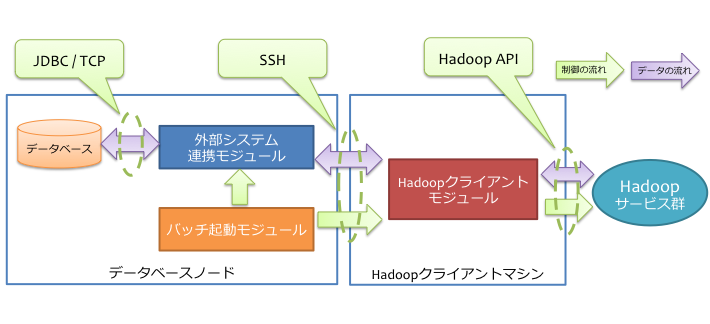
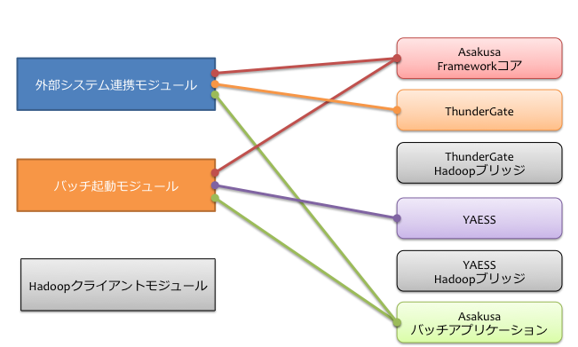
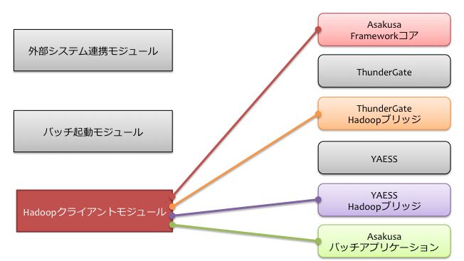

====================================
デプロイメントガイド for ThunderGate
====================================

この文書では、外部システムとの連携にThunderGateを用いる構成における、Asakusa Frameworkとバッチアプリケーションを運用環境にデプロイする手順について解説します。

用語の定義
==========
本書では、マシン構成に関しての用語を以下のように定義します。

  マシン
    それぞれのコンピューターを表します。
    仮想化されたコンピューターであっても構いません。

  モジュール
    特定の役割を持ったソフトウェアです。
    いくつかのコンポーネントを組み合わせて構成します。

  コンポーネント
    Asakusa Frameworkのそれぞれのコンポーネントです。
    Asakusa Frameworkコアや、ThunderGate、YAESSなどがコンポーネントの単位となります。

モジュール
----------
以下は本ガイドで紹介するモジュール群です。
それぞれのマシンに機能を割り当て、それを実現するモジュールを配置していく形になります。

  Hadoopクライアントモジュール
    Hadoopのジョブ起動や、HDFSへアクセスを行うためのモジュールです。
    
    このモジュールには :doc:`ThunderGate <../thundergate/index>` のエクストラクタ、コレクタを配置し、HadoopファイルシステムにAPI経由でアクセスします。

  外部システム連携モジュール
    外部システムとHadoopクラスター間でデータをやり取りするためのモジュールです。

    このモジュールには :doc:`ThunderGate <../thundergate/index>` のインポータ、エクスポータを配置し、RDBMSにJDBC経由でアクセスします。

    また、Hadoopクラスターとデータのやり取りをする際に、Hadoopクライアントモジュールを利用します。

  バッチ起動モジュール
    Asakusa Frameworkで開発したAsakusaバッチアプリケーションを起動するためのモジュールです。

    このモジュールには :doc:`YAESS <../yaess/index>` を配置し、外部システム連携モジュールやHadoopクライアントモジュールにジョブ実行を依頼します。

ひとつのマシン上に複数のモジュールを配置することもできます。
モジュールが異なるマシン上に存在する場合、SSH、RPCなどの適切なプロトコルを利用して処理を行います。

コンポーネント
--------------
以下は本ガイドでデプロイする対象のコンポーネント群です。
モジュールごとに利用するコンポーネントは異なります。
モジュールを配置したマシンごとに必要なコンポーネントをデプロイしていく形になります。

  Asakusaバッチアプリケーション
    Asakusa Frameworkで作成したアプリケーションです。
    Hadoopクライアントモジュール、外部システム連携モジュール、バッチ起動モジュールのそれぞれが利用します。

  Asakusa Frameworkコア
    Asakusa Framework本体です。
    Hadoopクライアントモジュール、外部システム連携モジュール、バッチ起動モジュールのそれぞれが利用します。

  ThunderGate
    :doc:`ThunderGate <../thundergate/index>` 本体です [#]_ 。
    外部システム連携モジュールが利用します。

  ThunderGate Hadoopブリッジ
    ThunderGateがHadoopと通信するために中継するソフトウェアです [#]_ 。
    Hadoopクライアントモジュールが利用します。

  YAESS
    :doc:`YAESS <../yaess/index>` 本体です。
    バッチ起動モジュールが利用します。

  YAESS Hadoopブリッジ
    YAESSがHadoopと通信するために中継するソフトウェアです。
    Hadoopクライアントモジュールが利用します。

..  [#] ThunderGate本体には インポータ, エクスポータが含まれます。
        また、コマンドラインツールとして提供される運用ツールとして リカバラ, DBクリーナ, 及びキャッシュ操作用の各種コマンドが含まれます。
..  [#] ThunderGate Hadoopブリッジには エクストラクタ, コレクタが含まれます。

システム構成の検討
==================
ThunderGateを用いた場合のシステム構成を見ていきます

ThunderGateによる標準的な構成例
-------------------------------
ThunderGateを利用した構成例を以下に示します。

上記の構成はバッチ実行モジュールがデータベースノード上に配置されていますが、これは独立したマシンに配置することも可能です。その他のモジュール構成については、ThunderGateは基本的に上記の構成のみを想定しています。

データベースノードではローカルのデータベースとJDBCを利用して通信し、Hadoopクライアントマシン上の各種HadoopブリッジとはSSHを利用して通信しています。
そのため、以下の準備があらかじめ必要です。

* データベースノードからHadoopクライアントマシンにSSH経由（パスフレーズなしの公開鍵認証）でアクセスできるようにする [#]_ 

下図は、この構成でデータベースノードが利用するコンポーネントの一覧です。

同様に、下図はHadoopクライアントマシンが利用するコンポーネントの一覧です。

..  note::
    この構成の利点は、データベースノードとHadoopクライアントマシンに異なるセキュリティレベルを設定できる点です。
    データベースノード *から* Hadoopクライアントマシンに対してSSHでログイン出来ればよく、
    HadoopクラスターやHadoopクライアントマシンに不正侵入されても、そこからデータベースノードに侵入するにはもう一手間必要です。
    データベースやバッチの起動部分を保護するという点では重要な意味合いがあります。

..  [#] データベースノードとHadoopクライアントマシンを同一マシンにする構成も可能です。その場合でもThunderGateはローカルのHadoopクライアントモジュールに対してssh経由でアクセスします。

運用環境の構築
==============
運用環境の構築を以下の流れで説明します。

1. Hadoopクラスターの構築
2. データベースの構築
3. Asakusa Frameworkのデプロイメントアーカイブの作成
4. Asakusa Frameworkのデプロイ
5. Asakusa Framework追加ライブラリのデプロイ
6. Asakusa Framework実行時プラグインの設定
7. ThunderGateの設定
8. ThunderGate用システムテーブルの作成
9. ThunderGate用テンポラリディレクトリの設定
10. YAESSプラグインライブラリのデプロイ
11. YAESSの設定
12. Hadoopブリッジの設定
13. バッチアプリケーションのデプロイ
14. バッチアプリケーション用テーブルの作成
15. ロック管理テーブルのレコード登録
16. バッチアプリケーションの実行

Hadoopクラスターの構築
----------------------
Hadoopクラスターを分散モードで動作するように構築します。Hadoopクラスターの具体的な構築手順は、Hadoopを提供している各ディストリビューションのドキュメント等を参考にして下さい。

Hadoopクラスターの構築が完了したら、HadoopクライアントモジュールにAsakusa Framework管理用のOSユーザを作成します。以後、このユーザを *ASAKUSA_USER* と表記します。

*ASAKUSA_USER* からHadoopが提供しているサンプルアプリケーションのジョブをhadoopコマンドを使って実行し、ジョブが正常に実行されることを確認して下さい。

データベースの構築
------------------
データベースノードにMySQL Serverをインストールし、設定を行います。
MySQLのセットアップが完了したら、MySQLのデータベースとユーザを作成します。

MySQL Serverの具体的なセットアップ手順は、MySQLのドキュメント等を参照してください。

本文書で以降に示す設定例や手順例では、データベースとユーザを以下の通りに作成したものとして説明を行います。

..  list-table:: MySQLデータベースとユーザ名
    :widths: 30 30
    :header-rows: 1

    * - 項目
      - 値
    * - データベース名
      - ``appdb``
    * - ユーザ名
      - ``appuser``
    * - ユーザのパスワード
      - ``appuser``

Asakusa Frameworkのデプロイメントアーカイブの作成
-------------------------------------------------
Asakusa Frameworkのデプロイメントアーカイブを用意します。

Asakusa Frameworkのデプロイメントアーカイブは、Framework Organizer に対して、記述指定子 ``prod-thundergate`` を持つ
デプロイメントアーカイブを出力するよう指定した上で、Mavenの以下のコマンドを実行して生成します [#]_ 。

..  code-block:: sh

    mvn package

このコマンドを実行すると、Framework Organizerの ``target`` ディレクトリ配下にいくつかのファイルが生成されます。
このうち以下のファイルが今回利用するアーカイブ [#]_ です。

``asakusafw-${asakusafw.version}-prod-thundergate.tar.gz``

``${asakusafw.version}`` は使用しているAsakusa Frameworkのバージョンです。
例えばversion |version| を使っている場合、ファイル名は asakusafw-|version|-prod-thundergate.tar.gz になります。

..  [#] 詳しくは、 :doc:`framework-organizer` を参照してください。
..  [#] このアーカイブにはAsakusa Frameworkのコアライブラリ、ThunderGate、YAESS、各種Hadoopブリッジが含まれています。

Asakusa Frameworkのデプロイ
---------------------------
作成したデプロイメントアーカイブを利用し、Asakusa Frameworkを以下それぞれのモジュールを配置するマシン上にデプロイします。

..  list-table:: Asakusa Frameworkのデプロイが必要なモジュール
    :widths: 10 10
    :header-rows: 1

    * - モジュール名
      - 必要
    * - Hadoopクライアントモジュール
      - ○
    * - 外部システム連携モジュール
      - ○
    * - バッチ起動モジュール
      - ○

Asakusa Frameworkは上記すべてのモジュールから利用しているため、それぞれのモジュールに関連するすべてのマシンにデプロイします。
一台のマシンに複数のモジュールを配置している場合は、マシンごとに1セットだけデプロイします [#]_ 。

Asakusa Frameworkのデプロイ先を環境変数 ``$ASAKUSA_HOME`` とした場合、 ``$ASAKUSA_HOME`` ディレクトリを作成し、
``$ASAKUSA_HOME`` 直下にAsakusa Framework用のデプロイメントアーカイブ( ``asakusafw-${asakusafw.version}-prod-thundergate.tar.gz`` )を展開します。
展開後、 ``$ASAKUSA_HOME`` 配下の ``*.sh`` に実行権限を追加します。

..  code-block:: sh

    # ASAKUSA_HOME="(デプロイ先)"
    mkdir -p "$ASAKUSA_HOME"
    cp asakusafw-*-prod-thundergate.tar.gz "$ASAKUSA_HOME"
    cd "$ASAKUSA_HOME"
    tar -xzf asakusafw-*-prod-thundergate.tar.gz
    find "$ASAKUSA_HOME" -name "*.sh" | xargs chmod u+x

..  attention::
    HadoopクライアントモジュールにAsakusa Frameworkをデプロイする際には、
    *ASAKUSA_USER* から利用可能な位置にデプロイしてください。

..  [#] 各モジュールを同一マシン上の異なるOSのユーザ名に割り当てる場合、ユーザごとにAsakusa Frameworkをデプロイしてください。

Asakusa Framework追加ライブラリのデプロイ
-----------------------------------------
Asakusaバッチアプリケーションで利用する共通ライブラリ（Hadoopによって提供されているライブラリ以外のもの） [#]_ や、Asakusa Frameworkを拡張する :doc:`実行時プラグイン <deployment-runtime-plugins>` が存在する場合、これらのクラスライブラリアーカイブを以下のモジュールに追加でデプロイします。

..  list-table:: Asakusa Framework追加ライブラリのデプロイが必要なモジュール
    :widths: 10 10
    :header-rows: 1

    * - モジュール名
      - 必要
    * - Hadoopクライアントモジュール
      - ○
    * - 外部システム連携モジュール
      - 
    * - バッチ起動モジュール
      - 

追加ライブラリのデプロイ先は ``$ASAKUSA_HOME/ext/lib/`` の直下です。
実行時プラグインの設定は `Asakusa Framework実行時プラグインの設定`_ を参照してください。

..  [#] Asakusa Framework バージョン ``0.5.1`` から、バッチアプリケーションのコンパイル時に規定のディレクトリに追加ライブラリを配置しておくことで、バッチアプリケーションアーカイブに共通ライブラリを含める機能が追加されました。この機能を使って共通ライブラリを管理する場合は、本手順で説明するデプロイ手順は不要です。

    詳しくは、 :doc:`../application/maven-archetype` の :ref:`dependency-library-maven-archetype` を参照してください。

Asakusa Framework実行時プラグインの設定
---------------------------------------
以下のモジュールを配置したマシン上で、Asakusa Frameworkの実行時プラグインの設定を行います。

..  list-table:: 実行時プラグインの設定が必要なモジュール
    :widths: 10 10
    :header-rows: 1

    * - モジュール名
      - 必要
    * - Hadoopクライアントモジュール
      - ○
    * - 外部システム連携モジュール
      - 
    * - バッチ起動モジュール
      - 

実行時プラグインの設定についての詳細は、 :doc:`deployment-runtime-plugins` を参考にしてください。

ThunderGateの設定
-----------------
以下のモジュールを配置したマシン上で、ThunderGateの設定を環境に応じて行います。

..  list-table:: ThunderGateの設定が必要なモジュール
    :widths: 10 10
    :header-rows: 1

    * - モジュール名
      - 必要
    * - Hadoopクライアントモジュール
      - 
    * - 外部システム連携モジュール
      - ○
    * - バッチ起動モジュール
      - 

ThunderGateの設定についての詳細は、 :doc:`../thundergate/user-guide` などを参考にしてください。

ThunderGate用システムテーブルの作成
-----------------------------------
`データベースの構築`_ で作成したMySQLに対して、ThunderGateのシステムテーブルを登録します。

システムテーブルの登録用DDLスクリプトは、 ``$ASAKUSA_HOME/bulkloader/sql/create_table.sql`` に配置されています。このDDLスクリプトを `データベースの構築`_ で作成したMySQLのデータベースに対して実行します。

以下作成例です。

..  code-block:: sh

    cd $ASAKUSA_HOME/bulkloader/sql
    mysql -u appuser -pappuser -D appdb < create_table.sql

なお、ThunderGateのマイグレーションに伴いシステムテーブルを再登録する場合には、マイグレーション前のシステムテーブルを削除してからシステムテーブルを再登録してください。以下手順例です。

..  code-block:: sh

    cd $ASAKUSA_HOME/bulkloader/sql
    mysql -u appuser -pappuser -D appdb < drop_table.sql
    mysql -u appuser -pappuser -D appdb < create_table.sql

..  attention::
    システムテーブルを再登録すると、実行中のジョブフローの管理情報がすべて失われます。また、ここで使用するシステムテーブル登録、削除用DDLスクリプトはキャッシュ管理用のシステムテーブルに対する登録、削除も含まれますが、キャッシュ管理情報を削除することで、キャッシュはすべて初期化されるので注意が必要です。

ThunderGate用テンポラリディレクトリの作成
-----------------------------------------
以下のモジュールを配置したマシン上で、ThunderGate用のテンポラリテーブルを作成します。

..  list-table:: ThunderGate用テンポラリテーブルの作成が必要なモジュール
    :widths: 10 10
    :header-rows: 1

    * - モジュール名
      - 必要
    * - Hadoopクライアントモジュール
      - 
    * - 外部システム連携モジュール
      - ○
    * - バッチ起動モジュール
      - 

上述の `ThunderGateの設定`_ にて :ref:`thundergate-db-configuration-file` に設定した以下のプロパティの値を確認します。

* ``import.tsv-create-dir``
* ``export.tsv-create-dir``

上記の2プロパティに指定したテンポラリ用ディレクトリを作成します。これらのディレクトリのパーミッションはASAKUSA_USERとMySQL実行ユーザの両ユーザが読み込み、書き込み可能な権限を設定します。

以下設定例です。

..  code-block:: sh

    mkdir -p -m 777 /var/tmp/asakusa/importer
    mkdir -p -m 777 /var/tmp/asakusa/exporter
    chown -R mysql:mysql /var/tmp/asakusa

..  attention::
    ``import.tsv-create-dir``, ``export.tsv-create-dir`` のデフォルトの設定は ``/tmp`` 配下に設定されていますが、一部のOSでは ``/tmp`` 配下は再起動時にクリアされるため、必要に応じて設定を変更してください。

YAESSプラグインライブラリのデプロイ
-----------------------------------
以下のモジュールを配置したマシンに、必要なYAESSのプラグインや依存ライブラリを追加でデプロイします。

..  list-table:: YAESSプラグインライブラリのデプロイが必要なモジュール
    :widths: 10 10
    :header-rows: 1

    * - モジュール名
      - 必要
    * - Hadoopクライアントモジュール
      - 
    * - 外部システム連携モジュール
      - 
    * - バッチ起動モジュール
      - ○

..  note::
    Asakusa Frameworkのデプロイメントアーカイブには、デフォルトのYAESS用プラグインライブラリとして、
    あらかじめ以下のプラグインライブラリと、プラグインライブラリが使用する依存ライブラリが同梱されています。

    * ``asakusa-yaess-paralleljob`` : ジョブを並列実行のためのプラグイン
    * ``asakusa-yaess-jsch`` : SSH経由でジョブを起動するためのプラグイン
    * ``jsch`` : ``asakusa-yaess-jsch`` が依存するSSH接続用ライブラリ
    * ``asakusa-yaess-flowlog`` : ジョブフローごとに進捗状況を個別ファイルに出力するためのプラグイン
    * ``asakusa-yaess-multidispatch`` : ジョブの実行クラスタの振り分けを行うためのプラグイン

YAESSのプラグインライブラリについては、 :doc:`../yaess/user-guide` も参考にしてください。

YAESSの設定
-----------
以下のモジュールを配置したマシン上で、YAESSの設定を環境に応じて行います。

..  list-table:: YAESSの設定が必要なモジュール
    :widths: 10 10
    :header-rows: 1

    * - モジュール名
      - 必要
    * - Hadoopクライアントモジュール
      - 
    * - 外部システム連携モジュール
      - 
    * - バッチ起動モジュール
      - ○

YAESSの設定についての詳細は、 :doc:`../yaess/user-guide` などを参考にしてください。

..  note::
    リモートマシン上のThunderGateやHadoopを利用する場合、 ``...env.ASAKUSA_HOME`` の値には
    リモートマシンで `Asakusa Frameworkのデプロイ`_ を行ったパスを指定してください。

Hadoopブリッジの設定
--------------------
以下のモジュールを配置したマシン上で、ThunderGateやYAESSが利用するHadoopブリッジの設定を行います。

..  list-table:: Hadoopブリッジの設定が必要なモジュール
    :widths: 10 10
    :header-rows: 1

    * - モジュール名
      - 必要
    * - Hadoopクライアントモジュール
      - ○
    * - 外部システム連携モジュール
      - 
    * - バッチ起動モジュール
      - 

ThunderGateのHadoopブリッジについては :doc:`../thundergate/user-guide` などを参考にしてください。
YAESSのHadoopブリッジについては :doc:`../yaess/user-guide` などを参考にしてください。

バッチアプリケーションのデプロイ
--------------------------------
開発したバッチアプリケーションデプロイするには、
あらかじめデプロイ対象のアプリケーションアーカイブを作成しておきます。
このアプリケーションアーカイブの作成方法は、 :doc:`../application/maven-archetype` を参照してください。 

作成したアプリケーションアーカイブを利用して、それぞれのバッチアプリケーションを以下のモジュールを配置したマシン上にデプロイします。

..  list-table:: バッチアプリケーションのデプロイが必要なモジュール
    :widths: 10 10
    :header-rows: 1

    * - モジュール名
      - 必要
    * - Hadoopクライアントモジュール
      - ○
    * - 外部システム連携モジュール
      - ○
    * - バッチ起動モジュール
      - ○

バッチアプリケーションは ``$ASAKUSA_HOME/batchapps/`` ディレクトリ直下にアプリケーションアーカイブを配置し、そこでJARファイルとして展開します。

..  warning::
    デプロイ対象とするjarファイルを間違えないよう注意してください。
    デプロイ対象ファイルは ``${artifactId}-batchapps-{version}.jar`` のようにアーティファクトIDの後に **batchapps** が付くjarファイルです。

    アプリケーションのビルドとデプロイについては、 :doc:`../introduction/start-guide` の「サンプルアプリケーションのビルド」「サンプルアプリケーションのデプロイ」も参考にしてください。

以下は ``/tmp/asakusa-app/example-app-batchapps-1.0.0.jar`` にアプリケーションアーカイブがある前提で、
それに含まれるバッチアプリケーションをデプロイする例です。

..  code-block:: sh

    #ASAKUSA_HOME=(Asakusa Frameworkデプロイ先のパス)
    cp /tmp/asakusa-app/example-app-batchapps-1.0.0.jar "$ASAKUSA_HOME/batchapps"
    cd "$ASAKUSA_HOME/batchapps"
    jar -xf example-app-batchapps-1.0.0.jar
    rm -f example-app-batchapps-1.0.0.jar
    rm -fr META-INF

..  note::
    ``$ASAKUSA_HOME/batchapps`` ディレクトリ直下にはバッチIDを示すディレクトリのみを配置するとよいでしょう。
    上記例では、展開前のjarファイルや、jarを展開した結果作成されるMETA-INFディレクトリなどを削除しています。

バッチアプリケーション用テーブルの作成
--------------------------------------
バッチアプリケーションが使用する業務テーブルと管理テーブルをMySQLに登録します。

業務テーブルや管理テーブルについては :doc:`../thundergate/user-guide`  を参照してください。特に、管理テーブルについては、 :ref:`generate-thundergate-management-table` も参照してください。

ロック管理テーブルのレコード登録
--------------------------------
バッチアプリケーション用のテーブルをMySQLに登録後、ロック管理テーブルに対して業務テーブルのテーブル名を登録します。

ロック管理テーブルとそのメンテナンスについては、 :doc:`../thundergate/user-guide` の :ref:`maintain-lock-table` を参照してください。

以下手順例です。

..  code-block:: sh

    cd $ASAKUSA_HOME/bulkloader/sql
    mysql -u appuser -pappuser -D appdb < insert_import_table_lock.sql

なお、アプリケーションの変更に伴い業務テーブルに追加になった場合には、先述の `バッチアプリケーション用テーブルの作成`_ を再度実行するとともに、ロック管理テーブルのレコード登録も再度実行する必要があります。この場合、ロック管理テーブルの古いレコード情報を削除してから、ロック管理テーブルのレコードを再登録してください。以下手順例です。

..  code-block:: sh

    cd $ASAKUSA_HOME/bulkloader/sql
    mysql -u appuser -pappuser -D appdb < delete_import_table_lock.sql
    mysql -u appuser -pappuser -D appdb < insert_import_table_lock.sql

バッチアプリケーションの実行
----------------------------
最後に、デプロイしたバッチアプリケーションをYAESSで実行します。

実行方法は、 :doc:`../introduction/start-guide` の「サンプルアプリケーションの実行」で説明したYAESSの実行方法と同じです。
``$ASAKUSA_HOME/yaess/bin/yaess-batch.sh`` コマンドにバッチIDとバッチ引数を指定して実行します。

YAESSの詳しい利用方法については :doc:`../yaess/user-guide` を参照してください。

