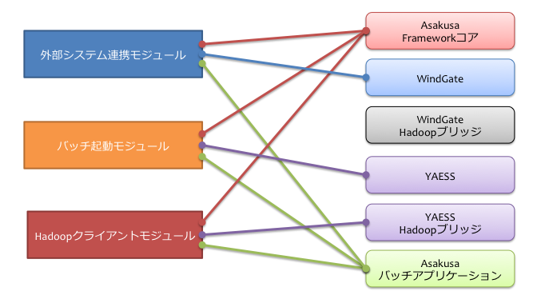
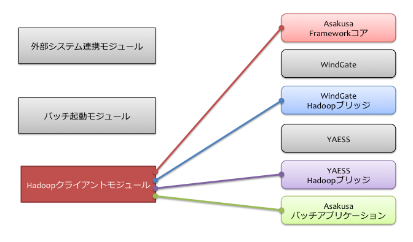

=================================
デプロイメントガイド for WindGate
=================================

この文書では、外部システムとの連携にWindGateを用いる構成における、Asakusa Frameworkとバッチアプリケーションを運用環境にデプロイする手順について解説します。

用語の定義
==========
本書では、マシン構成に関しての用語を以下のように定義します。

  Hadoopサービス群
    Hadoopが提供する各サービス（デーモン）が稼動しているクラスター全体を表します。
    一般的にはJobTrackerおよびNameNodeが可動する「マスターノード」と、TaskTrackerおよびDataNodeから構成される「スレーブノード」群から構成されます。

  Hadoopクライアントモジュール
    Hadoopのジョブ起動や、HDFSへアクセスするためのモジュールを表します [#]_ 。

    マスターノードやスレーブノードがクライアントモジュールを配置することもできます。

  外部システム連携モジュール
    外部システムとHadoopクラスター間でデータをやり取りするためのモジュールです。

    このモジュールには :doc:`WindGate <../windgate/index>` を配置し、DBMSに直接アクセスしたり、または前処理で取り込んだCSV形式のデータを利用します。
    また、Hadoopクラスターとデータのやり取りをする際に、Hadoopクライアントモジュールを利用します。

  バッチ起動モジュール
    Asakusa Frameworkで開発したAsakusaバッチアプリケーションを起動するためのモジュールです。

    このモジュールには :doc:`YAESS <../yaess/index>` を配置し、外部システム連携モジュールやHadoopクライアントモジュールにジョブ実行を依頼します。

  データベースノード
    DBMSがインストールされているマシンを表します。WindGateをデータベースと連携する構成で使用する場合における、バッチ処理のデータ入出力先となります。

    データベースと連携しない場合には不要です。

上記それぞれのモジュールは、同一マシン上にあってもかまいません。
モジュールが異なるマシン上に存在する場合、SSHやJDBC、RPCなどの適切なプロトコルを利用して処理を行います。

また、Asakusa Frameworkの各種コンポーネントについての用語を以下のように定義します。

  Asakusaバッチアプリケーション
    Asakusa Frameworkで作成したアプリケーション。
    Hadoopクライアントモジュール、外部システム連携モジュール、バッチ起動モジュールのそれぞれに含めます。

  Asakusa Frameworkコア
    Asakusa Framework本体。
    Hadoopクライアントモジュール、外部システム連携モジュール、バッチ起動モジュールのそれぞれに含めます。

  WindGate
    :doc:`WindGate <../windgate/index>` 本体。
    外部システム連携モジュールに含めます。

  WindGate Hadoopブリッジ
    WindGateがHadoopと通信するために中継するソフトウェア。
    Hadoopクライアントモジュールに含めます。

    外部システム連携モジュールとHadoopクライアントモジュールが同じマシン上に構成されている場合、
    このWindGate Hadoopブリッジは利用しません。
    この場合、WindGateはHadoopに直接アクセスします。

  YAESS
    :doc:`YAESS <../yaess/index>` 本体。
    バッチ起動モジュールに含めます。

  YAESS Hadoopブリッジ
    YAESSがHadoopと通信するために中継するソフトウェア。
    Hadoopクライアントモジュールに含めます。

..  [#] Hadoopクライアントモジュールは、さらにジョブの起動を行うモジュールとHDFSにアクセスするモジュールの2つに細分化することも可能です。
    この文書では、簡単のためこれらをまとめてHadoopクライアントモジュールと呼んでいます。

システム構成の検討
==================
WindGateを用いた場合のシステム構成について、いくつか例を見ていきます。

WindGate/CSVによるシンプルな構成例
----------------------------------
WindGateをローカルのCSVファイルと連携する構成における、シンプルな構成例を以下に示します。

..  figure:: deployment-with-windgate-figure1.png

上記の構成では、Hadoopクライアントモジュール、外部システム連携モジュール、バッチ起動モジュールがそれぞれ同じマシン（Hadoopクライアントマシン）上に存在しています。
また、データベースを利用しないため、データベースノードは存在しません。

下図は、この構成でHadoopクライアントマシンが利用するコンポーネントの一覧です。

..  note::
    Hadoopクライアントモジュールと外部システム連携モジュールが同一のマシン上に存在するため、WindGate Hadoopブリッジは不要です。

..  attention::
    この例では、外部システムがCSVファイルを生成、または取り込みし、
    Hadoopクライアントモジュールとの受け渡しはAsakusa Frameworkとは別の仕組みで行うという前提です。

WindGate/DBMSによるHadoopブリッジを使った構成例
-----------------------------------------------
WindGateをDBMSと連携し、かつHadoopクライアントモジュールと外部システム連携モジュールが異なる場合の構成例を以下に示します。

..  figure:: deployment-with-windgate-figure3.png

上記の構成では、前述のHadoopクライアントマシンのほかに、ゲートウェイマシンを導入しています。
ゲートウェイマシンはデータベースとJDBCを利用して通信し、Hadoopクライアントマシン上の各種HadoopブリッジとはSSHを利用して通信しています。
そのため、以下の準備があらかじめ必要です。

* ゲートウェイからデータベースにJDBC経由でアクセスできるようにする
* ゲートウェイからHadoopクライアントマシンにSSH経由（公開鍵認証）でアクセスできるようにする

下図は、この構成でゲートウェイマシンが利用するコンポーネントの一覧です。

..  figure:: deployment-with-windgate-figure4.png

同様に、下図はHadoopクライアントマシンが利用するコンポーネントの一覧です。

運用環境の構築
==============
運用環境の構築を以下の流れで説明します。

1. Hadoopクラスターの構築
2. Asakusa Frameworkのインストールアーカイブの作成
3. Asakusa Frameworkのデプロイ
4. Asakusa Framework追加ライブラリのデプロイ
5. Asakusa Framework実行時プラグインの設定
6. WindGateプラグインライブラリのデプロイ
7. WindGateの設定
8. YAESSプラグインライブラリのデプロイ
9. YAESSの設定
10. Hadoopブリッジの設定
11. バッチアプリケーションのデプロイ
12. バッチアプリケーションの実行

Hadoopクラスターの構築
----------------------
Hadoopクラスターを分散モードで動作するように構築します。Hadoopクラスターの具体的な構築手順は、Hadoopを提供している各ディストリビューションのドキュメント等を参考にして下さい。

Hadoopクラスターの構築が完了したら、HadoopクライアントモジュールにAsakusa Framework管理用のOSユーザを作成します。以後、このユーザを *ASAKUSA_USER* と表記します。

*ASAKUSA_USER* からHadoopが提供しているサンプルアプリケーションのジョブをhadoopコマンドを使って実行し、ジョブが正常に実行されることを確認して下さい。

Asakusa Frameworkのインストールアーカイブの作成
-----------------------------------------------
Asakusa Frameworkのインストールアーカイブを用意します。

Asakusa Frameworkのインストールアーカイブは、アプリケーション開発プロジェクトからMavenの以下のコマンドを実行して生成します。

..  code-block:: sh

    mvn assembly:single

このコマンドを実行すると、プロジェクトの target ディレクトリ配下にいくつかのファイルが生成されます。
このうち以下のファイルがAsakusa FrameworkとWindGateをインストールするためのアーカイブです。

``asakusafw-${asakusafw.version}-prod-windgate.tar.gz``

``${asakusafw.version}`` は使用しているAsakusa Frameworkのバージョンです。
例えばversion 0.2.4 を使っている場合、ファイル名は ``asakusafw-0.2.4-prod-windgate.tar.gz`` になります。

Asakusa Frameworkのデプロイ
---------------------------
Asakusa Frameworkを以下それぞれのモジュールを配置するマシン上にインストールします。

..  list-table:: Asakusa Frameworkのデプロイが必要なモジュール
    :widths: 10 10
    :header-rows: 1

    * - モジュール名
      - 必要
    * - Hadoopクライアントモジュール
      - ○
    * - 外部システム連携モジュール
      - ○
    * - バッチ起動モジュール
      - ○

Asakusa Frameworkは上記すべてのモジュールを配置するマシンにインストールします。
一台のマシンに複数のモジュールを割り当てている場合は、マシンごとに1セットだけインストールします [#]_ 。

Asakusa Frameworkのインストール先を環境変数 ``$ASAKUSA_HOME`` とした場合、``$ASAKUSA_HOME`` ディレクトリを作成し、
``$ASAKUSA_HOME`` 直下にAsakusa Framework用のインストールアーカイブ( ``asakusafw-${asakusafw.version}-prod-windgate.tar.gz`` )を展開します。
展開後、 ``$ASAKUSA_HOME`` 配下の ``*.sh`` に実行権限を追加します。

..  code-block:: sh

    # ASAKUSA_HOME="(インストール先)"
    mkdir -p "$ASAKUSA_HOME"
    cp asakusafw-*-prod-windgate.tar.gz "$ASAKUSA_HOME"
    cd "$ASAKUSA_HOME"
    tar -xzf asakusafw-*-prod-windgate.tar.gz
    find "$ASAKUSA_HOME" -name "*.sh" | xargs chmod u+x

..  attention::
    HadoopクライアントモジュールにAsakusa Frameworkをインストールする際には、
    *ASAKUSA_USER* から利用可能な位置にインストールしてください。

..  [#] 各モジュールを同一マシン上の異なるOSのユーザ名に割り当てる場合、ユーザごとにそれぞれのコンポーネントをインストールしてください。

Asakusa Framework追加ライブラリのデプロイ
-----------------------------------------
Asakusaバッチアプリケーションで利用するライブラリや、Asakusa Frameworkを拡張する :doc:`実行時プラグイン <deployment-runtime-plugins>` が存在する場合、
これらのクラスライブラリアーカイブを以下のモジュールにインストールします。

..  list-table:: Asakusa Framework追加ライブラリのデプロイが必要なモジュール
    :widths: 10 10
    :header-rows: 1

    * - モジュール名
      - 必要
    * - Hadoopクライアントモジュール
      - ○
    * - 外部システム連携モジュール
      - 
    * - バッチ起動モジュール
      - 

追加ライブラリのインストール先は ``$ASAKUSA_HOME/ext/lib`` の直下です。
実行時プラグインの設定は `Asakusa Framework実行時プラグインの設定`_ を参照してください。

Asakusa Framework実行時プラグインの設定
---------------------------------------
Asakusa Frameworkの実行時プラグインは、以下のモジュールで設定します。

..  list-table:: 実行時プラグインの設定が必要なモジュール
    :widths: 10 10
    :header-rows: 1

    * - モジュール名
      - 必要
    * - Hadoopクライアントモジュール
      - ○
    * - 外部システム連携モジュール
      - 
    * - バッチ起動モジュール
      - 

実行時プラグインの設定についての詳細は、 :doc:`deployment-runtime-plugins` を参考にしてください。

WindGateプラグインライブラリのデプロイ
--------------------------------------
必要なWindGateのプラグインや依存ライブラリを以下のモジュールにインストールします。

..  list-table:: WindGateプラグインライブラリのデプロイが必要なモジュール
    :widths: 10 10
    :header-rows: 1

    * - モジュール名
      - 必要
    * - Hadoopクライアントモジュール
      - 
    * - 外部システム連携モジュール
      - ○
    * - バッチ起動モジュール
      - 

WindGateのデータベース(JDBC)連携を使用する場合は、使用するJDBCドライバライブラリが含まれるJDBCドライバのjarファイルを、 ``$ASAKUSA_HOME/windgate/plugin`` ディレクトリ配下に配置してください。

..  note::
    Asakusa Frameworkのインストールアーカイブには、デフォルトのWindGate用プラグインライブラリとして、
    あらかじめ以下の3つのプラグインライブラリと、プラグインライブラリが使用する依存ライブラリが同梱されています。

    * asakusa-windgate-stream: ローカルのファイルと連携するためのプラグイン
    * asakusa-windgate-jdbc: JDBC経由でDBMSと連携するためのプラグイン
    * asakusa-windgate-hadoopfs: Hadoopブリッジを使用してHadoopと連携するためのプラグイン
    * jsch: asakusa-windgate-hadoopfsが依存するSSH接続用ライブラリ

WindGateのプラグインライブラリについては、 :doc:`../windgate/user-guide` も参考にしてください。

また、WindGateを利用するには外部システム連携モジュールにHadoopのライブラリが必要です。
Hadoopクライアントモジュールと外部システム連携モジュールが異なるマシン上に存在する場合、外部システム連携モジュールにHadoopをインストールしてください。

..  note::
    外部システム連携モジュールにインストールしたHadoopのサービスは実行する必要がありません。
    WindGateでは、Hadoopに含まれる一部のライブラリのみを利用します。
    Hadoopのインストールについては :doc:`../introduction/start-guide` などが参考になるでしょう。

WindGateの設定
--------------
WindGateの設定を環境に応じて以下のモジュールで行います。

..  list-table:: WindGateの設定が必要なモジュール
    :widths: 10 10
    :header-rows: 1

    * - モジュール名
      - 必要
    * - Hadoopクライアントモジュール
      - 
    * - 外部システム連携モジュール
      - ○
    * - バッチ起動モジュール
      - 

WindGateの設定についての詳細は、 :doc:`../windgate/user-guide` などを参考にしてください。

YAESSプラグインライブラリのデプロイ
-----------------------------------
必要なYAESSのプラグインや依存ライブラリを以下のモジュールにインストールします。

..  list-table:: YAESSプラグインライブラリのデプロイが必要なモジュール
    :widths: 10 10
    :header-rows: 1

    * - モジュール名
      - 必要
    * - Hadoopクライアントモジュール
      - 
    * - 外部システム連携モジュール
      - 
    * - バッチ起動モジュール
      - ○

..  note::
    Asakusa Frameworkのインストールアーカイブには、デフォルトのYAESS用プラグインライブラリとして、
    あらかじめ以下の2つのプラグインライブラリと、プラグインライブラリが使用する依存ライブラリが同梱されています。

    * asakusa-yaess-paralleljob: ジョブの並列実行のためのプラグイン
    * asakusa-yaess-jsch: SSH経由でジョブを起動するためのプラグイン
    * jsch: asakusa-yaess-jschが依存するSSH接続用ライブラリ

YAESSのプラグインライブラリについては、 :doc:`../yaess/user-guide` も参考にしてください。

YAESSの設定
-----------
YAESSの設定を環境に応じて以下のモジュールで行います。

..  list-table:: YAESSの設定が必要なモジュール
    :widths: 10 10
    :header-rows: 1

    * - モジュール名
      - 必要
    * - Hadoopクライアントモジュール
      - 
    * - 外部システム連携モジュール
      - 
    * - バッチ起動モジュール
      - ○

YAESSの設定についての詳細は、 :doc:`../yaess/user-guide` などを参考にしてください。

..  note::
    リモートマシン上のWindGateやHadoopを利用する場合、 ``...env.ASAKUSA_HOME`` の値には
    リモートマシンで `Asakusa Frameworkのデプロイ`_ を行ったパスを指定してください。

..  note::
    WindGateを利用する場合、 ``command.<プロファイル名>.env.HADOOP_HOME`` の指定が必要です。
    または、 `WindGateの設定`_ 時に環境変数設定で ``HADOOP_HOME`` を指定してください。

Hadoopブリッジの設定
--------------------
WindGateやYAESSが利用するHadoopブリッジを以下のモジュールで設定します。

..  list-table:: Hadoopブリッジの設定が必要なモジュール
    :widths: 10 10
    :header-rows: 1

    * - モジュール名
      - 必要
    * - Hadoopクライアントモジュール
      - ○
    * - 外部システム連携モジュール
      - 
    * - バッチ起動モジュール
      - 

WindGateのHadoopブリッジについては :doc:`../windgate/user-guide` などを参考にしてください。
YAESSのHadoopブリッジについては :doc:`../yaess/user-guide` などを参考にしてください。

..  note::
    WindGateが直接HDFSを参照する ( ``resource.hadoop=com.asakusafw.windgate.hadoopfs.HadoopFsProvider`` ) 場合、
    WindGateのHadoopブリッジに関する設定は不要です。

バッチアプリケーションのデプロイ
--------------------------------
開発したバッチアプリケーションデプロイするには、
あらかじめデプロイ対象のアプリケーションアーカイブを作成しておきます。
このアプリケーションアーカイブの作成方法は、 :doc:`../application/maven-archetype` を参照してください。 

作成したアプリケーションアーカイブを利用して、それぞれのバッチアプリケーションを以下のモジュールにデプロイします。

..  list-table:: バッチアプリケーションのデプロイが必要なモジュール
    :widths: 10 10
    :header-rows: 1

    * - モジュール名
      - 必要
    * - Hadoopクライアントモジュール
      - ○
    * - 外部システム連携モジュール
      - ○
    * - バッチ起動モジュール
      - ○

バッチアプリケーションは ``$ASAKUSA_HOME/batchapps/`` ディレクトリ直下にアプリケーションアーカイブを配置し、そこでJARファイルとして展開します。

..  warning::
    デプロイ対象とするjarファイルを間違えないよう注意してください。
    デプロイ対象ファイルは ``${artifactId}-batchapps-{version}.jar`` のようにアーティファクトIDの後に **batchapps** が付くjarファイルです。

    アプリケーションのビルドとデプロイについては、 :doc:`../introduction/start-guide` の「サンプルアプリケーションのビルド」「サンプルアプリケーションのデプロイ」も参考にしてください。

以下は ``/tmp/asakusa-app/example-app-batchapps-1.0.0.jar`` にアプリケーションアーカイブがある前提で、
それに含まれるバッチアプリケーションをデプロイする例です。

..  code-block:: sh

    #ASAKUSA_HOME=(Asakusa Frameworkインストール先のパス)
    cp /tmp/asakusa-app/example-app-batchapps-1.0.0.jar "$ASAKUSA_HOME/batchapps"
    cd "$ASAKUSA_HOME/batchapps"
    jar -xf example-app-batchapps-1.0.0.jar
    rm -f example-app-batchapps-1.0.0.jar
    rm -fr META-INF

..  note::
    ``$ASAKUSA_HOME/batchapps`` ディレクトリ直下にはバッチIDを示すディレクトリのみを配置するとよいでしょう。
    上記例では、展開前のjarファイルや、jarを展開した結果作成されるMETA-INFディレクトリなどを削除しています。

バッチアプリケーションの実行
----------------------------
最後に、デプロイしたバッチアプリケーションをYAESSで実行します。

実行方法は、 :doc:`../introduction/start-guide` の「サンプルアプリケーションの実行」で説明したYAESSの実行方法と同じです。
``$ASAKUSA_HOME/yaess/bin/yaess-batch.sh`` コマンドにバッチIDとバッチ引数を指定して実行します。

YAESSの詳しい利用方法については :doc:`../yaess/user-guide` を参照してください。

