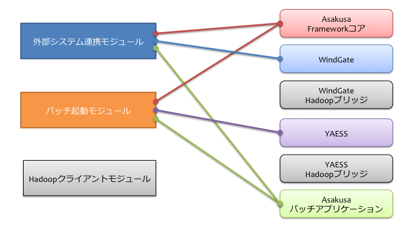

=================================
デプロイメントガイド for WindGate
=================================

この文書では、外部システムとの連携にWindGateを用いる構成における、Asakusa Frameworkとバッチアプリケーションを運用環境にデプロイする手順について解説します。

用語の定義
==========
本書では、マシン構成に関しての用語を以下のように定義します。

  マシン
    それぞれのコンピューターを表します。
    仮想化されたコンピューターであっても構いません。

  モジュール
    特定の役割を持ったソフトウェアです。
    いくつかのコンポーネントを組み合わせて構成します。

  コンポーネント
    Asakusa Frameworkのそれぞれのコンポーネントです。
    Asakusa Frameworkコアや、WindGate、YAESSなどがコンポーネントの単位となります。

モジュール
----------
以下は本ガイドで紹介するモジュール群です。
それぞれのマシンに機能を割り当て、それを実現するモジュールを配置していく形になります。

  Hadoopクライアントモジュール
    Hadoopのジョブ起動や、HDFSなどのHadoopファイルシステムへアクセスを行うためのモジュールです。

    Hadoopのマスターノードやスレーブノード上にクライアントモジュールを配置することもできます。

  外部システム連携モジュール
    外部システムとHadoopクラスター間でデータをやり取りするためのモジュールです [#]_ 。

    このモジュールには :doc:`WindGate <../windgate/index>` を配置し、RDBMSにJDBC経由でアクセスしたり、または前処理で取り込んだCSV形式のデータを利用します。
    また、Hadoopクラスターとデータのやり取りをする際に、Hadoopクライアントモジュールを利用します。

  バッチ起動モジュール
    Asakusa Frameworkで開発したAsakusaバッチアプリケーションを起動するためのモジュールです。

    このモジュールには :doc:`YAESS <../yaess/index>` を配置し、外部システム連携モジュールやHadoopクライアントモジュールにジョブ実行を依頼します。

ひとつのマシン上に複数のモジュールを配置することもできます。
モジュールが異なるマシン上に存在する場合、SSHやJDBC、RPCなどの適切なプロトコルを利用して処理を行います。

..  [#] 外部システム連携モジュールはシステム上に複数用意することもできます。

コンポーネント
--------------
以下は本ガイドでデプロイする対象のコンポーネント群です。
モジュールごとに利用するコンポーネントは異なります。
モジュールを配置したマシンごとに必要なコンポーネントをデプロイしていく形になります。

  Asakusaバッチアプリケーション
    Asakusa Frameworkで作成したアプリケーションです。
    Hadoopクライアントモジュール、外部システム連携モジュール、バッチ起動モジュールのそれぞれが利用します。

  Asakusa Frameworkコア
    Asakusa Framework本体です。
    Hadoopクライアントモジュール、外部システム連携モジュール、バッチ起動モジュールのそれぞれが利用します。

  WindGate
    :doc:`WindGate <../windgate/index>` 本体です。
    外部システム連携モジュールが利用します。

  WindGate Hadoopブリッジ
    WindGateがHadoopと通信するために中継するソフトウェアです。
    Hadoopクライアントモジュールが利用します。

    外部システム連携モジュールとHadoopクライアントモジュールが同じマシン上に配置されている場合、WindGate Hadoopブリッジは不要です。
    この場合、WindGateはHadoopブリッジを経由せず、Hadoopファイルシステムに直接アクセスします。

  YAESS
    :doc:`YAESS <../yaess/index>` 本体です。
    バッチ起動モジュールが利用します。

  YAESS Hadoopブリッジ
    YAESSがHadoopと通信するために中継するソフトウェアです。
    Hadoopクライアントモジュールが利用します。

システム構成の検討
==================
WindGateを用いた場合のシステム構成について、いくつか例を見ていきます。

WindGate/CSVによるシンプルな構成例
----------------------------------
WindGateをローカルのCSVファイルと連携する構成における、シンプルな構成例を以下に示します。

..  figure:: images/deployment-with-windgate-figure1.png

上記の構成では、Hadoopクライアントモジュール、外部システム連携モジュール、バッチ起動モジュールをそれぞれ同じマシン（Hadoopクライアントマシン）上に配置しています。
各モジュール間の通信はマシン内で行われ、HadoopクライアントモジュールはHadoop APIを介してHadoopクラスター上のサービスにアクセスします。

下図は、この構成でHadoopクライアントマシンが利用するコンポーネントの一覧です。

..  note::
    Hadoopクライアントモジュールと外部システム連携モジュールが同一のマシン上に存在するため、WindGate Hadoopブリッジは不要です。

..  attention::
    WindGateはローカルファイル上のCSVファイルに対する入出力の仕組みを提供します。
    WindGateのCSV機能を利用する外部システムは、WindGate(外部システム連携モジュール)がデプロイされている
    マシン上に対して処理対象となるCSVファイルを配置したり、取り込む仕組みを用意する必要があります。

WindGate/RDBMSによるHadoopブリッジを使った構成例
------------------------------------------------
WindGateをRDBMSと連携し、かつHadoopクライアントモジュールと外部システム連携モジュールが異なる場合の構成例を以下に示します。

..  figure:: images/deployment-with-windgate-figure3.png

上記の構成では、前述のHadoopクライアントマシンのほかに、ゲートウェイマシンを導入しています。
ゲートウェイマシンはデータベースとJDBCを利用して通信し、Hadoopクライアントマシン上の各種HadoopブリッジとはSSHを利用して通信しています。
そのため、以下の準備があらかじめ必要です。

* ゲートウェイマシンからデータベースにJDBC経由でアクセスできるようにする
* ゲートウェイマシンからHadoopクライアントマシンにSSH経由（公開鍵認証）でアクセスできるようにする

下図は、この構成でゲートウェイマシンが利用するコンポーネントの一覧です。

同様に、下図はHadoopクライアントマシンが利用するコンポーネントの一覧です。

..  note::
    この構成の利点は、ゲートウェイマシンとHadoopクライアントマシンに異なるセキュリティレベルを設定できる点です。
    ゲートウェイマシン *から* Hadoopクライアントマシンに対してSSHでログイン出来ればよく、
    HadoopクラスターやHadoopクライアントマシンに不正侵入されても、そこからゲートウェイマシンに侵入するにはもう一手間必要です。
    データベースやバッチの起動部分を保護するという点では重要な意味合いがあります。

運用環境の構築
==============
運用環境の構築を以下の流れで説明します。

1. Hadoopクラスターの構築
2. Asakusa Frameworkのデプロイメントアーカイブの作成
3. Asakusa Frameworkのデプロイ
4. Asakusa Framework追加ライブラリのデプロイ
5. Asakusa Framework実行時プラグインの設定
6. WindGateプラグインライブラリのデプロイ
7. WindGateの設定
8. YAESSプラグインライブラリのデプロイ
9. YAESSの設定
10. Hadoopブリッジの設定
11. バッチアプリケーションのデプロイ
12. バッチアプリケーションの実行

Hadoopクラスターの構築
----------------------
Hadoopクラスターを分散モードで動作するように構築します。Hadoopクラスターの具体的な構築手順は、Hadoopを提供している各ディストリビューションのドキュメント等を参考にして下さい。

Hadoopクラスターの構築が完了したら、HadoopクライアントモジュールにAsakusa Framework管理用のOSユーザを作成します。以後、このユーザを *ASAKUSA_USER* と表記します。

*ASAKUSA_USER* からHadoopが提供しているサンプルアプリケーションのジョブをhadoopコマンドを使って実行し、ジョブが正常に実行されることを確認して下さい。

Asakusa Frameworkのデプロイメントアーカイブの作成
-------------------------------------------------
Asakusa Frameworkのデプロイメントアーカイブを用意します。

Asakusa Frameworkのデプロイメントアーカイブの作成や設定は、
使用している開発環境に応じた以下のドキュメントを参照してください。

* Gradleを使った開発環境
   * :doc:`../application/gradle-plugin` - :ref:`deployment-archive-gradle-plugin`
* Mavenを使った開発環境
   * :doc:`framework-organizer` - :ref:`deployment-archive-maven-archetype`

デプロイメントアーカイブのファイル名
~~~~~~~~~~~~~~~~~~~~~~~~~~~~~~~~~~~~
Asakusa Frameworkのデプロイメントアーカイブのファイル名は ``asakusafw-`` から始まるtarファイルですが、
そのファイル名は使用しているビルド環境や構成によって異なります。
    
例えば、Gradleを使った開発環境でAsaksa Framework バージョン ``0.6.2`` を使っている場合、
ファイル名は以下のようになります。

* ``asakusafw-0.6.2.tar.gz``

以降本書では、Asakusa Frameworkのデプロイメントアーカイブ名を使った操作手順例では
デプロイメントアーカイブのファイル名を ``asakusafw-*.tar.gz`` と表記します。

    
Asakusa Frameworkのデプロイ
---------------------------
作成したデプロイメントアーカイブを利用し、Asakusa Frameworkを以下それぞれのモジュールを配置するマシン上にデプロイします。

..  list-table:: Asakusa Frameworkのデプロイが必要なモジュール
    :widths: 10 10
    :header-rows: 1

    * - モジュール名
      - 必要
    * - Hadoopクライアントモジュール
      - ○
    * - 外部システム連携モジュール
      - ○
    * - バッチ起動モジュール
      - ○

Asakusa Frameworkは上記すべてのモジュールから利用しているため、それぞれのモジュールに関連するすべてのマシンにデプロイします。
一台のマシンに複数のモジュールを配置している場合は、マシンごとに1セットだけデプロイします [#]_ 。

Asakusa Frameworkのデプロイ先を環境変数 ``$ASAKUSA_HOME`` とした場合、 ``$ASAKUSA_HOME`` ディレクトリを作成し、
``$ASAKUSA_HOME`` 直下にAsakusa Frameworkのデプロイメントアーカイブ( ``asakusafw-*.tar.gz`` )を展開します。
展開後、 ``$ASAKUSA_HOME`` 配下の ``*.sh`` に実行権限を追加します。

..  code-block:: sh

    mkdir -p "$ASAKUSA_HOME"
    cp asakusafw-*.tar.gz "$ASAKUSA_HOME"
    cd "$ASAKUSA_HOME"
    tar -xzf asakusafw-*.tar.gz
    find "$ASAKUSA_HOME" -name "*.sh" | xargs chmod u+x

..  attention::
    HadoopクライアントモジュールにAsakusa Frameworkをデプロイする際には、
    *ASAKUSA_USER* から利用可能な位置にデプロイしてください。

..  [#] 各モジュールを同一マシン上の異なるOSのユーザ名に割り当てる場合、ユーザごとにAsakusa Frameworkをデプロイしてください。

Asakusa Framework追加ライブラリのデプロイ
-----------------------------------------
Asakusaバッチアプリケーションで利用する共通ライブラリ(Hadoopによって提供されているライブラリ以外のもの)が存在する場合、これらのクラスライブラリアーカイブを以下のモジュールに追加でデプロイします。

..  list-table:: Asakusa Framework追加ライブラリのデプロイが必要なモジュール
    :widths: 10 10
    :header-rows: 1

    * - モジュール名
      - 必要
    * - Hadoopクライアントモジュール
      - ○
    * - バッチ起動モジュール
      - 

追加ライブラリの作成や設定は、
使用している開発環境に応じた以下のドキュメントを参照してください。

* Gradleを使った開発環境
   * :doc:`../application/gradle-plugin` - :ref:`dependency-library-gradle-plugin`
* Mavenを使った開発環境
   * :doc:`../application/maven-archetype` の :ref:`dependency-library-maven-archetype`

Asakusa Framework実行時プラグインの設定
---------------------------------------
以下のモジュールを配置したマシン上で、Asakusa Frameworkの実行時プラグインの設定を行います。

..  list-table:: 実行時プラグインの設定が必要なモジュール
    :widths: 10 10
    :header-rows: 1

    * - モジュール名
      - 必要
    * - Hadoopクライアントモジュール
      - ○
    * - 外部システム連携モジュール
      - 
    * - バッチ起動モジュール
      - 

実行時プラグインの設定についての詳細は、 :doc:`deployment-runtime-plugins` を参考にしてください。

WindGateプラグインライブラリのデプロイ
--------------------------------------
以下のモジュールを配置したマシンに、必要なWindGateのプラグインや依存ライブラリを追加でデプロイします。

..  list-table:: WindGateプラグインライブラリのデプロイが必要なモジュール
    :widths: 10 10
    :header-rows: 1

    * - モジュール名
      - 必要
    * - Hadoopクライアントモジュール
      - 
    * - 外部システム連携モジュール
      - ○
    * - バッチ起動モジュール
      - 

WindGateのデータベース(JDBC)連携を使用する場合は、使用するJDBCドライバライブラリが含まれるJDBCドライバのjarファイルを、 ``$ASAKUSA_HOME/windgate/plugin`` ディレクトリ配下に配置してください。

..  note::
    Asakusa Frameworkのデプロイメントアーカイブには、デフォルトのWindGate用プラグインライブラリとして、
    あらかじめ以下のプラグインライブラリと、プラグインライブラリが使用する依存ライブラリが同梱されています。

    * ``asakusa-windgate-stream`` : ローカルのファイルシステムと連携するためのプラグイン
    * ``asakusa-windgate-jdbc`` : JDBC経由でDBMSと連携するためのプラグイン
    * ``asakusa-windgate-hadoopfs`` : Hadoopと連携するためのプラグイン

WindGateのプラグインライブラリについては、 :doc:`../windgate/user-guide` も参考にしてください。

また、WindGateを利用するには外部システム連携モジュールにHadoopのライブラリが必要です。
Hadoopクライアントモジュールと外部システム連携モジュールが異なるマシン上に存在する場合、
外部システム連携モジュールを配置したマシンにもHadoopをインストールしてください。

..  note::
    外部システム連携モジュールにインストールしたHadoopのサービスを実行する必要はありません。
    WindGateでは、Hadoopに含まれる一部のライブラリのみを利用します。
    Hadoopのインストールについては :doc:`../introduction/start-guide` などが参考になるでしょう。

WindGateの設定
--------------
以下のモジュールを配置したマシン上で、WindGateの設定を環境に応じて行います。

..  list-table:: WindGateの設定が必要なモジュール
    :widths: 10 10
    :header-rows: 1

    * - モジュール名
      - 必要
    * - Hadoopクライアントモジュール
      - 
    * - 外部システム連携モジュール
      - ○
    * - バッチ起動モジュール
      - 

WindGateの設定についての詳細は、 :doc:`../windgate/user-guide` などを参考にしてください。

YAESSプラグインライブラリのデプロイ
-----------------------------------
以下のモジュールを配置したマシンに、必要なYAESSのプラグインや依存ライブラリを追加でデプロイします。

..  list-table:: YAESSプラグインライブラリのデプロイが必要なモジュール
    :widths: 10 10
    :header-rows: 1

    * - モジュール名
      - 必要
    * - Hadoopクライアントモジュール
      - 
    * - 外部システム連携モジュール
      - 
    * - バッチ起動モジュール
      - ○

..  note::
    Asakusa Frameworkのデプロイメントアーカイブには、デフォルトのYAESS用プラグインライブラリとして、
    あらかじめ以下のプラグインライブラリと、プラグインライブラリが使用する依存ライブラリが同梱されています。

    * ``asakusa-yaess-paralleljob`` : ジョブを並列実行のためのプラグイン
    * ``asakusa-yaess-jsch`` : SSH経由でジョブを起動するためのプラグイン
    * ``jsch`` : ``asakusa-yaess-jsch`` が依存するSSH接続用ライブラリ
    * ``asakusa-yaess-flowlog`` : ジョブフローごとに進捗状況を個別ファイルに出力するためのプラグイン
    * ``asakusa-yaess-multidispatch`` : ジョブの実行クラスタの振り分けを行うためのプラグイン

YAESSのプラグインライブラリについては、 :doc:`../yaess/user-guide` も参考にしてください。

YAESSの設定
-----------
以下のモジュールを配置したマシン上で、YAESSの設定を環境に応じて行います。

..  list-table:: YAESSの設定が必要なモジュール
    :widths: 10 10
    :header-rows: 1

    * - モジュール名
      - 必要
    * - Hadoopクライアントモジュール
      - 
    * - 外部システム連携モジュール
      - 
    * - バッチ起動モジュール
      - ○

YAESSの設定についての詳細は、 :doc:`../yaess/user-guide` などを参考にしてください。

..  note::
    リモートマシン上のWindGateやHadoopを利用する場合、 ``...env.ASAKUSA_HOME`` の値には
    リモートマシンで `Asakusa Frameworkのデプロイ`_ を行ったパスを指定してください。

Hadoopブリッジの設定
--------------------
以下のモジュールを配置したマシン上で、WindGateやYAESSが利用するHadoopブリッジの設定を行います。

..  list-table:: Hadoopブリッジの設定が必要なモジュール
    :widths: 10 10
    :header-rows: 1

    * - モジュール名
      - 必要
    * - Hadoopクライアントモジュール
      - ○
    * - 外部システム連携モジュール
      - 
    * - バッチ起動モジュール
      - 

WindGateのHadoopブリッジについては :doc:`../windgate/user-guide` などを参考にしてください。
YAESSのHadoopブリッジについては :doc:`../yaess/user-guide` などを参考にしてください。

..  note::
    WindGateが直接Hadoopファイルシステムを参照する ( ``resource.hadoop=com.asakusafw.windgate.hadoopfs.HadoopFsProvider`` ) 場合、
    WindGateのHadoopブリッジに関する設定は不要です。

バッチアプリケーションのデプロイ
--------------------------------
開発したバッチアプリケーションデプロイするには、
あらかじめデプロイ対象のバッチアプリケーションアーカイブを作成しておきます。

バッチアプリケーションアーカイブの作成は、
使用している開発環境に応じた以下のドキュメントを参照してください。

* Gradleを使った開発環境
   * :doc:`../application/gradle-plugin` - :ref:`batch-compile-gradle-plugin`
* Mavenを使った開発環境
   * :doc:`../application/maven-archetype` の :ref:`batch-compile-maven-archetype`

作成したバッチアプリケーションアーカイブを利用して、それぞれのバッチアプリケーションを以下のモジュールを配置したマシン上にデプロイします。

..  list-table:: バッチアプリケーションのデプロイが必要なモジュール
    :widths: 10 10
    :header-rows: 1

    * - モジュール名
      - 必要
    * - Hadoopクライアントモジュール
      - ○
    * - バッチ起動モジュール
      - ○

バッチアプリケーションアーカイブは ``$ASAKUSA_HOME/batchapps/`` ディレクトリ直下にJARファイルを展開して配置します。

..  warning::
    デプロイ対象とするjarファイルを間違えないよう注意してください。
    デプロイ対象ファイルは ``${baseName}-batchapps-${version}.jar`` のようにファイル名に **batchapps** が付くjarファイルです。

..  note::
    アプリケーションのビルドとデプロイについては、 :doc:`../introduction/start-guide` の「サンプルアプリケーションのビルド」「サンプルアプリケーションのデプロイ」も参考にしてください。

以下は ``/tmp/asakusa-app/example-app-batchapps.jar`` にアプリケーションアーカイブがある前提で、
それに含まれるバッチアプリケーションをデプロイする例です。

..  code-block:: sh

    cp /tmp/asakusa-app/example-app-batchapps.jar "$ASAKUSA_HOME/batchapps"
    cd "$ASAKUSA_HOME/batchapps"
    jar -xf example-app-batchapps.jar
    rm -f example-app-batchapps.jar
    rm -fr META-INF

..  note::
    ``$ASAKUSA_HOME/batchapps`` ディレクトリ直下にはバッチIDを示すディレクトリのみを配置するとよいでしょう。
    上記例では、展開前のjarファイルや、jarを展開した結果作成されるMETA-INFディレクトリなどを削除しています。

バッチアプリケーションの実行
----------------------------
最後に、デプロイしたバッチアプリケーションをYAESSで実行します。

実行方法は、 :doc:`../introduction/start-guide` の「サンプルアプリケーションの実行」で説明したYAESSの実行方法と同じです。
``$ASAKUSA_HOME/yaess/bin/yaess-batch.sh`` コマンドにバッチIDとバッチ引数を指定して実行します。

YAESSの詳しい利用方法については :doc:`../yaess/user-guide` を参照してください。

