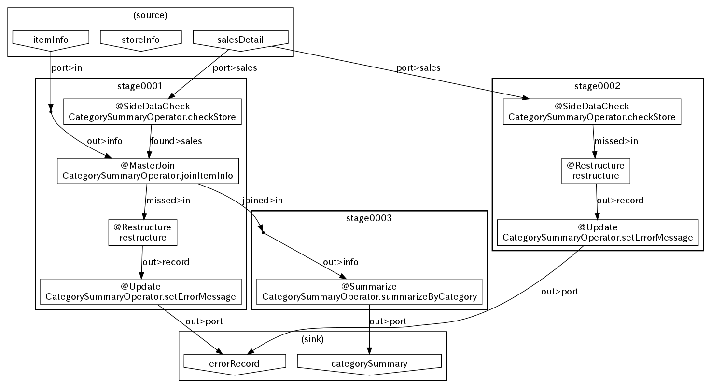
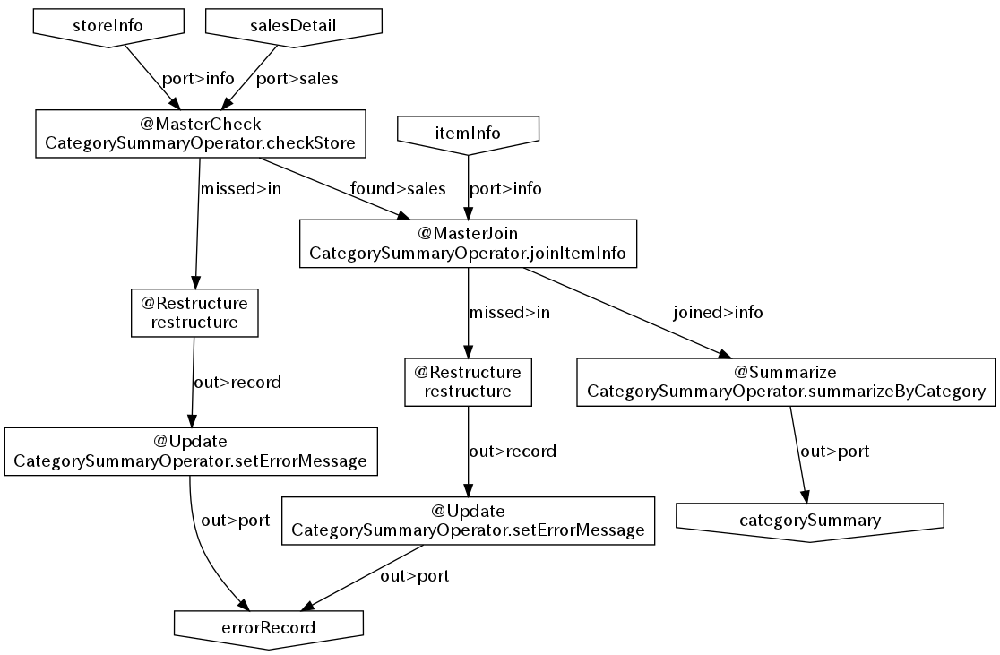

===================
Asakusa DSLの可視化
===================

この文書では、Asakusa DSLの分析を行うにあたって、Asakusa Frameworkが提供するDSLの可視化の仕組みについて解説します。

..  attention::
    Asakusa Framework バージョン |version| では、本書で説明する機能はMapReduce DSLコンパイラで使用可能です。Spark DSLコンパイラには含まれていません。

Asakusa DSLの分析用ファイル
===========================

Asakusa DSLをバッチコンパイルして生成したバッチアプリケーションアーカイブファイル [#]_ には、Asakusa DSLの分析用ファイルが含まれています。
この分析用ファイルは、バッチアプリケーションの構造を把握したり、アプリケーション実行時に発生した問題箇所の特定を行うことを補助します。

分析用ファイルは、バッチアプリケーションアーカイブファイル内の :file:`<バッチID>/opt/dsl-analysis` ディレクトリ配下に配置されています [#]_ 。
各分析用ファイルの説明を以下に示します。
なお、以下に示すファイルのうち、dotファイルについては後述の `Graphvizによるグラフの生成`_ を参照してグラフ形式として出力することも可能です。

..  list-table:: dotスクリプトファイル一覧
    :widths: 4 6
    :header-rows: 1

    * - ファイル名
      - 説明
    * - :file:`batch/compiled-structure.txt`
      - バッチコンパイルした結果のバッチ構造を示すテキストファイル
    * - :file:`batch/compiled-structure.dot`
      - バッチコンパイルした結果のバッチ構造を示すdotファイル
    * - :file:`batch/compiled-merged-structure.dot`
      - バッチコンパイルした結果のバッチ構造を示すdotファイル。同一の演算子を単一のノードとして表現する。
    * - :file:`batch/original-structure.txt`
      - バッチコンパイル前のバッチ構造を示すテキストファイル
    * - :file:`batch/original-structure.dot`
      - バッチコンパイル前のバッチ構造を示すdotファイル
    * - :file:`batch/original-merged-structure.txt`
      - バッチコンパイル前のバッチ構造を示すテキストファイル。同一の演算子を単一のノードとして表現する。
    * - :file:`jobflow/<フローID>/flowgraph.dot`
      - フローの入出力を示すdotファイル
    * - :file:`jobflow/<フローID>/stagegraph.dot`
      - ステージ全体の構造を示すdotファイル
    * - :file:`jobflow/<フローID>/stageblock-XX.dot`
      - 各ステージ単位の構造を示すdotファイル

..  [#] バッチアプリケーションアーカイブファイルを生成する方法については、 :doc:`gradle-plugin` を参照してください。
..  [#] バッチアプリケーションアーカイブファイルから分析用ファイルを取り出すには、jarコマンド等を使用してアーカイブファイルから分析用ファイルを抽出してください。
        なお、プロジェクトをバッチコンパイルした環境では、プロジェクトのビルドディレクトリ配下の :file:`batchc/<バッチID>/opt/dsl-analysis` ディレクトリに分析用ファイルが出力されています。

.. _create-graph-with-graphviz:

Graphvizによるグラフの生成
==========================

グラフ生成ツールである Graphviz [#]_ を使用して、dotファイルからグラフファイルを生成する方法を説明します。

..  [#] http://www.graphviz.org/

Graphvizのインストール
----------------------

開発環境にGraphvizをインストールします。UbuntuにGraphvizをインストールする例を以下に示します。

..  code-block:: sh

    sudo apt-get install graphviz

Graphvizの詳細やインストール方法は上記のGraphvizのサイト等を参照して下さい。

dotスクリプトからグラフファイルを作成する
=========================================

Graphvizを使って、dotファイルからPDF形式 [#]_ でグラフを作成する例を以下に示します。

..  code-block:: sh

    # バッチアプリケーションアーカイブファイルを解凍する
    jar -xf example-app-batchapps-1.0-SNAPSHOT.jar
    # バッチアプリケーションアーカイブに含まれるdotファイルをPDFに変換する
    cd example.summarizeSales/opt/dsl-analysis/jobflow/byCategory
    dot -Tpdf -o stagegraph.pdf stagegraph.dot

..  [#] GraphvizではPDF形式の他に、 PNGやJPEG形式など様々な形式でグラフを出力することができます。詳しくは Graphviz のマニュアルなどを参照してください。

グラフの出力例
==============

分析用ファイルから生成することができるグラフの出力例を紹介します。

ステージグラフ
--------------

:file:`jobflow/<フローID>/stagegraph.dot` は、ジョブフローが持つステージ [#]_ 全体の構造を示すグラフを提供します。

ステージ全体の構造のうち、特定のステージのみのグラフを参照したい場合は、 :file:`jobflow/<フローID>/stageblock-XX.dot` を参照します。

..  [#] ステージとはAsakusa DSLをバッチコンパイルした結果生成されるバッチアプリケーションに含まれるMapReduceジョブの単位です。
        詳しくは :doc:`../dsl/user-guide` - :ref:`compiled-batch-application-components` などを参照してください。

フローグラフ
------------

:file:`jobflow/<フローID>/flowgraph.dot` は、ジョブフローの入出力、及びジョブフローに含まれる演算子間の入出力の関係を示すグラフを提供します。

バッチ構造を示すテキストファイルの出力例
========================================

分析用ファイルに含まれるバッチ構造を示すテキストファイルの例を紹介します。

バッチコンパイル前のバッチ構造
------------------------------

:file:`batch/original-structure.txt` はバッチコンパイル前のバッチ構造を示します [#]_ 。

..  code-block:: none

    batch: example.summarizeSales
    flow: byCategory
        input:
            salesDetail (hoge.jobflow.SalesDetailFromCsv)
            itemInfo (hoge.jobflow.ItemInfoFromCsv)
            storeInfo (hoge.jobflow.StoreInfoFromCsv)
        output:
            categorySummary (hoge.jobflow.CategorySummaryToCsv)
            errorRecord (hoge.jobflow.ErrorRecordToCsv)
        flow: hoge.jobflow.CategorySummaryJob
            operator: hoge.operator.CategorySummaryOperator#setErrorMessage([class hoge.modelgen.dmdl.model.ErrorRecord, class java.lang.String])[message[class java.lang.String]=店舗不明]
            input: InputDescription{name=itemInfo, type=class hoge.modelgen.dmdl.model.ItemInfo}
            output: OutputDescription{name=errorRecord, type=class hoge.modelgen.dmdl.model.ErrorRecord}
            input: InputDescription{name=salesDetail, type=class hoge.modelgen.dmdl.model.SalesDetail}
            output: OutputDescription{name=categorySummary, type=class hoge.modelgen.dmdl.model.CategorySummary}
            input: InputDescription{name=storeInfo, type=class hoge.modelgen.dmdl.model.StoreInfo}
            operator: com.asakusafw.vocabulary.flow.util.CoreOperatorFactory$Restructure#toString([])[]
            operator: com.asakusafw.vocabulary.flow.util.CoreOperatorFactory$Restructure#toString([])[]
            operator: hoge.operator.CategorySummaryOperator#summarizeByCategory([class hoge.modelgen.dmdl.model.JoinedSalesInfo])[]
            operator: hoge.operator.CategorySummaryOperator#checkStore([class hoge.modelgen.dmdl.model.StoreInfo, class hoge.modelgen.dmdl.model.SalesDetail])[]
    ...

..  [#] バッチコンパイル前のバッチ構造はdotファイルによるグラフ形式も利用することができますが、テキストファイル形式のほうがより詳細な情報が含まれています。

バッチコンパイル後のバッチ構造
------------------------------

:file:`batch/compiled-structure.txt` はバッチコンパイル後のバッチ構造を示します [#]_ 。

..  code-block:: none

    batch: example.summarizeSales
    flow: byCategory
        input:
            salesDetail (hoge.jobflow.SalesDetailFromCsv)
            itemInfo (hoge.jobflow.ItemInfoFromCsv)
            storeInfo (hoge.jobflow.StoreInfoFromCsv)
        output:
            categorySummary (hoge.jobflow.CategorySummaryToCsv)
            errorRecord (hoge.jobflow.ErrorRecordToCsv)
        stages:
            prologue:
            main:
                stage: hoge.batchapp.example.summarizeSales.byCategory.stage0001.StageClient
                    mapper: hoge.batchapp.example.summarizeSales.byCategory.stage0001.StageMapper1
                        fragment: hoge.batchapp.example.summarizeSales.byCategory.stage0001.MapFragment1
                    mapper: hoge.batchapp.example.summarizeSales.byCategory.stage0001.StageMapper2
                        fragment: hoge.batchapp.example.summarizeSales.byCategory.stage0001.MapFragment2
                            operator: hoge.operator.CategorySummaryOperator#checkStore([class hoge.modelgen.dmdl.model.StoreInfo, class hoge.modelgen.dmdl.model.SalesDetail])[]
                                side-data: storeInfo (hoge.jobflow.StoreInfoFromCsv)
                    reducer: hoge.batchapp.example.summarizeSales.byCategory.stage0001.StageReducer
                        fragment: hoge.batchapp.example.summarizeSales.byCategory.stage0001.ReduceFragment4
                            operator: hoge.operator.CategorySummaryOperator#joinItemInfo([class hoge.modelgen.dmdl.model.ItemInfo, class hoge.modelgen.dmdl.model.SalesDetail])[]
                        fragment: hoge.batchapp.example.summarizeSales.byCategory.stage0001.MapFragment3
                            operator: com.asakusafw.vocabulary.flow.util.CoreOperatorFactory$Restructure#toString([])[]
                            operator: hoge.operator.CategorySummaryOperator#setErrorMessage([class hoge.modelgen.dmdl.model.ErrorRecord, class java.lang.String])[message[class java.lang.String]=商品不明]
                stage: hoge.batchapp.example.summarizeSales.byCategory.stage0002.StageClient
                    mapper: hoge.batchapp.example.summarizeSales.byCategory.stage0002.StageMapper1
                        fragment: hoge.batchapp.example.summarizeSales.byCategory.stage0002.MapFragment1
                            operator: hoge.operator.CategorySummaryOperator#checkStore([class hoge.modelgen.dmdl.model.StoreInfo, class hoge.modelgen.dmdl.model.SalesDetail])[]
                                side-data: storeInfo (hoge.jobflow.StoreInfoFromCsv)
                        fragment: hoge.batchapp.example.summarizeSales.byCategory.stage0002.MapFragment2
                            operator: com.asakusafw.vocabulary.flow.util.CoreOperatorFactory$Restructure#toString([])[]
                            operator: hoge.operator.CategorySummaryOperator#setErrorMessage([class hoge.modelgen.dmdl.model.ErrorRecord, class java.lang.String])[message[class java.lang.String]=店舗不明]
                stage: hoge.batchapp.example.summarizeSales.byCategory.stage0003.StageClient
                    mapper: hoge.batchapp.example.summarizeSales.byCategory.stage0003.StageMapper1
    ...
    
..  [#] バッチコンパイル後のバッチ構造はdotファイルによるグラフ形式も利用することができますが、テキストファイル形式のほうがより詳細な情報が含まれています。
