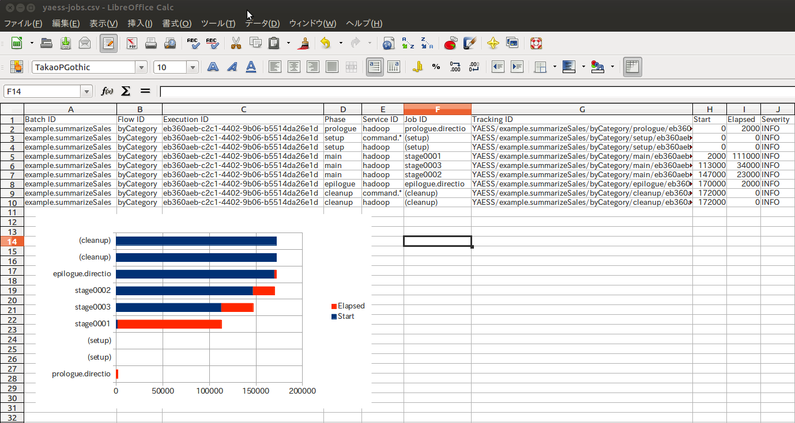

=================
YAESSログの可視化
=================

..  attention::
    バージョン 0.8.1 より、 YAESSログの可視化の利用は非推奨となりました。

この文書では、 :doc:`YAESS <../yaess/index>` を実行した際のログを分析する際に有用な、YAESS Log Analyzerツールの使い方について解説します。

..  attention::
    Asakusa Framework バージョン |version| では、 YAESS Log Analyzerツールは試験的機能として提供されています。

YAESSログのファイル出力
=======================

YAESS Log Analyzerツールを利用するには、適切なフォーマットでYAESS実行時のログファイルを出力する必要があります。

:file:`$ASAKUSA_HOME/yaess/conf/logback.xml` を以下のように編集し、適切なログファイルを出力できるようにしてください。

..  literalinclude:: yaess-attachment/logback.xml
    :language: xml

..  hint::
    Asakusa Frameworkに標準で添付されているログ設定でも、標準出力をファイルにリダイレクトすることで本ツールを利用できます。

..  note::
    より詳しく言うと、YAESS Log Analyzerツールが対象とするログの形式は以下のようなものです。

    * 各ログレコードが1行以内に収まっている
    * 行の先頭に ``yyyy/MM/dd HH:mm:ss`` 形式の時刻が含まれている
    * 行の末尾にYAESSログメッセージの本体 ( ``[YS-????-????] ...``) が含まれている

    なお本ツールは、上記を満たさない行を単純に読み飛ばします。

YAESS Log Analyzerの実行
========================

YAESS Log Analyzerツールを利用するには、コマンドラインコンソールから、アプリケーション開発プロジェクト上で以下のコマンドを実行します。

..  code-block:: sh

    ./gradlew summarizeYaessJob --input <YAESSのログファイル>

上記のコマンドを実行すると、アプリケーションプロジェクト配下の :file:`build/reports/yaess-jobs.csv` にCSV形式のレポートファイルが生成されます。

また、出力先を指定したい場合には、以下のように実行します。

..  code:: sh

    ./gradlew summarizeYaessJob --input <YAESSのログファイル> --output <出力先パス>

レポートファイルには、以下のカラムが定義されています。

..  list-table:: YAESS Log Analyzerの出力ファイル形式
    :widths: 4 6
    :header-rows: 1

    * - カラム名
      - 概要
    * - ``Batch ID``
      - 対象のバッチのバッチID
    * - ``Flow ID``
      - 対象のジョブフローのフローID
    * - ``Execution ID``
      - 対象のジョブフローの実行ID
    * - ``Phase``
      - 対象のステージのフェーズ
    * - ``Service ID``
      - 対象のステージを実行したサービスID [#]_
    * - ``Job ID``
      - 対象のステージのジョブID
    * - ``Tracking ID``
      - 対象のステージを一意に識別するID
    * - ``Start``
      - 開始時刻 (ms) [#]_ [#]_
    * - ``Elapsed``
      - 所要時間 (ms)
    * - ``Severity``
      - 対象のステージの最大ログレベル

..  [#] ここには通常、 :file:`$ASAKUSA_HOME/yaess/conf/yaess.properties` 内で設定したプロファイルの名前が記載されます。
..  [#] この時刻は、ログファイルに含まれる最初のステージを ``0`` として、そこからの相対時刻が記載されます。
        ログファイルにバッチを複数回実行したログレコードが含まれている場合、最初に実行したバッチからの相対時刻となることに注意してください。
..  [#] 現在のバージョンでは、 開始時刻と所要時間はログのタイムスタンプを(ミリ秒単位ではなく)秒単位で解析した結果を出力するため、ミリ秒単位の情報は欠落します。
        例えば、ある時点で開始したジョブが同じ秒の間に終了した場合、所要時間の欄には ``0`` と表示されます。

レポートファイルの例
--------------------

以下はレポートファイルの例です。
見やすいように、併せて棒グラフを表示しています。

