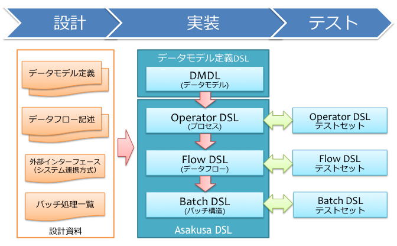

==========
開発の流れ
==========

この文書では、はじめてAsakusa Frameworkを使ったバッチアプリケーションを開発するユーザー向けに、Asakusa Frameworkを使った開発の流れを紹介します。

Asakusa Frameworkを使ったアプリケーションの開発の流れの概要を、下図に示します。

アプリケーションの設計
======================

本書では設計については、Asakusa Frameworkに直接関係あるトピックに対してのみ、その概要を簡単に説明します。バッチの運用設計やシステムアーキテクチャ設計などについては、本書では説明しません。

バッチ処理一覧
--------------

あるシステムに対して提供されるバッチの一覧とその概要を洗い出します。
ここから、ユーザーが実行するバッチの単位（もしくは、ワークフローエンジンやYAESSなどのバッチを実行するためのツールが認識する単位）を決定します。

Asakusa Frameworkでは、このバッチの実行単位毎にAsakusa DSLの最上位のDSLであるバッチDSLを作成し、固有のIDを設定します。

外部インターフェース
--------------------

バッチアプリケーションは何かしらの外部システムから処理対象データを入力し、また実行結果を外部システムに出力します。
ここでは連携する外部システムとの入出力方式に関する検討を行います。

Asakusa Frameworkには、Hadoopが管理する分散ファイルシステム上に配置したデータに対して、 :doc:`Direct I/O <../directio/index>` というデータ入出力機能を利用してデータを読み書きすることができます。

Direct I/OはHadoopを利用する上での様々な最適化機構を備えており、またデータ入出力に外部システム連携ツールを経由しないため高速に動作するというメリットがある反面、データの投入や保全などの運用面を個別に考える必要があります。

また、Asakusa Frameworkには、外部システムと連携するためのツールとして :doc:`WindGate <../windgate/index>` という外部システム連携ツールが標準で同梱されています。

WindGateは「ポータブルなデータ転送ツール」を目指したもので、さまざまなRDBMSやローカルファイルシステム上のフラットファイルなどを利用できますが、特定環境向けの最適化を行っておらず、大容量データの入出力には不向きです。

以下はフラットファイルをデータの入出力に利用する際に、Direct I/OとWindGateの特性を比較したものです。

..  list-table:: 外部システム連携の比較 (フラットファイル)
    :widths: 10 50 50
    :header-rows: 1

    * - 特徴
      - Direct I/O
      - WindGate

    * - メリット

      - * Hadoopの性能を生かして高速に動作する

      - * ファイルストレージとHadoopを柔軟な構成で配置して利用できる

    * - デメリット

      - * ファイルをHadoopから直接参照できる場所に配置する必要がある

      - * Direct I/Oに性能面で劣る

以上を考慮して、バッチ処理のデータ入出力に利用する構成を検討します。

また、バッチ処理が失敗したときのロールバック、リカバリーの単位などを考慮しながら、外部システムと連携して一連の処理を行う単位と、この単位で入力および出力を行うデータを決定します。
Asakusa Frameworkではこの処理単位を「ジョブフロー」として定義します。

また、Asakusa Frameworkでは、入力データに対してそのデータサイズを指定することで処理の最適化を行う仕組みが提供されているため、この時点でおおよその入力データの種類毎のデータサイズを把握しておくとよいでしょう。

データフロー記述
----------------

あるデータに対する処理について、入力となるデータ、入力データに対する処理の内容、出力となるデータを定義し、その流れを記述します。

Asakusa Frameworkでは、バッチの処理をデータフローの形式で記述します。
そのため、バッチ処理の流れを設計する際にも、あらかじめデータフローに近い形式で記述しておくのがよいでしょう。
それぞれのデータフローでは、入力された（複数の）データをどのように加工して、最終的にどこに出力するかということを記述します。

データを加工する部分は、Asakusa Frameworkでは「演算子」として実装することになります。
演算子には、データの内容を書きかえるような単純なものや、複数のデータの流れを特定のプロパティでグループ化し、さらにそれらのグループを結合するような複雑なものもあります。

Asakusa Frameworkではデータフローの一部を共通化して、データフローを部品化して扱うことも出来ます。
Asakusa Frameworkでは、共通化されたデータフロー部品を「フロー部品」と呼びます。
データフローを記述する際にはこういった点も考慮するとよいでしょう。

データモデル定義
----------------

バッチアプリケーションが扱う入力データ、出力データの項目レベルの定義を行います。

外部システムとの連携がDBMSの場合はデータベースのE/R設計、ファイルによる連携の場合はファイルフォーマットに合わせて定義することになるでしょう。

アプリケーションの実装
======================

Asakusa Frameworkを使ったバッチアプリケーションの実装の流れを見ていきます。

アプリケーションプロジェクトの作成とビルド
------------------------------------------

バッチアプリケーションのソースコード一式を作成・管理するためのプロジェクトを作成します。

:doc:`../application/gradle-plugin` には、アプリケーションプロジェクトの作成やビルドに関する内容が記載されています。

データモデル定義DSLの記述
-------------------------

データモデル定義に基づいて、Asakusa Frameworkが提供するデータモデル記述言語(DMDL)を記述します。
また、記述したDMDLからデータモデルクラスを自動生成します。
作成したデータモデルクラスは、後述するAsakusa DSLで処理の入力、及び出力対象のオブジェクトとして利用します。

:doc:`../dmdl/start-guide` には、DMDLの記述およびデータモデルクラスの作成に関する基本的な内容が記載されています。

Asakusa DSLの記述
-----------------

Asakusa Frameworkでアプリケーションを作成するには、 Asakusa DSLで処理の内容やデータフロー、データの入出力方式を定義します。

Asakusa DSLでは、データフローの最小単位で、主にデータの加工を行う演算子（Operator DSL）の記述、演算子を組み合わせてデータフローの構造を記述し、外部システムとの入出力データ定義を行うジョブフロー/フロー部品（Flow DSL）、バッチの構造の記述（Batch DSL）をそれぞれ行います。

:doc:`../dsl/start-guide` には、Asakusa DSLの記述に関する基本的な内容が記載されています。

アプリケーションのテスト
------------------------

Asakusa Frameworkは、Asakusa DSLの単位でテストを行うための仕組みが提供されています。

Operator DSLついては、通常のJavaのクラスと同様にテストを行うことが出来ます。
Flow DSLおよびBatch DSLについては、DSLをHadoopや外部システム連携モジュール上で実行可能な形式にコンパイルし、テストツールと連携してテストを行う TestDriver と呼ばれるテスト部品を使用してテストを行います。

TestDriverを利用したテストは、テストセットとして、JUnitなどのテストハーネス上でTestDriver APIを使用したテストクラス、およびテストの入力データ、テスト結果の期待値、及びテスト検討のルールを定義したテストデータを作成します。
TestDriver APIでは、テストデータをExcelやJSONファイルとして作成するための仕組みが提供されています。

:doc:`../testing/start-guide` には、アプリケーションのテストに関する基本的な内容が記載されています。

外部システム連携
----------------

Asakusa DSLのジョブフローについては、外部システムとの連携についての定義を行います。
また、アプリケーションのテストを行う際に、外部システム連携の構成によっては外部システム連携モジュールに適切な設定を行う必要があります。

外部システム連携モジュールの利用方法については、以下のドキュメントを参照してください。

* :doc:`../directio/start-guide`
* :doc:`../windgate/start-guide`

運用環境の構築とアプリケーションの実行
======================================

開発したバッチアプリケーションを運用環境（Hadoopクラスター、及び外部システムとの連携）で実行する準備を行います。
運用環境の構築については、以下のドキュメントを参照してください。

* :doc:`../administration/deployment-guide`

運用環境の構築が完了したら、バッチアプリケーションを実行してみましょう。

:doc:`../yaess/start-guide` には、Asakusa Frameworkが提供するバッチ実行ツールの基本的な説明が記載されています。
