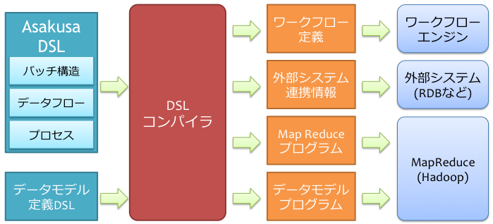
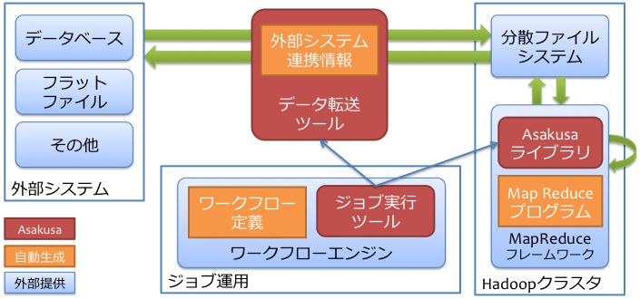

=====================
Asakusa Framework概観
=====================

Asakusa Frameworkは、基幹向けの分散バッチアプリケーションを開発する目的で作成されたフレームワークです。

従来の基幹向けバッチアプリケーション開発では、信頼性の高い汎用機を利用したり、集中型のリレーショナルデータベースを利用したりと、いずれも取り扱うデータが大きくなるにつれて時間内の処理が難しくなっていくという問題を抱えていました。
そこで、Asakusa Frameworkでは分散処理の技術を取り入れ、複数コンピューターの計算資源を組み合わせてそのようなバッチ処理を高速に行えるようにしています。

現在のところ、Asakusa Frameworkはバッチ処理基盤にHadoop [#]_ を採用しています。
Hadoopは信頼性の高い、スケーラブルな分散処理基盤を提供する目的で作成されたオープンソースソフトウェアで、現在さまざまな分野で利用されています。

Asakusa Frameworkでは、基幹向けのバッチアプリケーションの作成を主眼に置いた、独自のドメイン特化言語(Domain Specific Language, DSL)を利用してアプリケーションを作成します。
このDSLはプログラミング言語Javaを基礎に作成していて、Hadoopや分散処理特有のプログラムをほとんど記述することなく、シンプルなJavaのプログラムの組み合わせから複雑なHadoop上のアプリケーションを作成できます。

..  [#] http://hadoop.apache.org/

Asakusa Frameworkの構成
=======================

Asakusa Frameworkは、 `Asakusa DSL`_ を中心としたフレームワークです。
Asakusa DSLはデータフロー形式のバッチ処理を記述することに特化した言語で、次のような特徴があります。

* データフロー内のそれぞれの処理をJavaプログラムとして記述できる
* データフローをデータフロー図と似た形式でそのまま記述できる

上記のような特徴を持つAsakusa DSLや、その他バッチ処理内で利用するデータモデルを定義するためのDSLを作成し、それぞれのDSLを処理するコンパイラに渡します。
このコンパイラは、DSLの内容を解析して、以下のような情報を出力します。

ワークフロー定義
    作成したバッチアプリケーション全体の処理の流れを表す情報です。
    ワークフローエンジンにこの情報を渡すことで、Asakusa Frameworkが生成する複雑なバッチの構造もワークフローエンジンで処理できるようになります。
    詳しくは `バッチ実行ツール`_ などを参照してください。
外部システム連携情報
    バッチ処理内で利用するデータや、バッチ処理の結果データを外部システムとやり取りするための情報です。
    Asakusa Frameworkでは外部システムとシームレスに連携して、バッチ処理を作成するための仕組みが用意されています。
    詳しくは `外部システム連携`_ などを参照してください。
MapReduceプログラム
    入力されたデータをHadoop上で処理するためのプログラムです。
    Asakusa DSLで記述されたデータフロー構造のプログラムは、コンパイラによってMapReduceのプログラム群に変換されます。
    詳しくは `Asakusa DSL`_ などを参照してください。
データモデルプログラム
    外部システム連携やMapReduceプログラム内で利用されるデータモデルを表すプログラムです。
    Hadoopや外部システム内では別々の方式で処理が行われますが、それらをつなぐのがこのデータモデルです。
    詳しくは `データモデル定義DSL`_ などを参照してください。

以下は、上記の内容を俯瞰する図です。

また、実行時にはそれぞれのコンポーネントに対し、DSLから生成されたそれぞれの情報を渡します。
それぞれのコンポーネントは、これらの情報を元にバッチアプリケーションを分散システム上で協調しながら処理を進めていきます。

Asakusa Frameworkのコンポーネント
=================================

Asakusa Frameworkは主に以下のようなコンポーネントの組み合わせで成り立っています。

* `Asakusa DSL`_
* `データモデル定義DSL`_
* `自動テストサポート`_
* `外部システム連携`_
* `バッチ実行ツール`_

Asakusa DSL
-----------

Asakusa DSLは基幹向けのバッチ処理アプリケーションを作成するために開発されたDSLで、Asakusa Frameworkの中心を担っています。
それぞれのバッチアプリケーションは、Asakusa DSLが提供する「語彙」を拡張したり組み合わせたりしてプログラムを記述し、最後に記述したプログラムをコンパイラに渡して、実行に必要なさまざまな情報を生成します。

Asakusa DSLについての詳しい情報は、 :doc:`../dsl/index` を参照してください。

データモデル定義DSL
-------------------

データモデル定義DSL (Data Model Definition Language: DMDL)はAsakusa DSL内で利用するデータモデルプログラムを作成するための言語です。
データモデルが持つ構造を単純な方法で記述でき、そこから以下のような情報を生成します。

* Hadoopの直列化形式
* Javaの標準的なメソッド
* `外部システム連携`_ で利用するデータ変換ロジック
* `自動テストサポート`_ で利用するテンプレート

データモデル定義DSLについての詳しい情報は、 :doc:`../dmdl/index` を参照してください。

外部システム連携
----------------

外部システム連携は基幹システムでのバッチアプリケーションの肝ともなる部分で、Asakusa Frameworkでは以下のツールや機能を提供しています。

WindGate
    ローカルファイルシステム上のフラットファイルや、JDBC経由でのデータベースアクセスなど、単純なデータソースとの連携を前提としたツール。

    詳しくは :doc:`../windgate/index` を参照してください。

ThunderGate
    オンラインシステムで利用するMySQL [#]_ データベースとの連携を前提としたツール。
    ロングランニングトランザクションやロック、キャッシュなどの仕組みなどを持つ代わりに、ツール特有のテーブル構造が必要。

    詳しくは :doc:`../thundergate/index` を参照してください。

Direct I/O
    Asakusa Frameworkの外でHadoopやその周辺に取り込んだデータを直接読み書きする機能。

    詳しくは :doc:`../directio/index` を参照してください。

なお、これらのツールとの連携はAsakusa DSLから記述できます。

..  [#] http://www.mysql.com/

自動テストサポート
------------------

Asakusa Frameworkには、Asakusa DSLで記述したアプリケーションの自動テストツールが含まれています。

バッチアプリケーションでは、通常、外部システム連携と複雑な業務ロジックを組み合わせて一連の処理を行います。
そのようなアプリケーションに対し、この自動テストツールは以下のような処理を行います。

* バッチアプリケーションをビルドする
* 定義されたテストデータを外部システムに流し込む
* バッチアプリケーション全体を実行する
* 外部システムから結果データを取り出す
* 結果データを検証してレポートする

さらに、このテストツールは統合開発環境(IDE)やビルドツール内からも利用できます。
そのため、開発の早い時期から積極的にテストを行え、また自動ビルドの環境も無理なく用意できるようになっています。

自動テストサポートについての詳しい情報は、 :doc:`../testing/index` を参照してください。

バッチ実行ツール
----------------

Asakusa Frameworkが生成する情報は、外部システム連携やMapReduceなど様々なもので、さらにそれらはジョブネットの構造を持っています。
そのようなバッチを統一された方法で実行する手段として、現在は YAESS というツールを提供しています。

YAESSについての詳しい情報は、 :doc:`../yaess/index` を参照してください。
