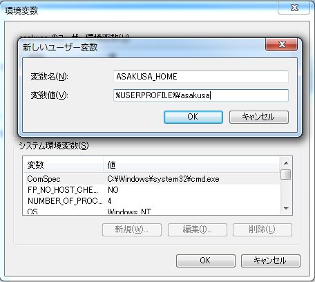
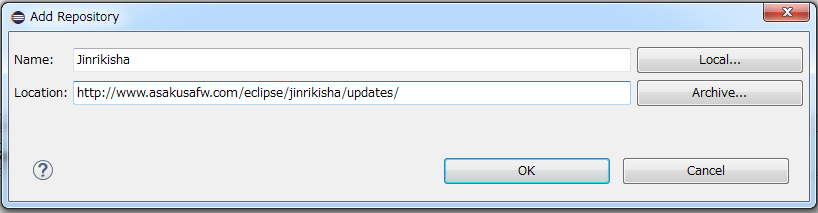
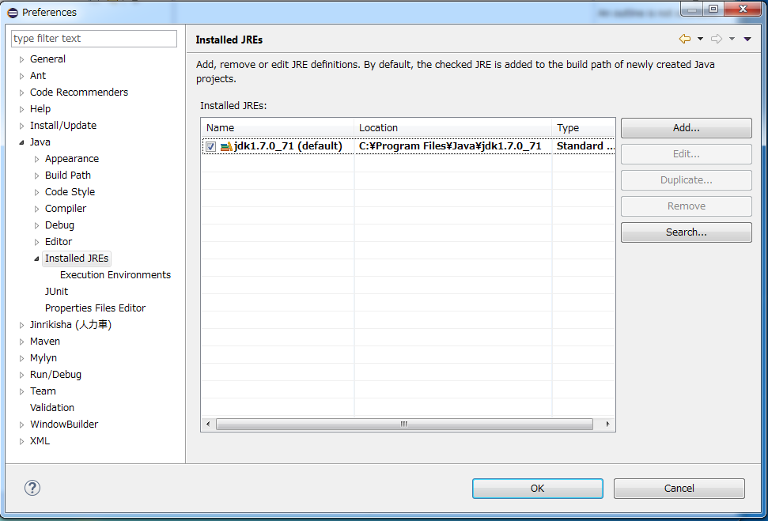
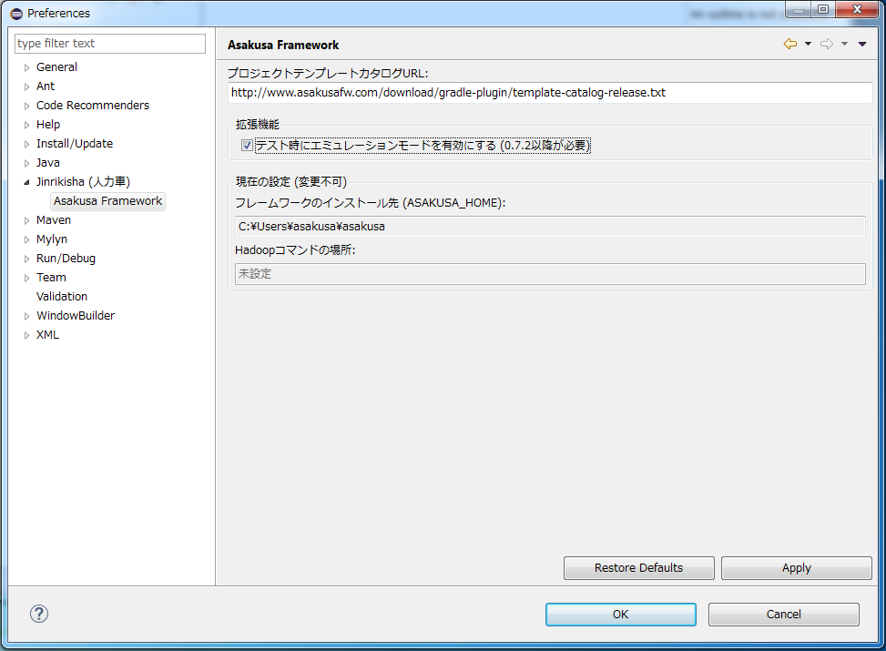
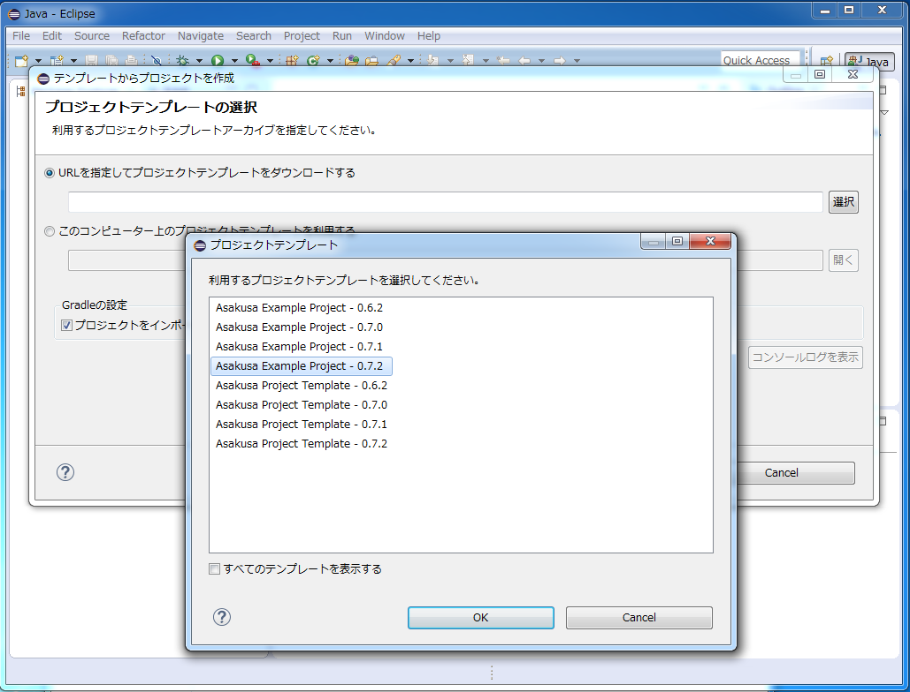
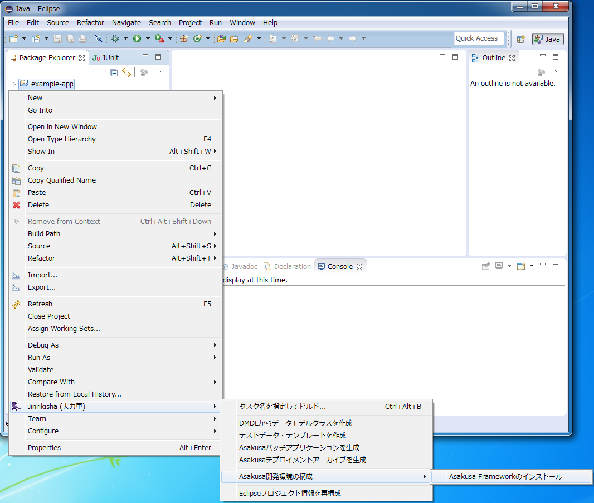
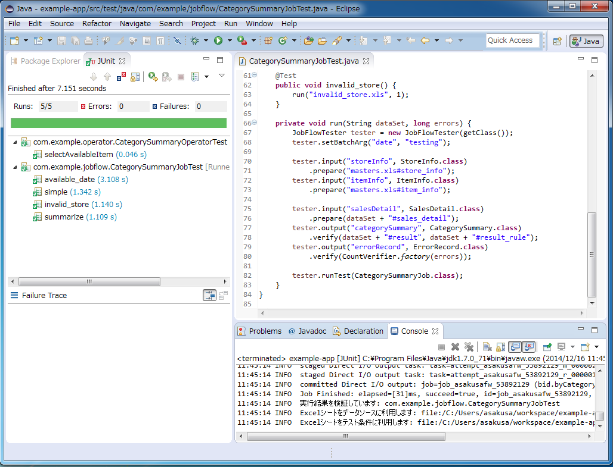

============================================
Asakusa Framework スタートガイド for Windows
============================================

* 対象バージョン: Asakusa Framework ``0.7.2`` 以降

この文書では、Asakusa Frameworkをはじめて利用するユーザ向けに、Windows OS上にAsakusa Frameworkの開発環境を作成し、その環境でアプリケーションの開発とテストを実行するまでの手順を説明します。

..  attention::
    Asakusa Framework バージョン |version| において、Windows環境はアプリケーションの開発、テスト環境としての用途にのみ利用することができます。
    
    Windows環境で作成したバッチアプリケーションは、Linux環境など異なるプラットフォーム上に構築した運用環境（Hadoopクラスター）で実行することができます。

..  seealso::
    この文書では開発環境の構築に必要となる各種ソフトウェアのバージョンは明記していません。Asakusa Frameworkが動作検証を行っている各種ソフトウェアのバージョンについては、 :doc:`../product/target-platform` を確認してください。

Windows環境の制約
=================

Asakusa Frameworkが提供する以下の運用環境向けの機能はWindows環境で利用することができません。

* :doc:`YAESS <../yaess/index>` を利用したアプリケーションの実行
* :doc:`WindGate <../windgate/index>` [#]_ による外部システム連携モジュールの実行
* シェルスクリプトとして提供している運用ツール系のコマンドラインインターフェース

..  [#] WindGate/JDBCを使ってWindowsに配置したデータベースと連携することは可能です。

開発環境の構築
==============

Windows OS上にAsakusa Frameworkの開発環境を作成します。

Java(JDK)のインストール
-----------------------

Asakusa Frameworkの実行に使用するJavaをインストールします。

ブラウザを開き、Javaのダウンロードサイト (http://www.oracle.com/technetwork/java/javase/downloads/index.html) から、JDK 7 のインストールアーカイブ :file:`jdk-7uXX-windows-YY.tar.gz` ( ``XX`` はUpdate番号、 ``YY`` はプラットフォームを示す文字列 ) をダウンロードして実行します。

..  attention::
    利用するプラットフォーム(32/64bit版)に応じたインストールアーカイブをダウンロードしてください。

ここでは、標準のインストールオプションを選択してインストールしたものとして以降の説明を行います。

環境変数の設定
--------------

Asakusa Frameworkの利用に必要となる環境変数を設定します。

環境変数の設定画面を開き、Asakusa Frameworkのインストールフォルダを定義する ``ASAKUSA_HOME`` 環境変数を追加します。

変数名
  ``ASAKUSA_HOME``

変数値
  任意のフォルダ (例: :file:`%USERPROFILE%¥asakusa` )

..  tip::
    環境変数の設定方法は利用するWindowsのバージョンによって異なります。
    一例としてWindows 7ではコントロールパネルのユーザーアカウントの画面から ``環境変数の変更`` を選択します。

Eclipseのインストール
---------------------

Asakusa Frameworkのアプリケーション実装・テストに使用する統合開発環境(IDE)として、Eclipseの環境を構築します。

Eclipseのダウンロードサイト (http://www.eclipse.org/downloads/) から Eclipse IDE for Java Developers のインストールアーカイブ :file:`eclipse-java-XX-winYY.zip` ( ``XX`` はバージョンを表すコード名、 ``YY`` はプラットフォームを示す文字列 ) をダウンロードします。

..  attention::
    利用するプラットフォーム(32/64bit版)に応じたインストールアーカイブをダウンロードしてください。

ダウンロードが完了したらインストールアーカイブを任意のフォルダに展開します。

Eclipseを起動するには、展開した :file:`eclipse` フォルダ内の :program:`eclipse.exe` を実行します。
Eclipse起動時にワークスペースを指定するダイアログが表示されるので、任意のフォルダを指定します。

Shafu (Asakusa Framework Eclipse プラグイン) のインストール
-----------------------------------------------------------

Asakusa Frameworkのバッチアプリケーション開発をサポートするEclipseプラグイン :jinrikisha:`Shafu <shafu.html>` をインストールします。

#. Eclipseのメニューバーから :menuselection:`Help --> Install New Software...` を選択します。
#. :guilabel:`Install` ダイアログで :guilabel:`Work with:` の項目右の :guilabel:`Add` ボタンを押下します。
#. :guilabel:`Add Repository` ダイアログに以下の値を入力します。

   * :guilabel:`Name:` 任意の名前(例: ``Jinrikisha`` )
   * :guilabel:`Location:` ``http://www.asakusafw.com/eclipse/jinrikisha/updates/``
#. :guilabel:`Install` ダイアログに表示された :guilabel:`Jinrikisha (人力車)` カテゴリを展開して :guilabel:`Asakusa Gradle プラグインサポート` を選択し、 :guilabel:`Next >` ボタンを押下します。
#. 以降、画面の指示に従いインストールを進めます。Eclipseの再起動を促されたら :guilabel:`Yes` を選択します。
#. Eclipseの再起動が完了したら、 :guilabel:`Java` パースペクティブを表示してメニューバーから :menuselection:`Window --> Reset Perspective..` を選択して :guilabel:`Java` パースペクティブを初期化します。

Eclipseの設定
-------------

Asakusa Frameworkの開発環境向けにEclipseの設定を行います。

以降の設定はEclipseの設定画面から行います。
Eclipseのメニューバーから :menuselection:`Window --> Preferences` で設定画面を表示します。

JDKの登録
~~~~~~~~~

Eclipse経由で実行するJavaに `Java(JDK)のインストール`_ でインストールしたJDKを設定します。

#. Eclipseの設定画面から :menuselection:`Java --> Installed JREs` を選択します。
#. :guilabel:`Installed JREs` ダイアログにJDK7以外のJava定義が表示されている場合 (例えば ``jre7`` のような項目が表示されている場合)、これら項目を削除します。 削除する項目を選択して、 :guilabel:`Remove` ボタンを押下します。
#. `Java(JDK)のインストール`_ でインストールしたJDKを追加します。 :guilabel:`Installed JREs` ダイアログで :guilabel:`Add` ボタンを押下します。
#. :guilabel:`JRE Type` ダイアログで :guilabel:`Standard VM` を選択し、 :guilabel:`Next >` ボタンを押下します。
#. :guilabel:`JRE Definition` ダイアログで :guilabel:`JRE home:` の項目右の :guilabel:`Directory...` ボタンを押下し、JDKのフォルダ [#]_ を指定します。
#. :guilabel:`JRE Definition` ダイアログの各項目にインストールしたJDKの情報が設定されたことを確認して :guilabel:`Finish` ボタンを押下します。
#. :guilabel:`Installed JREs` ダイアログに追加したJDKの項目が表示されるので、その項目の :guilabel:`Name` 欄に表示されているチェックボックスを :guilabel:`ON` にします。JDKの項目が ``jdk1.7.0_XX (default)`` のような表示になれば設定完了です。

..  [#] JDKのフォルダは例えば ``C:¥Program Files¥Java¥jdk1.7.0_XX`` のようなフォルダです。JREのフォルダを指定しないよう注意してください。

..  attention::
    Asakusa Frameworkのバッチアプリケーションのコンパイルやテストの実行にはJDKを使用する必要があります。
    JREを使用することはできないため、ここで示す手順以外でJDKの設定を行う場合、誤ってJREが使用されるような設定にならないよう注意してください。

Shafuの設定
~~~~~~~~~~~

Shafuの設定を行います。

#. Eclipseの設定画面から :menuselection:`Jinrikisha (人力車) --> Asakusa Framework` を選択します。
#. :guilabel:`Asakusa Framework` ダイアログで :guilabel:`テスト時にエミュレーションモードを有効にする` チェックボックスをONにします。
#. フレームワークのインストール先に環境変数 ``ASAKUSA_HOME`` で設定したフォルダが表示されていることを確認します。

   * 正しく表示されていない場合、 `環境変数の設定`_ で説明した環境の設定を確認してください。

上記の設定が完了したら、Eclipseの設定画面 の :guilabel:`OK` ボタンを押下します。

アプリケーションの開発
======================

開発環境上で Asakusa Frameworkのバッチアプリケーションを開発する方法を見ていきます。

プロジェクトの作成
------------------

まずはEclipse上にAsakusa Frameworkアプリケーション開発用のプロジェクトを作成します。

新規プロジェクトの作成
~~~~~~~~~~~~~~~~~~~~~~

Shafuを導入した開発環境では、オンライン上に公開されているAsakusa Frameworkのプロジェクトテンプレートを利用して、Asakusa Frameworkの開発に必要な設定が導入済みのプロジェクトを作成することができます。

標準の設定では、以下のプロジェクトテンプレートを選択することができます。

``Asakusa Project Template``
  新規プロジェクト開発用のプロジェクトテンプレート

``Asakusa Example Project``
  サンプルアプリケーションのソースコードを含むプロジェクトテンプレート

ここでは、サンプルアプリケーションを含むプロジェクトを生成します。

#. Javaパースペクティブ上のメニューバーから :menuselection:`File --> New --> Gradleプロジェクトをテンプレートから生成` を選択します。

   * このメニューが表示されない場合は、巻末の `トラブルシューティング`_ - `プロジェクト生成メニューが表示されない`_ を確認してください。
#. :guilabel:`新規プロジェクト情報` ダイアログで、プロジェクト名などを入力します。
#. :guilabel:`プロジェクトテンプレートの選択` ダイアログで :guilabel:`URLを指定してプロジェクトテンプレートをダウンロードする` が選択状態になっていることを確認して、画面右の :guilabel:`選択` ボタンを押下します。
#. :guilabel:`プロジェクトテンプレート` ダイアログにオンラインに公開されている、利用可能なプロジェクトテンプレートの一覧が表示されます。ここでは Asakusa Example Project - |version| を選択します。
#. :guilabel:`Finish` ボタンを押すと選択したプロジェクトテンプレートを読み込み、Eclipseプロジェクトとして新規プロジェクトが作成されます。

..  attention::
    開発環境で初めてAsakusa Frameworkのプロジェクトを作成する際にはリモートからプロジェクトに必要なライブラリをダウンロードするため、初回のプロジェクト作成には時間がかかることがあります。

既存プロジェクトのインポート
~~~~~~~~~~~~~~~~~~~~~~~~~~~~

異なる開発環境で作成したプロジェクトをインポートすることも可能です。
LinuxやMacOSX上で開発したプロジェクトもインポートすることができます。

プロジェクトをインポートする場合、開発環境にインポート対象のプロジェクトを配置して、以下の手順を実施します。

#. Javaパースペクティブ上のメインメニューなどから :menuselection:`File --> Import` を選択します。
#. :guilabel:`Select` ダイアログで :menuselection:`Jinrikisha (人力車) --> Gradle プロジェクト` を選択して :guilabel:`Next >` ボタンを押します。
#. :guilabel:`プロジェクトディレクトリーの選択` ダイアログで、インポートするプロジェクトのディレクトリーパスを選択して :guilabel:`Next >` ボタンを押します。
#. :guilabel:`インポート対象のプロジェクト選択` ダイアログで、インポート対象のプロジェクトを選択して :guilabel:`Finish` ボタンを押します。

アプリケーションのソースコード作成
----------------------------------

プロジェクトの :file:`src` フォルダ配下に、Asakusa DSLやデータモデル定義DSL、テストケースなどを作成してアプリケーションを開発します。
サンプルアプリケーション用プロジェクトには、これらのソースコード一式が :file:`src` フォルダ内に含まれています。

サンプルアプリケーションの概要
~~~~~~~~~~~~~~~~~~~~~~~~~~~~~~

サンプルアプリケーションには、「カテゴリー別売上金額集計バッチ」のソースファイルが含まれています。

カテゴリー別売上金額集計バッチは、売上トランザクションデータと、商品マスタ、店舗マスタを入力として、エラーチェックを行った後、売上データを商品マスタのカテゴリ毎に集計するアプリケーションです。

バッチアプリケーションの入力データ取得と出力データ生成には、Asakusa Frameworkの「Direct I/O」と呼ばれるコンポーネントを利用しています。Direct I/Oを利用して、Hadoopファイルシステム上のCSVファイルに対して入出力を行います。

開発用Asakusa Frameworkのインストール
-------------------------------------

Asakusa Frameworkのアプリケーションのテストを行うには、開発用のAsakusa Frameworkを開発環境にインストールする必要があります。

#. Javaパースペクティブ上のプロジェクトを選択してコンテキストメニュー(右クリックなどで表示されるメニュー)を表示します。
#. コンテキストメニューから :menuselection:`Jinrikisha (人力車) --> Asakusa開発環境の構成 --> Asakusa Frameworkのインストール` を選択します。
#. インストールが成功した場合、Eclipseのコンソールに以下のように表示され、環境変数 ``ASAKUSA_HOME`` で指定したフォルダ配下にAsakusa Frameworkがインストールされます。

..  code-block:: none

    ...
    :installAsakusafw
    Asakusa Framework is successfully installed: C:\Users\asakusa\asakusa
    
    BUILD SUCCESSFUL
    
    Total time: 4.352 secs

アプリケーションのテスト
------------------------

アプリケーションのテストは通常のJavaアプリケーションのテストと同様に、EclipseからJUnitを実行します。

例えばプロジェクトに含まれるすべてのテストケースを実行する場合は、コンテキストメニューから :menuselection:`Run As --> JUnit Test` を実行します。

テストが失敗する場合は、巻末の `トラブルシューティング`_ - `テスト実行に失敗する`_ を確認してください。

デプロイメントアーカイブの作成
------------------------------

Windows上の開発環境で作成したアプリケーションを運用環境（Hadoopクラスタ）上で実行するには、まずアプリケーションをパッケージングして「デプロイメントアーカイブ」を作成します。

デプロイメントアーカイブを生成するには、コンテキストメニューから :menuselection:`Jinrikisha (人力車) --> Asakusaデプロイメントアーカイブを生成` を選択します。

デプロイメントアーカイブの生成に成功した場合、Eclipseのコンソールに以下のように表示され、プロジェクトの :file:`build` フォルダ配下にデプロイメントアーカイブファイル :file:`asakusafw-{asakusafwVersion}.tar.gz` が生成されます。

..  code-block:: none

    ...
    :assemble
    
    BUILD SUCCESSFUL
    
    Total time: 4.804 secs

運用環境へのデプロイメントアーカイブの配備方法や、カスタマイズ方法については :doc:`../administration/deployment-guide` を参照してください

Next Step:アプリケーションの開発を行う
======================================

これまでの手順で、Asakusa Framework上でバッチアプリケーションの開発を行う準備が整いました。

次に、実際にアプリケーションの開発を行うために、Asakusa Frameworkを使ったアプリケーション開発の流れを見てみましょう。 >> :doc:`next-step`

トラブルシューティング
======================

Asakusa Frameworkの開発環境の作成、アプリケーション実行に関するトラブルシューティングです。

プロジェクト生成メニューが表示されない
--------------------------------------

発生する事象
~~~~~~~~~~~~

`新規プロジェクトの作成`_ の手順で、Javaパースペクティブ上のメニューバーから :menuselection:`File --> New` を選択してもサブメニューに :guilabel:`Gradleプロジェクトをテンプレートから生成` が表示されない。

原因
^^^^

Javaパースペクティブが初期化されていない可能性があります。
メニューバーから :menuselection:`Window --> Reset Perspective..` を選択後、再度メニューを表示してください。

それでも表示されない場合は、以下の手順でメニューの設定を行なってください。

#. メニューバーから :menuselection:`Window --> Customize Perspective..` を選択します。
#. Customize Perspectiveダイアログから :guilabel:`Shortcuts` タブを選択します。
#. 画面左上の :guilabel:`Submenus:` が :guilabel:`New` になっていることを確認後、 :guilabel:`Shortcut Categories:` のリストから :guilabel:`Jinrikisha (人力車）` を選択します。
#. :guilabel:`OK` ボタンを押下して設定を保存した後、再度メニューを表示してください。

上記の手順で :guilabel:`Jinrikisha (人力車）` が表示されない場合はShafuがインストールされていない可能性があります。
`Shafu (Asakusa Framework Eclipse プラグイン) のインストール`_ の内容を確認してください。

プロジェクトの作成に失敗する
----------------------------

発生する事象
~~~~~~~~~~~~

`新規プロジェクトの作成`_ の手順を実行すると、以下のエラーメッセージが表示されプロジェクトの作成に失敗する。

..  code-block:: none

    ...
    :compileJava FAILED
    
    FAILURE: Build failed with an exception.
    
    * What went wrong:
    Execution failed for task ':compileJava'.
    > Cannot find System Java Compiler. Ensure that you have installed a JDK (not just a JRE) and configured your JAVA_HOME system variable to point to the according directory.
    ...

原因
^^^^

Eclipseがデフォルトで利用するJavaにJDKが登録されていない可能性があります。
`JDKの登録`_ の手順を確認し、JDKが登録されていることを確認してください。

複数のJava環境が登録されている場合、Eclipse設定画面の :menuselection:`Installed JREs --> Execution-Environments` の ``JavaSE-1.7`` の項目にJDKが表示されていること、およびJDKにチェックがON(デフォルトで利用する)になっていることを確認してください。

Asakusa Frameworkのインストールに失敗する
-----------------------------------------

発生する事象
~~~~~~~~~~~~

`開発用Asakusa Frameworkのインストール`_ の手順を実行すると、以下のエラーメッセージが表示されインストールに失敗する。

..  code-block:: none

    ...
    :updateAsakusafw FAILED
    
    FAILURE: Build failed with an exception.
    
    * What went wrong:
    Execution failed for task ':updateAsakusafw'.
    > ASAKUSA_HOME is not defined
    ...

原因
^^^^

環境変数 ``ASAKUSA_HOME`` が設定されていない可能性があります。
`環境変数の設定`_ の手順を確認し、環境変数が追加されていることを確認してください。

Eclipseを起動中に環境変数を追加した場合は、Eclipseの再起動が必要です。

テスト実行に失敗する
--------------------

発生する事象
~~~~~~~~~~~~

`アプリケーションのテスト`_ の手順を実行すると、以下のエラーメッセージが表示されテストが失敗する。

..  code-block:: none

    ...
    java.lang.AssertionError: 環境変数"ASAKUSA_HOME"が未設定です
      at com.asakusafw.testdriver.inprocess.InProcessJobExecutor.validateEnvironment(InProcessJobExecutor.java:108)
    ...

原因
^^^^

環境変数 ``ASAKUSA_HOME`` が設定されていない可能性があります。
`環境変数の設定`_ の手順を確認し、環境変数が追加されていることを確認してください。

Eclipseを起動中に環境変数を追加した場合は、Eclipseの再起動が必要です。

発生する事象
~~~~~~~~~~~~

`アプリケーションのテスト`_ の手順を実行すると、以下のエラーメッセージが表示されテストが失敗する。

..  code-block:: none

    ...
    java.lang.AssertionError: この環境ではJavaコンパイラを利用できません（JDKを利用してテストを実行してください）
        at com.asakusafw.testdriver.TestDriverContext.validateCompileEnvironment(TestDriverContext.java:227)
    ...

原因
^^^^

Eclipseがデフォルトで利用するJavaにJDKが登録されていない可能性があります。
`JDKの登録`_ の手順を確認し、JDKが登録されていることを確認してください。

複数のJava環境が登録されている場合、Eclipse設定画面の :menuselection:`Installed JREs --> Execution-Environments` の ``JavaSE-1.7`` の項目にJDKが表示されていること、およびJDKにチェックがON(デフォルトで利用する)になっていることを確認してください。

発生する事象
~~~~~~~~~~~~

`アプリケーションのテスト`_ の手順を実行すると、以下のエラーメッセージが表示されテストが失敗する。

..  code-block:: none

    ...
    java.lang.IllegalStateException: java.io.IOException: Asakusa Framework is not installed: C:\Users\asakusa\asakusa
      at com.asakusafw.testdriver.JobFlowTester.runTest(JobFlowTester.java:105)
    ...

    
原因
^^^^

開発環境の ``ASAKUSA_HOME`` フォルダにAsakusa Frameworkがインストールされていない可能性があります。
`開発用Asakusa Frameworkのインストール`_ が正しく行われているかを確認してください。

発生する事象
~~~~~~~~~~~~

`アプリケーションのテスト`_ の手順を実行すると、以下のメッセージが表示され一部のテストがスキップされてしまう。

..  code-block:: none

    ...
    XX:YY:ZZ WARN  コマンド"hadoop"を検出できませんでした
    XX:YY:ZZ INFO  この環境では現在のテストを実行できないため、スキップします: com.example.jobflow.CategorySummaryJobTest
    ...

原因
^^^^

エミュレーションモードが有効になっていない可能性があります。
`Shafuの設定`_ の手順を確認し、エミュレーションモードの設定が有効になっていることを確認してください。

エミュレーションモードを無効から有効に切り替えた場合、すでにEclipseのワークスペースに存在するプロジェクトについてはEclipseプロジェクト情報の再構成（クラスパス情報の更新）を行うまではエミュレーションモードが有効になりません。

エミュレーションモードを利用するプロジェクトはプロジェクトのコンテキストメニューから :menuselection:`Jinrikisha (人力車) --> Eclipseプロジェクト情報の再構成` を選択してEclipseプロジェクト情報の再構成を行なってください。

..  attention::
    Shafuでエミュレーションモードを有効にするためには、
    プロジェクトのAsakusa Framework バージョンが ``0.7.2`` 以降である必要があります。
    これより前のバージョンを指定した場合、エミュレーションモードは有効にならないことに注意してください。
