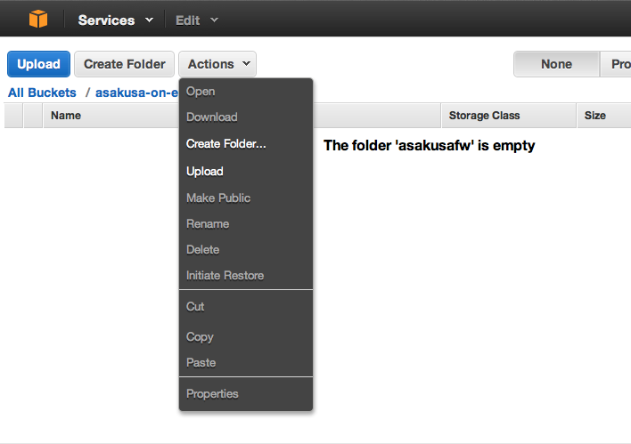
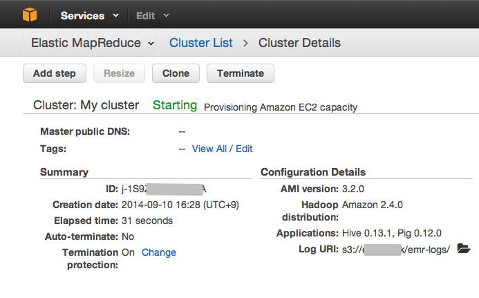
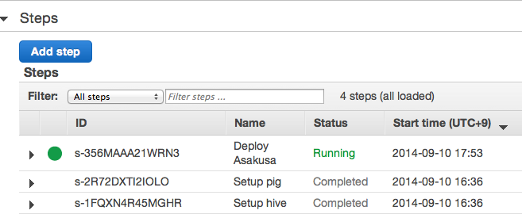
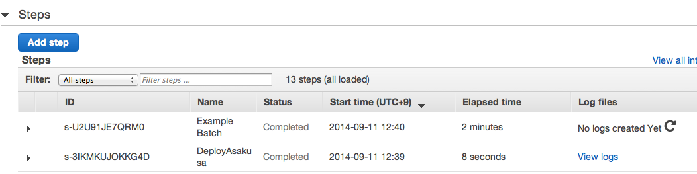
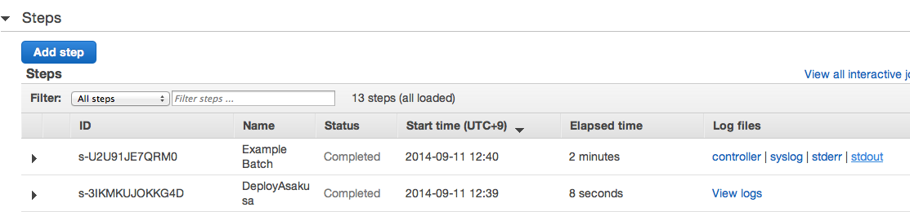

=========================================
Amazon EMR上でAsakusa Frameworkを利用する
=========================================

* 対象バージョン: Asakusa Framework ``0.7.0`` 以降

この文書は、 `Amazon Web Services`_ (AWS) が提供する
クラウド環境上のHadoopサービス `Amazon Elastic MapReduce`_ (Amazon EMR) 上で
Asakusa Frameworkを利用する方法について説明します。

以降では、 `Amazon Web Services`_ を「AWS」、
`Amazon Elastic MapReduce`_ を「EMR」と表記します。

また、本書ではAsakusa Frameworkのデプロイやアプリケーションの実行時に、
AWSが提供するストレージサービスである `Amazon Simple Storage Service`_ （Amazon S3）
を利用します。以降では、 `Amazon Simple Storage Service`_ を「S3」と表記します。

AWSが提供する各サービスの詳細はAWSが提供するドキュメントを参照してください。

..  note::
    本書では必要に応じてAWSが提供するドキュメントへのリンクを掲載しており、
    その中で日本語ドキュメントが存在するものはなるべく
    日本語ページへのドキュメントにリンクしています。
     
    ただし、「EMR開発者ガイド」 ( `EMR Developer Guide`_ )
    に関しては本書の作成時点で日本語ドキュメントの情報が古いため、
    英語版のドキュメントの内容に沿った説明とリンクを行なっています。

..  _`Amazon Web Services`: http://aws.amazon.com/jp/
..  _`Amazon Elastic MapReduce`: http://aws.amazon.com/jp/elasticmapreduce/
..  _`Amazon Simple Storage Service`: http://aws.amazon.com/jp/s3/
..  _`EMR Developer Guide`: http://docs.aws.amazon.com/ElasticMapReduce/latest/DeveloperGuide/

はじめに
========
本書では、 :doc:`../introduction/start-guide`
の説明で使用したサンプルアプリケーションを例に、
EMR上でバッチアプリケーションを実行するまでの手順を説明します。

また、ここではアプリケーションのデータ入出力をS3に対して行うよう設定します。

EMRと関連サービス利用環境の準備
===============================
EMRやS3を利用するための環境を準備します。

本書で示す手順に従ってEMR上でAsakusa Frameworkを利用するためには、
以下の準備を行う必要があります。

1. AWSへのサインアップ
2. Amazon S3バケットの作成

これらの準備が整っていない場合、以下に示すドキュメントなどを参考にして、EMRを利用するための環境を準備してください。

AWSへのサインアップ
  `アカウント作成の流れ | アマゾン ウェブ サービス（AWS 日本語）`_

Amazon S3バケットの作成
  `Amazon Simple Storage Service の使用開始`_ ( `Amazon S3 入門ガイド`_ ) 

..  _`アカウント作成の流れ | アマゾン ウェブ サービス（AWS 日本語）`: http://aws.amazon.com/jp/register-flow/
..  _`Amazon Simple Storage Service の使用開始`: http://docs.aws.amazon.com/ja_jp/AmazonS3/latest/gsg/GetStartedWithS3.html
..  _`Amazon S3 入門ガイド`: http://docs.aws.amazon.com/ja_jp/AmazonS3/latest/gsg/GetStartedWithS3.html

AWSサービスの操作
-----------------
EMRやS3など、AWSが提供する各サービスに対する操作には以下のような方法があります。

* `AWSマネジメントコンソール`_ (以下「コンソール」)を使用する方法
* `AWSコマンドラインインターフェイス`_ (以下「CLI」)を使用する方法
* AWSが提供するSDKを利用する方法
* 各サービスが提供するWeb Service APIを利用する方法
   
それぞれのツールで実現可能な操作が多少異なりますが、
本書の範囲内ではコンソールやCLIですべての操作が可能です。
本書では操作手順の説明においてコンソールとCLIの操作を簡単に紹介します。

AWSで利用可能な操作の詳細やツールのセットアップ方法などは、
各サービスのドキュメントを参照してください。

..  _`AWSマネジメントコンソール`: http://aws.amazon.com/jp/console/
..  _`AWSコマンドラインインターフェイス`: http://aws.amazon.com/jp/cli/

Asakusa Framework実行環境の構成とデプロイ
=========================================
開発環境で作成したアプリケーションプロジェクトに対して
EMR環境向けにAsakusa Frameworkの構成を行い、
Asakusa Framework実行環境一式をデプロイします。

EMRを利用する上では、様々な方法でAsakusa Frameworkをデプロイすることができますが、
ここではAsakusa FrameworkのデプロイメントアーカイブをEMRクラスター [#]_ の起動前にS3に配置し、
EMRクラスターの起動後にこれをEMRクラスターのマスターノードにデプロイするものとします。

..  [#] `EMR Developer Guide`_ の記述に基づき、
        EMRを利用して構築したHadoopクラスターをEMRクラスターと呼びます

Direct I/Oの設定
----------------
バッチアプリケーションに対して
EMR上でS3に対するデータ入出力を行うための設定を行います。

Direct I/Oを使ってS3に対してデータの読み書きを行うようにするため
設定ファイル ``asakusa-resources.xml`` [#]_ を編集します。

以下は、 ``asakusa-resources.xml`` の設定例です [#]_ 。

* :download:`asakusa-resources.xml <attachment/asakusa-resources.xml>`

..  literalinclude:: attachment/asakusa-resources.xml
    :language: xml

ここでは上記の ``asakusa-resources.xml`` をダウンロードして、
アプリケーションプロジェクト配下のディレクトリ
``src/dist/emr/core/conf`` に同名で配置してください。

..  code-block:: sh
     
    mkdir -p src/dist/emr/core/conf
    cp $HOME/Downloads/asakusa-resources.xml src/dist/emr/core/conf

..  hint::
    上記設定に含まれる ``@...@`` の文字列は、 :doc:`Framework Organizer Plugin <../application/gradle-plugin>` の機能を利用して
    デプロイメントアーカイブ作成時に環境に合わせた値に置換します。
    
    たとえば、 ``@directioRootFsPath@`` はデータ入出力に利用する、S3上のパスに置換します（次項を参照してください）。

..  [#] ``asakusa-resources.xml`` で記述するDirect I/O の設定について詳しくは、
        :doc:`../directio/user-guide` を参照してください。
        また、上記の設定ファイルの例ではDirect I/O以外にいくつかの実行時設定を行なっています。
        詳しくは、 :doc:`../administration/configure-hadoop-parameters` を参照してください。

..  [#] プロパティ ``com.asakusafw.directio.root.fs.path``
        は後の手順でプロファイルの機能を使って置換します。

デプロイメント構成の設定
------------------------
EMR向けの構成を持つデプロイメントアーカイブ [#]_ を作成するための設定を行います。

ここでは、サンプルアプリケーションのプロジェクトに
EMR向けのデプロイメント構成用のプロファイル ``emr`` を作成するため
ビルドスクリプト ``build.gradle`` を編集します。

**build.gradle**

..  code-block:: groovy
    :emphasize-lines: 9
    
    asakusafwOrganizer {
        profiles.prod {
            asakusafwVersion asakusafw.asakusafwVersion
        }
        profiles.emr {
            asakusafwVersion '0.7.2-hadoop2'
            assembly.into('.') {
                put 'src/dist/emr'
                replace 'asakusa-resources.xml', directioRootFsPath: 's3://[mybucket]/app-data'
            }
        }
    }
   
..  attention::
    上記例を参考に設定ファイルを作成する際は、必ず ``directioRootFsPath`` の値を実際に使用するS3バケットのパスに置き換えてください。
   
ここでは標準の設定に対して、 
EMR向けのプロファイルとして ``profiles.emr`` ブロックを追加しています。

``emr`` プロファイルの ``asakusafwVersion``
にはHadoop2系向けのAsakusa Frameworkを指定しています。
本書ではHadoop2系のEMRクラスターを使用します。
詳細は後述の `EMRクラスターの起動`_ を参照してください。

``assembly.into('.')`` 配下は先述の `Direct I/Oの設定`_ で説明した設定ファイルを
``put`` によってデプロイメント構成に加えています。
このとき、 ``asakusa-resources`` 内で定義したDirect I/O のファイルシステムパスの値
``directioRootFsPath`` を指定したS3バケット上のパスに置換するための設定を定義しています。

``directioRootFsPath`` の値は、アプリケーションのデータ入出力を行うS3バケット上のパスになります。
使用する環境に応じて、適切なパスに変更してください。
特にバケット名の部分( ``[mybucket]`` )は必ず変更する必要があります。

..  [#] デプロイメントアーカイブやデプロイメント構成の編集について詳しくは、
        :doc:`../administration/deployment-guide` を参照してください。

デプロイメントアーカイブの生成
------------------------------
Akakusa Frameworkの実行環境一式を含むデプロイメントアーカイブを作成します。

デプロイメントアーカイブを作成するには、
アプリケーションプロジェクト上でGradleの ``assemble`` タスクを実行します。

..  code-block:: sh
     
    ./gradlew assemble

`デプロイメント構成の設定`_ を行った状態でデプロイメントアーカイブの生成を行うと、
``build`` ディレクトリ配下に標準のデプロイメントアーカイブに加えて、
``asakusafw-${asakusafwVersion}-emr.tar.gz`` というファイル名で
``emr`` プロファイルに対応したデプロイメントアーカイブが生成されます。

デプロイメントアーカイブをS3に配置
----------------------------------
`デプロイメントアーカイブの生成`_ で作成した
デプロイメントアーカイブファイル ``asakusafw-${asakusafwVersion}-emr.tar.gz``
をS3に配置します。

コンソール
~~~~~~~~~~
S3に対するファイルアップロードは `AWSマネジメントコンソール`_ から実行することができます。

コンソールを使ってS3にファイルをアップロードする手順の例は、
`バケットにオブジェクトを追加`_ ( `Amazon S3 入門ガイド`_ ) などを参照してください。

..  _`バケットにオブジェクトを追加`: http://docs.aws.amazon.com/ja_jp/AmazonS3/latest/gsg/PuttingAnObjectInABucket.html

CLI
~~~
S3に対するファイルアップロードはAWS CLIからも実行することができます。

以下AWS CLIによるファイルアップロードの例です。

..  code-block:: sh
    
    aws s3 cp build/asakusafw-0.7.2-hadoop2-emr.tar.gz s3://[mybucket]/asakusafw/

S3上のファイルを表示し、正しくアップロードされたことを確認します。

..  code-block:: sh
    
    aws s3 ls s3://[mybucket]/asakusafw/
    
..  attention::
    上記例を参考にコマンドを入力する際は、必ずアップロード先のS3バケットのパスを実際に使用するパスに置き換えてください。

EMRクラスターの起動と確認
=========================
EMRを利用したHadoopクラスターのセットアップと動作確認を行います。

EMRクラスターの起動
-------------------

コンソール
~~~~~~~~~~
`AWSマネジメントコンソール`_ からEMRクラスターを起動することができます。

1. `AWSマネジメントコンソール`_  の画面左上のメニューから ``Services`` - ``Elastic MapReduce`` を選択する。

2. EMRのクラスター一覧 (Cluster List) 画面で、画面上部の ``Create cluster`` ボタンを押下する。

    ..  figure:: attachment/emr-console-menu-createcluster.png
        :width: 50%

3. EMRクラスターの起動パラメータを入力する

   EMRクラスター起動手順の例は、 `Get Started: Launch the Cluster`_ ( `EMR Developer Guide`_ )
   などを参照してください。

   コンソールで指定する起動パラメータについては、 
   後述の `起動パラメータ`_ で説明しているのでこちらも参照してください。

    ..  figure:: attachment/emr-console-create-cluster.png
        :width: 80%

4. 画面下の ``Create cluster`` ボタンを押下する。

    ..  figure:: attachment/emr-console-create-cluster-bottom.png
        :width: 50%

   EMRクラスターの起動処理が開始され、
   クラスター詳細画面 (Cluster Details) が表示されます。

..  _`Get Started: Launch the Cluster`: http://docs.aws.amazon.com/ElasticMapReduce/latest/DeveloperGuide/emr-get-started-count-words-step-5.html

CLI
~~~
EMRクラスターの起動はAWS CLIから実行することができます。

以下AWS CLIによるEMRクラスター起動の例です。

..  code-block:: sh
    
    aws emr create-cluster \
     --ami-version 3.2.0 \
     --instance-groups \
     InstanceGroupType=MASTER,InstanceCount=1,InstanceType=c3.xlarge \
     InstanceGroupType=CORE,InstanceCount=1,InstanceType=c3.xlarge \
     --name asakusa-batch \
     --log-uri s3://[mybucket]/mylog \
     --enable-debugging

起動パラメータ
~~~~~~~~~~~~~~
EMRクラスターの起動パラメータ（オプション）の概要を説明します。

起動パラメータの詳細についてはコンソールのヘルプやAWS CLI Referenceの
`create cluster <http://docs.aws.amazon.com/cli/latest/reference/emr/create-cluster.html>`_ などを参照してください。
各パラメータは以下の表記で説明しています。

``コンソール上の項目名`` ``(--CLIのオプション名 )``

``Cluster name`` ``(--name)``
  EMRクラスター名です。この名前はコンソールやCLIから参照するクラスター一覧などで表示されます。

``Logging`` ``(--log-uri)``
  このオプションを有効にすると、EMRクラスターの各ノードのログを定期的な間隔(およそ5分ごと)でS3にコピーする機能が有効になります。ログを配置するS3バケット上のパスを合わせて指定します。

``Debugging`` ``(--enable-debugging)``
  このオプションを有効にすると、コンソール上から各ログファイルを参照するためのインデックスが生成されます。

``AMI version`` ``(--ami-version)``
  EMRクラスターのマシンイメージ(AMI)のバージョンです。AMIのバージョンによって使用されるHadoopバージョンや設定が異なります。
  指定可能なAMIバージョンについては `AMI Versions Supported in Amazon EMR`_ ( `EMR Developer Guide`_ ) などを参照してください。

..  attention::
    AMIバージョンの ``3.0.0`` 以降はEMRクラスターに使用されるHadoopのバージョンはHadoop2系が利用されます。
    そのため、AMIバージョンの ``3.0.0`` 以降を利用する場合はHadoop2系向けのAsakusa Frameworkバージョンを使用する必要があります。
    
    詳しくは先述の `デプロイメント構成の設定`_ を参照してください。

``Network``
  VPCの使用有無を指定します。VPCを使用しない場合は ``EC2 avaliability zone`` を、VPCを使用する場合は ``EC2 Subnet`` を、それぞれ指定します。デフォルトではVPCは使用しません。

``Master/Core/Task`` ``(--instance-groups InstanceGroupType=MASTER, ...)``
  EMRクラスターのインスタンス構成を指定します。
  起動するインスタンスグループ(Master/Core/Task)ごとのインスタンス数やインスタンスタイプなどを指定します。
  
..  hint::
    デプロイメント構成の確認やアプリケーションとの疎通確認など、試験的に実行する段階ではEC2インスタンスタイプは低コストで利用できるインスタンスタイプを使用し、ノード数も少なめで確認するのがよいでしょう。

``EC2 key pair`` ``(--ec2-attributes KeyName=[key-name])``
  EMRクラスターの各ノードにSSH接続するためのキーペアを指定します。
  デフォルトではキーペアの指定がありません。
  SSH接続を行う場合は、このオプションを指定します。

..  _`AMI Versions Supported in Amazon EMR`: http://docs.aws.amazon.com/ElasticMapReduce/latest/DeveloperGuide/ami-versions-supported.html

ジョブフローID (クラスターID)
-----------------------------
EMRクラスターの起動を実行すると、コンソールやCLIの出力として
クラスターを一意に特定するためのジョブフローID(クラスターID)が出力されます。

CLI
~~~
..  code-block:: json
     
    {
        "ClusterId": "j-XXXXXXXXXXXXX"
    }

CLIではEMRクラスターに対する処理を行う際に、このIDを指定します。

ステータスの確認
----------------
コンソールやCLIからEMRクラスターのステータスを確認することができます。

コンソール
~~~~~~~~~~
`EMRクラスターの起動`_ 後に表示される
クラスター詳細画面 (Cluster Details) などで確認します。

クラスター詳細画面では、画面上部 ``Cluster: <name>``
の右側に色付きの文字列で表示されます
( 下例では ``Starting`` ) 。

CLI
~~~
以下はAWS CLIでクラスターのステータスを取得する例です。

..  code-block:: sh
    
    aws emr describe-cluster --cluster-id j-XXXXXXXXXXXXX \
     --query 'Cluster.Status.State'

..  code-block:: json
    
    "WAITING"

..  hint::
    上記例の ``--query`` オプションによって全体の出力から結果ステータスの項目を抽出しています。
    
    ``aws`` コマンドには他にも様々なオプションが利用できます。
    詳しくは AWS CLI Reference の `Command Reference <http://docs.aws.amazon.com/cli/latest/index.html>`_
    などを参照してください。

主なステータス [#]_ には以下のようなものがあります。

``STARTING``
  EMRクラスターが起動中

``WAITING``
  EMRクラスターがアイドル状態（ステップの実行待ち）

``RUNNING``
  EMRクラスターがステップを実行中

``TERMINATED``
  EMRクラスターが停止済み

`EMRクラスターの起動`_ の手順でEMRクラスターが正常に起動し、
ステータスが ``Waiting`` になっていることを確認して以降の手順に進みます。

..  [#] EMRが管理するステータスの意味やその種類については、
        `Life Cycle of a Cluster <http://docs.aws.amazon.com/ElasticMapReduce/latest/DeveloperGuide/ProcessingCycle.html>`_
        ( `EMR Developer Guide`_ ) などを参照してください。 

EMRクラスターにAsakusa Frameworkをデプロイ
==========================================
EMRクラスターが起動したら、
`デプロイメントアーカイブをS3に配置`_ でS3に配置した
Asakusa Frameworkのデプロイメントアーカイブを
EMRクラスターのマスターノードにデプロイします。

EMRクラスターに対して処理を要求するには、
コンソールやCLIから「ステップ」と呼ばれる処理単位を登録します。

コンソール
----------
クラスター詳細画面で以下の手順でデプロイを実行します。

1. 画面上部の ``Add step`` ボタンを押下する。

    ..  figure:: attachment/emr-console-menu-addstep.png
        :width: 50%

2. ``Add Step`` ダイアログで以下の通りに入力し、 ``Add`` ボタンを押下する

    ..  figure:: attachment/emr-console-addstep-deploy.png
        :width: 100%

    ``Step type``
      ``Custom JAR`` を選択
    
    ``Name``
      任意のステップ名を入力 (この名前はステップ一覧に表示されます)
    
    ``JAR locations``
      以下のS3パスを入力 [#]_
    
      * ``s3://elasticmapreduce/libs/script-runner/script-runner.jar``
    
    ``Arguments``
      以下2つの引数を半角スペース区切りで指定 [#]_
    
      * 第1引数:  ``s3://asakusafw/emr/deploy-asakusa.sh``
      * 第2引数:  `デプロイメントアーカイブをS3に配置`_ で配置したデプロイメントアーカイブのS3パス
        
        * 例: ``s3://[mybucket]/asakusafw/asakusafw-0.7.2-hadoop2-emr.tar.gz``
    
    ``Action on failure``
      * ``Continue`` を選択
    
以上の手順でマスターノード上にAsakusa Frameworkのデプロイ処理が実行されます。

正常にデプロイが完了したことを確認するには、クラスター詳細画面の
``Steps`` セクションを展開して、 ステップ一覧に表示されるデプロイ用のステップを確認します。

デプロイ用のステップのステータスが ``Completed`` と表示されればデプロイは成功です。

デプロイ用のステップのステータスが ``Failed`` と表示されデプロイが失敗した場合は、
ダイアログの入力内容を確認 [#]_ してください。

..  [#] ``script-runner.jar`` はEMRが提供する、任意のスクリプトをマスターノード上で実行するためのツールです。
        詳しくは `Run a Script in a Cluster`_ ( `EMR Developer Guide`_ ) を参照してください。

..  [#] ``deploy-asakusa.sh`` はAsakusa Frameworkが公開しているデプロイ用のスクリプトで、
        引数に指定したS3パスに配置されているデプロイメントアーカイブを ``${HOME}/asakusa`` に展開します。

..  [#] もしくはEMRクラスター上のステップのログを確認します。
        ステップのログの確認方法は後述の `アプリケーションの実行結果を確認`_ を参照してください。

..  _`Run a Script in a Cluster`: http://docs.aws.amazon.com/ElasticMapReduce/latest/DeveloperGuide/emr-hadoop-script.html

CLI
---
AWS CLI を使ったデプロイ例を以下に示します。

..  code-block:: sh
    
    aws emr add-steps --cluster-id j-XXXXXXXXXXXXX --steps \
    Type=CUSTOM_JAR,\
    Name=DeployAsakusa,\
    ActionOnFailure=CONTINUE,\
    Jar=s3://elasticmapreduce/libs/script-runner/script-runner.jar,\
    Args=s3://asakusafw/emr/deploy-asakusa.sh,\
    s3://[mybucket]/asakusafw/asakusafw-0.7.2-hadoop2-emr.tar.gz

ステップを登録すると、以下のようにステップIDが表示されます。
ステップIDはステップの実行結果を確認する場合などで使用します。

..  code-block:: json
    
    {
        "StepIds": [
            "s-XXXXXXXXXXXXX"
        ]
    }

デプロイの結果を確認します。
 
..  code-block:: sh
    
    aws emr describe-step --cluster-id j-XXXXXXXXXXXXX --step-id s-XXXXXXXXXXXXX \
     --query 'Step.Status.State'    

..  code-block:: json
    
    "COMPLETED"

バッチアプリケーションの実行
============================
EMR環境にデプロイしたAsakusa Frameworkのバッチアプリケーションを実行します。

バッチアプリケーションの実行の流れは、以下のようになります。

1. `アプリケーションの入力データをS3に配置`_
2. `アプリケーションのステップを実行`_
3. `アプリケーションの実行結果を確認`_
4. `アプリケーションの出力データをS3から取得`_

以下、これらの手順について説明します。

アプリケーションの入力データをS3に配置
--------------------------------------
アプリケーションの入力データをS3に配置します。

入力データを配置するS3上のパスは、 `デプロイメント構成の設定`_ の手順内で
``build.gradle`` に設定した Direct I/O のファイルシステムパス ( ``directioRootFsPath`` の値 ) を基点とします。

サンプルアプリケーションの例では、
プロジェクトに含まれるテストデータのディレクトリ ``src/test/example-dataset`` 配下のファイルを
このディレクトリ構造ごとS3のパスに配置します。

本書の例では、サンプルアプリケーションのテストデータを配置したS3のパスは以下のようになります。

..  code-block:: sh
    
    s3://[mybucket]/app-data
     ├── master
     │   └── item_info.csv
     │   └── store_info.csv
     └── sales
         └── 2011-04-01.csv

コンソール
~~~~~~~~~~
AWSマネジメントコンソールなどを使ってテストデータをアップロードします。
先述の `デプロイメントアーカイブをS3に配置`_ などを参考にしてください。

CLI
~~~
以下AWS CLIによるテストデータのアップロードの例です。

..  code-block:: sh
     
    aws s3 cp --recursive src/test/example-dataset s3://[mybucket]/app-data

..  attention::
    上記例を参考にコマンドを入力する際は、必ずアップロード先のS3バケットのパスを実際に使用するパスに置き換えてください。

アプリケーションのステップを実行
--------------------------------
ステップを通じてYAESSを実行することでアプリケーションをEMRクラスター上で実行します。

コンソール
~~~~~~~~~~
クラスター詳細画面で以下の手順でデプロイを実行します。

1. 画面上部の ``Add step`` ボタンを押下する。

    ..  figure:: attachment/emr-console-menu-addstep.png
        :width: 50%

2. ``Add Step`` ダイアログで以下の通りに入力し、 ``Add`` ボタンを押下する

    ..  figure:: attachment/emr-console-addstep-runbatch.png
        :width: 100%
    
    ``Step type``
      ``Custom JAR`` を選択
    
    ``Name``
      任意のステップ名を入力 (この名前はステップ一覧に表示されます)
    
    ``JAR locations``
      以下のS3パスを入力 [#]_
    
      * ``s3://asakusafw/emr/asakusa-script-runner.jar``
    
    ``Arguments``
      以下2つの引数を半角スペース区切りで指定 [#]_
    
      * 第1引数:  ``$ASAKUSA_HOME/yaess/bin/yaess-batch.sh``
      * 第2引数以降:  ``yaess-batch.sh`` の引数
        
        * 例: ``example.summarizeSales -A date=2011-04-01``
    
    ``Action on failure``
      * ``Continue`` を選択

以上の手順でバッチアプリケーションが実行されます。

..  [#] ``asakusa-script-runner.jar`` はAsakusa Frameworkが公開しているツールで、
        ``${ASAKUSA_HOME}`` 配下の指定したスクリプトを実行します。

..  [#] ``Arguments`` に入力するYAESSコマンドは、通常コマンドライン上で ``yaess-batch.sh`` を実行する形式と同じです。
         
        例えばサンプルアプリケーションの実行では :ref:`introduction-start-guide-run-app` ( :doc:`../introduction/start-guide` )
        の実行例のコマンド記述がそのまま使用できます。

CLI
~~~
AWS CLI を使ったバッチアプリケーション実行例を以下に示します。

..  code-block:: sh
    
    aws emr add-steps --cluster-id j-XXXXXXXXXXXXX --steps \
    Type=CUSTOM_JAR,\
    Name=ExampleBatch,\
    ActionOnFailure=CONTINUE,\
    Jar=s3://asakusafw/emr/asakusa-script-runner.jar,\
    Args='[$ASAKUSA_HOME/yaess/bin/yaess-batch.sh,example.summarizeSales,-A,date=2011-04-01]'

..  attention::
    ``Args`` の値全体は上の例のように ``'[`` ``]'`` で囲むことを推奨します。
    こうすることで、 ``Args`` の値に ``key=value`` 形式や ``${...}``
    といった形式が含まれていてもそのまま記述できます。
    
    また、 ``Args`` の値に複数の引数を指定する場合は、
    半角スペースではなくカンマ区切りになることに注意してください。
    
アプリケーションの実行結果を確認
--------------------------------
`アプリケーションのステップを実行`_ で実行したステップの実行結果を確認します。

コンソール
~~~~~~~~~~
クラスター詳細画面の ``Steps`` セクションを展開して、
ステップ一覧に表示されるデプロイ用のステップを確認します。

アプリケーションを実行したステップのステータスが ``Completed`` と表示されれば
アプリケーションの実行は正常に完了しています。

ステップのステータスが ``Failed`` と表示されアプリケーションが失敗した場合は、
ステップのログを確認します。

ステップのログは、ステップ一覧の列 ``Log files`` 上の ``View logs`` を選択します。
このログは定期的(およそ5分ごと)にEMRクラスターの各ノードのログが収集されるため、
ログの収集が終わっていない場合は、 ``No logs created Yet`` のように表示されます。
その場合、間隔をおいてリロードアイコンを押下します。

ログが収集されると、以下のようにログの種類ごとにリンクが表示されます。

デフォルトの設定では、Hadoop上のログは ``syslog``, YAESSのログは ``stderr`` に
リダイレクトされるので、これらのログを確認します。

CLI
~~~
AWS CLI を使ったステップのステータス確認の例を以下に示します。

..  code-block:: sh
    
    aws emr describe-step --cluster-id j-XXXXXXXXXXXXX --step-id s-XXXXXXXXXXXXX \
     --query 'Step.Status.State'    

..  code-block:: json
    
    "COMPLETED"

ステップのログは定期的(およそ5分ごと)に収集され、
`EMRクラスターの起動`_ の `起動パラメータ`_ で ``--log-uri`` に指定した
S3上のパスに配置されます。これを ``aws s3`` コマンド等で取得して確認します。

アプリケーションの出力データをS3から取得
----------------------------------------
アプリケーションの設定に従ってデータ出力先のS3パスからデータを取得します。

サンプルアプリケーションの例では、入力データと出力データを配置するファイルシステムパスは同じです。
`デプロイメント構成の設定`_ の手順内で ``build.gradle`` に設定した
Direct I/O のファイルシステムパス ( ``directioRootFsPath`` の値 ) 配下になります。

本書の例では、サンプルアプリケーションの出力データのS3パスは以下のようになります。

..  code-block:: sh
    
    s3://[mybucket]/app-data
     └── result
         ├── category
         │    └── result.csv
         └── error
              └── 2011-04-1.csv

コンソール
~~~~~~~~~~
AWSマネジメントコンソールなどを使って出力データをダウンロードします。

CLI
~~~
AWS CLI を使ったファイルダウンロードの例を以下に示します。

..  code-block:: sh
    
    aws s3 cp --recursive s3://[mybucket]/app-data/result /tmp/result
    
..  attention::
    上記例を参考にコマンドを入力する際は、必ずダウンロード元のS3バケットのパスを実際に使用するパスに置き換えてください。

EMRクラスターの停止
===================
使用が終わったEMRクラスターを停止します。

..  warning::
    EMRクラスターを稼働し続けると、その分課金が発生し続けます。
    不要になったEMRクラスターは忘れずに停止してください。

コンソール
----------

1. クラスター詳細画面上部の ``Terminate`` ボタンを押下する。

    ..  figure:: attachment/emr-console-menu-terminate.png
        :width: 50%

2. ``Terminate cluster`` ダイアログで ``Terminate`` ボタンを押下する

    EMRクラスター起動時のデフォルト設定では ``Termination protection`` が ``Off`` になっています。
    この状態では ``Terminate`` ボタンが無効になっているので、
    ``Termination protection`` の ``Change`` を選択して ``Off`` に変更します。

    ..  figure:: attachment/emr-console-terminate-cluster.png
        :width: 80%

EMRクラスターが完全に停止すると、
画面上部のステータスが ``Terminated`` と表示されます。

CLI
---
AWS CLI を使ったEMRクラスター停止の例を以下に示します。

..  code-block:: sh
    
    aws emr terminate-clusters --cluster-ids j-XXXXXXXXXXXXX

クラスターが停止したことを確認します。

..  code-block:: sh
    
    aws emr describe-cluster --cluster-id j-XXXXXXXXXXXXX \
     --query 'Cluster.Status.State'
    
..  code-block:: json
    
    "TERMINATED"
    
