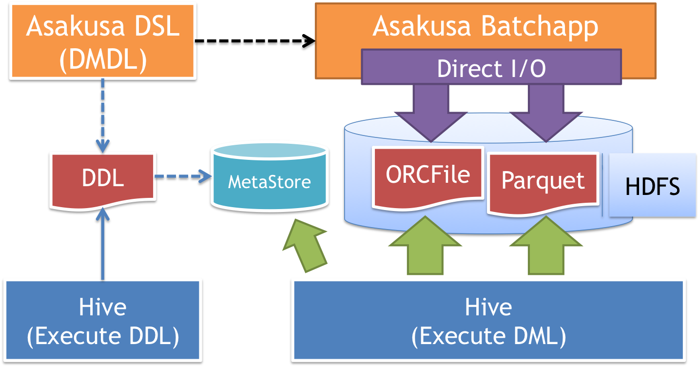

=========================================
Asakusa FrameworkとHiveを連携して利用する
=========================================

* 対象バージョン: Asakusa Framework ``0.7.0`` 以降

この文書では、Asakusa Framework と `Apache Hive`_ （以下「Hive」）を連携して利用する方法について説明します。

..  seealso::
    本書で説明するAsakusa FrameworkのHive連携に関する機能の詳細は、 :doc:`../directio/using-hive` を参照してください。

..  _`Apache Hive`: https://hive.apache.org/

はじめに
========

Apache HiveはHadoop上のデータをSQLライクな言語によって操作するためのプロダクトです。

Asakusa Frameworkは複雑なバッチアプリケーションを高品質に開発するための機能セットを中心に提供しています。
一方で、データを様々な観点でアドホックに抽出したり、データをインタラクティブに操作するといった用途に対する機能は提供していません。

HiveのようなSQLライクのクエリーを利用した、インタラクティブなデータ操作を提供するプロダクトをAsakusa Frameworkと組み合わせることで、より高度で柔軟なデータ処理システムを実現することができます。

SQL on Hadoop 周辺プロダクトとの連携
------------------------------------

本書の内容をベースとして、Hiveのメタデータ管理方法と互換性がある、SQLベースのクエリーエンジンを持つ様々なプロダクトと連携することも可能です。

SQL on Hadoopとも呼ばれるこのようなプロダクトのうち、オープンソースソフトウェアとして提供されているプロダクトの一例を以下に挙げます。

* `Impala <http://impala.io/>`_
* `Presto <http://prestodb.io/>`_
* `Apache Drill <http://incubator.apache.org/drill/>`_

..  attention::
    各プロダクトはそれぞれHiveとの互換性に関する機能が異なり、また同プロダクトのバージョンによっても機能が異なるため、Asakusa Frameworkが提供するHive連携機能との互換性についても対応状況は様々です。詳しくは各プロダクトのドキュメントを参照してください。

Hive環境の構築
--------------

以降の説明では、利用するHadoop環境にHiveが導入済みでHiveの各機能が利用できる状態であることを前提とします。
運用環境にHiveをセットアップする方法については、各Hadoopディストリビューションのドキュメントなどを参照してください。

なお :jinrikisha:`Jinrikisha <index.xml>` にはHiveが同梱されており、Jinrikishaで構築した開発環境上で本書の手順を確認することもできます。

コンポーネントの関連
====================

Asakusa FrameworkとHiveを連携したシステムにおける各コンポーネントの関連の概要を以下に示します。

`バッチアプリケーションの開発`_ : ``Asakusa DSL(DMDL)``
  Hiveと連携するバッチアプリケーションは、 :doc:`Direct I/O Hive <../directio/using-hive>` を利用して開発します。

  Direct I/O Hiveが提供するDMDLの拡張によって、入出力データの形式にカラムナフォーマットファイル( ``ORCFile`` または ``Parquet`` )を指定することができます。

  また、DMDLからHiveのテーブルを作成するためのDDLスクリプトを作成することができます。

`Hiveテーブルの作成`_ : ``Hive (Execute DDL)``
  DMDLから生成したHiveテーブル作成用のDDLスクリプトをHiveのコマンドやWeb UIから実行すると、Hiveのメタストア ( ``Metastore`` ) にテーブルの情報が登録されます。

  HiveメタストアはHiveのテーブル構造やデータの配置場所に関するメタ情報を保持するデータベースで、主にMySQLやPostgreSQLなどのRDBMSが利用されます。

`バッチアプリケーションの実行`_ : ``Asakusa Batchapp (Direct I/O)``
  Direct I/O Hiveを利用するアプリケーションは、HDFSなどのHadoopファイルシステムに対してカラムナフォーマットファイルの読み書きを行います。

`クエリーの実行`_ : ``Hive (Execute DML)``
  Hiveはメタストアの情報に基づいてHadoopファイルシステム上のデータに対してクエリーを実行し結果を出力します。

  Asakusa Frameworkとの連携の場合では、バッチアプリケーションが出力したカラムナフォーマットファイルを持つテーブルに対してクエリーを実行します。

  また逆に、クエリーによってカラムナフォーマットファイルを持つテーブルデータを生成し、これをバッチアプリケーションが読み込むこともできます。

バッチアプリケーションの開発
============================

Direct I/O Hiveを利用してHiveと連携するためのバッチアプリケーションを開発します。
Direct I/O Hiveの利用方法について、詳しくは :doc:`../directio/using-hive` を参照してください。
ここでは、Hive連携向けのアプリケーション開発時に考慮すべき内容や参考的な情報などを説明します。

カラムナフォーマットの選択
--------------------------

Hiveとの連携に利用するカラムナフォーマットファイルは、そのフォーマットごとに対応しているデータ型やクエリー実行時の性能特性、データ入出力時のパフォーマンスや生成されるデータサイズなどが異なります。

フォーマットごとの性能特性や入出力時のパフォーマンスは、利用する運用環境の構成によってもその影響度合いが異なります。

また、Hive以外のプロダクトを利用する場合は、そのプロダクトごとに対応しているカラムナフォーマットが異なります。

以上のような点を考慮して、利用するカラムナフォーマットを選択してください。

アプリケーションの例
--------------------

Asakusa Frameworkの `サンプルプログラム集 (GitHub)`_ にDirect I/O Hiveを利用したサンプルアプリケーションを公開しています。

以下はAsakusa Framework バージョン ``0.8.1`` を使用したDirect I/O Hiveのサンプルアプリケーションです。

* https://github.com/asakusafw/asakusafw-examples/tree/0.8.1/example-directio-hive

..  _`サンプルプログラム集 (GitHub)`: http://github.com/asakusafw/asakusafw-examples

Hiveテーブルの作成
==================

バッチアプリケーションの入出力に対応するHiveのテーブルを作成します。

Hiveテーブル用DDLの作成
-----------------------

Direct I/O Hiveを利用しているアプリケーションプロジェクトでは、DMDLスクリプトからHiveのDDLを生成する :program:`generateHiveDDL` タスクを利用することができます。

:program:`generateHiveDDL` タスクの実行例は以下の通りです。

..  code-block:: sh

    ./gradlew generateHiveDDL --location /user/asakusa/target/testing/directio/tables

``--location`` オプションを指定した場合、生成する ``CREATE TABLE`` 文に対して、 ``LOCATION`` (テーブルに対応するデータファイルを配置するHadoopファイルシステム上のパス) 句を追加し、さらにその引数として ``'<指定したパス>/<テーブル名>'`` が設定されます。
Hiveはここで指定したパスにディレクトリを作成し、配下にテーブルのデータファイルを格納します。

``--location`` の値はDirect I/Oのデータソース定義やジョブフローDSLに定義するベースパスやリソースパターンの値と対応している必要があります。

例えば、上例の ``--location`` に対応するエクスポート定義は以下のようになります。

..  code-block:: java

    public class CategorySummaryToOrc extends AbstractCategorySummaryOrcFileOutputDescription {

        @Override
        public String getBasePath() {
            return "tables/category_summary";
        }

        @Override
        public String getResourcePattern() {
            return "*";
        }

..  attention::
    ``--location`` オプションには絶対パスまたはスキーマ付きのURIを指定する必要があります。
    上記は、Direct I/Oのデータストアが :file:`/user/asakusa/target/testing/directio` を基点とした前提の例です。

..  hint::
    多くの場合、Direct I/Oのベースパス ( ``getBasePath()`` ) には ``--location`` オプションで指定したディレクトリと重なるように指定するのがよいでしょう。

:program:`generateHiveDDL` タスクを実行すると、アプリケーションプロジェクトの :file:`build/hive-ddl` ディレクトリ配下に :file:`<プロジェクト名>.sql` という名前でHiveのDDL文を含むSQLファイルが生成されます。

..  seealso::
    :program:`generateHiveDDL` タスクについてより詳しくは、 :doc:`../application/gradle-plugin` - :ref:`gradle-plugin-task-hiveddl` を参照してください。

Hiveテーブルの登録
------------------

Hiveテーブル登録用のDDLファイルを作成したら、これをHiveから実行してHiveメタストアにテーブル定義を登録します。

ここでは、Hiveのコマンドラインインターフェース(CLI)を使用してDDLファイルを実行する例を示します。
Hiveが導入されてる環境上にDDLファイルを配置し、コマンドラインから :program:`hive` コマンドを以下のように実行します。

..  code-block:: sh

    hive -f /tmp/hive-ddl/example-directio-hive.sql

..  code-block:: sh

    OK
    Time taken: 2.577 seconds
    OK
    Time taken: 0.058 seconds
    ...

テーブルが正常に登録されていることを確認します。まず :program:`hive` コマンドをインタラクティブモードで実行します。

..  code-block:: sh

    hive

``show tables`` クエリーを実行してメタストアに登録したテーブル一覧を表示します。

..  code-block:: sh

    hive> show tables;

    OK
    category_summary
    error_record
    item_info
    sales_detail
    store_info
    Time taken: 0.453 seconds, Fetched: 5 row(s)

..  seealso::
    HiveのCLIについて詳しくは、Hiveのドキュメント `LanguageManual Cli`_ などを参照してください。

..  _`LanguageManual Cli`: https://cwiki.apache.org/confluence/display/Hive/LanguageManual+Cli

バッチアプリケーションの実行
============================

Direct I/O Hiveを利用したバッチアプリケーションを実行します。

運用環境に対してAsakusa Frameworkとバッチアプリケーションをデプロイして実行する方法については、 :doc:`../administration/deployment-guide` を参照してください。

先述の `アプリケーションの例`_ で紹介したサンプルアプリケーションを実行する場合は、以下のようにサンプルデータを配置してYAESSコマンドを実行します。

..  warning::
    以下の例を実行すると、 ``target/testing/directio/tables`` 以下のファイルをすべて削除します。
    削除する前に重要なファイルがこのパスに存在しないかを必ず確認してください。

..  code-block:: sh

    hadoop fs -rm -r target/testing/directio/tables
    hadoop fs -put /tmp/example-dataset/tables target/testing/directio/tables

    $ASAKUSA_HOME/yaess/bin/yaess-batch.sh example.summarizeSales

クエリーの実行
==============

バッチアプリケーションが生成したテーブルデータは直接Hiveのクエリーで参照することができます。

以下は、サンプルアプリケーションの実行結果データを参照する例です。

..  code-block:: sh

    hive> select * from category_summary;
    OK
    1300    12  1596
    1401    15  1470
    1600    28  5400

    hive> select * from error_record;
    OK
    1990-01-01 10:40:00 0001    9999999999999   商品不明
    2011-04-01 11:00:00 0001    9999999999999   商品不明
    2011-04-01 20:00:00 9999    4922010001000   店舗不明
