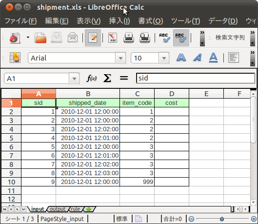
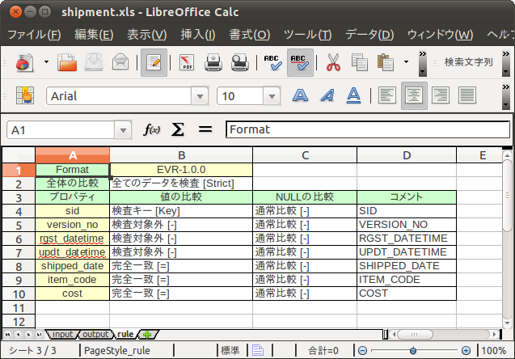

===========================
Excelによるテストデータ定義
===========================

この文書では、Excelでテストデータを定義する方法や、テストデータのテンプレートを生成する方法について紹介します。

テストデータテンプレート
========================

テストデータはDMDLで記述したそれぞれのデータモデルに対して記述します。
Asakusa Frameworkには、このテストデータを記述するためのExcelテンプレートを生成するツールが同梱されています。

..  seealso::
    DMDLでデータモデルを定義する方法は、 :doc:`../dmdl/index` を参照してください。

コマンドラインインターフェース
------------------------------

テストデータテンプレートを生成するには、 ``asakusa-test-data-generator`` の :javadoc:`com.asakusafw.testdata.generator.excel.Main` を実行します。
指定できるオプションは次の通りです。

..  program:: com.asakusafw.testdata.generator.excel.Main

..  option:: -format

    出力するテンプレートの形式。
    種類については `formatオプション`_ を参照。

..  option:: -source

    対象のデータモデルを定義したDMDLスクリプトへのパス一覧。
    スクリプトファイル化、それを含むディレクトリを指定する。
    パス区切り文字で区切って複数指定可能。

..  option:: -output

    生成したテストデータテンプレートを出力する先のディレクトリ。
    存在しない場合には自動生成する。

..  option:: -encoding (optional)

    DMDLスクリプトのエンコーディング。
    未指定の場合はプラットフォーム依存。

..  option:: -plugin (optional)

    DMDLコンパイラのプラグインファイル。
    パス区切り文字で区切って複数指定可能。

.. _testdata-generator-excel-format:

formatオプション
~~~~~~~~~~~~~~~~

``-format`` オプションには次の値を指定できます。

..  option:: ALL

    入力データ、期待データ、テスト条件を記述できるシートを生成 (Excel 97形式)。

..  option:: DATA

    入力データまたは期待データを記述できるシートのみを生成 (Excel 97形式)。

..  option:: RULE

    テスト条件を記述できるシートのみを生成 (Excel 97形式)。

..  option:: INOUT

    入力データと期待データを記述できるシートを生成 (Excel 97形式)。

..  option:: INSPECT

    期待データとテスト条件を記述できるシートを生成 (Excel 97形式)。

..  option:: ALLX

    入力データ、期待データ、テスト条件を記述できるシートを生成 (Excel 2007形式)。
    
    ..  versionadded:: 0.5.3

..  option:: DATAX

    入力データまたは期待データを記述できるシートのみを生成 (Excel 2007形式)。

    ..  versionadded:: 0.5.3

..  option:: RULEX

    テスト条件を記述できるシートのみを生成 (Excel 2007形式)。

    ..  versionadded:: 0.5.3

..  option:: INOUTX

    入力データと期待データを記述できるシートを生成 (Excel 2007形式)。

    ..  versionadded:: 0.5.3

..  option:: INSPECTX

    期待データとテスト条件を記述できるシートを生成 (Excel 2007形式)。

    ..  versionadded:: 0.5.3

..  attention::
    Excel 97形式のシートではカラム数が256までという制限があるため、256より多いプロパティを持つデータモデルに対して入力データシートと出力データシートですべてのプロパティを扱うことができないという制約があります。

..  attention::
    Asakusa Frameworkのバージョン |version| では、Excel 2007形式のシート生成オプションは試験的機能として提供されています。これまでのところでは、以下のような問題が報告されています。

    * Excel 2007形式のシートをLibreOffice Calcで編集すると、シートの罫線スタイルが崩れる

入力データと期待データ
======================

入力データと期待データは、それぞれ生成したテストデータテンプレートのデータ記述シートに記述します。
このデータ記述シートは、下図のように1行目にプロパティ名の一覧が記載され、2行目以降が空のシートです。

それぞれの行はデータモデルオブジェクト一つ分を表しています。
それぞれの列はオブジェクトのプロパティを表し、1行目にそのプロパティの名前が記載されています。
そのため、それぞれのセルは特定のオブジェクトのプロパティ値を表すことになります。

..  hint::
    プロパティが不要である場合、その列は削除してしまってかまいません。
    削除した場合、そのプロパティは ``NULL`` として取り扱います。

NULL値
------

NULLを表す値を入力するには、そのセルを空のままにします。
ここでは空の文字列とNULLは明確に区別されており、セルの種類が文字列であっても、空のセルは常にNULLとして取り扱います。

数値
----

数値を表す値を入力するには、セルにその数値を入力するか、またはその数値を表す文字列を入力します。

文字列が入力された場合、次の方法で適切な数値に変換します。

..  list-table:: 数値の変換方法
    :widths: 10 10
    :header-rows: 1

    * - データ型
      - 変換方法
    * - ``long`` までの整数
      - ``Long.parseLong``
    * - ``double`` までの浮動小数点
      - ``Double.parseDouble``
    * - 上記以外の数値
      - ``new BigDecimal(...)``

その後、実際の型に合わせて値が切り詰められます。
値が切り詰められる際に、オーバーフローやアンダーフローが発生する場合もあります。

..  attention::
    パーセンテージや日付等で表されているセルについても、Excelでは内部的に数値で表現されています。
    このため、数値を表すプロパティに対してこれらの値を入力した場合、予期せぬ値として評価されてしまう場合があります。

..  hint::
    Excelは数値データを内部的に倍精度の浮動小数点数として保持するようです。
    絶対値の大きな値や、正確な固定小数点数を利用したい場合には、文字列として入力するのが無難です。

論理値
------

論理値を表す値を入力するには、セルに ``TRUE`` または ``FALSE`` を直接指定するか、またはそれらと同等の文字列を入力します。
文字列でこれらの値を指定した場合、文字列 ``TRUE`` または ``FALSE`` と大文字小文字の区別なしに一致すれば、その値として取り扱います。

日付と時刻
----------

日付や時刻を表す値を入力するには、セルに日時（日付と時刻）を指定します。

テストドライバーは内部的に日付のみ、時刻のみ、日時、の3種類のデータ型を提供していますが、Excelでは指定できる形式は日時のみです。
日時以外のプロパティに対しては、必要なフィールドのみから値を取り出します [#]_ 。

..  note::
    ここは本来文字列による指定も可能であるべきですが、現在はExcelの日付や時刻に関する形式のみをサポートしています。

..  [#] つまり、日付型に ``1999-12-31 12:34:56`` という日時が指定されていても、実際には1999年12月31日を表す日付データとして取り扱われます。

文字列
------

文字列を入力するには、セルにその文字列を指定します。
ただし、Excelのセルは文字列を入力したつもりでも、内部的に数値や日付などの別の形式に変換されてしまう場合があります。

..  attention::
    テスト時のミスを減らすため、文字列型のプロパティに対応するセルに文字列型以外を入力した場合、テストは失敗するようになっています。
    文字列型以外のセルには、たとえば数値や日付など、ここまでに紹介したデータ型が含まれます。

Excelのセルの形式を強制的に文字列として指定するには、セルに入力する値の先頭に ``'`` (シングルクウォート) を付与します。
このシングルクウォート記号は文字列に含まれず、以降の値が文字列として取り扱われます。

また、空のセルはテストドライバーによって `NULL値`_ として取り扱われます。
長さ0の文字列を入力したい場合には ``'`` のみを指定してください。

数式
----

値にはExcelの数式を指定することができます。
数値内にセル参照を指定することも可能です。

..  hint::
    テストドライバーでは数式の評価や実行に `Apache POI`_ の機能を利用しています。
    利用可能な数式やその制限などについては `Apache POI`_ の情報を確認してください。

..  _`Apache POI`: http://poi.apache.org/

テスト条件
==========

テスト条件は、生成したテストデータテンプレートの条件記述シートに記述します。
このシートは、全体の比較条件やプロパティごとの比較条件をドロップダウンの形式で選択します。

このシートは、2行目で `全体の比較条件`_ を指定し、4行目以降でプロパティごとの比較条件を指定します。
また、4行目移行は1列目(A)に対象のプロパティ名が記載されています。

Format
------

条件記述シートにはテストデータテンプレートのフォーマットバージョンが定義されており、このバージョンによって利用可能な機能が異なります。

特定バージョンから利用可能な機能は後述の各機能の説明においてその条件が記載されています。

フォーマットバージョンの一覧は以下の通りです。

..  list-table:: フォーマットバージョン
    :widths: 2 3 5
    :header-rows: 1

    * - バージョン
      - Frameworkバージョン [#]_
      - 主な変更点
    * - ``EVR-1.0.0``
      - ``0.2.0`` 以降
      - 初期バージョン
    * - ``EVR-2.0.0``
      - ``0.7.0`` 以降
      - `値の比較`_ に ``特殊ルール [Expr]`` を追加

..  attention::
    テストデータテンプレートのフォーマットバージョンを上げたい場合は、新規のテストデータテンプレートを作成し、テスト条件シートを再定義してください。
    
    なお、入力データと期待データのシートはフォーマットバージョンのようなバージョン指定はありません。

..  [#] 該当するフォーマットバージョンが利用可能なAsakusa Frameworkのバージョンです。
        テストデータテンプレートの生成を行った場合、そのAsakusa Frameworkが対応している最新のフォーマットバージョンを持つテンプレートが生成されます。

テストドライバーの動作
----------------------

テストドライバーは、期待データと実際の結果をまず `キープロパティ`_ で突き合わせます。
突き合わせられたデータのペアはそれぞれ `値の比較`_ や `NULLの比較`_ に従って、プロパティごとに比較されます。
突き合わせに失敗したレコードがある場合、 `全体の比較条件`_ に従って比較を行います。

キープロパティ
--------------

Excelでテスト条件を記述する場合、突き合わせに利用するキープロパティには2列目(B)で ``検査キー [Key]`` を選んだものが利用されます。

キープロパティを複数指定した場合、それらは複合キーとして取り扱われます。
つまり、プロパティ ``a`` と ``b`` をどちらも検査キーとして指定した場合、 ``a`` と ``b`` のいずれも同じ値であるレコードどうしで比較を行います。

値の比較
--------

突き合わせられた期待データと結果のレコードは、 `値の比較`_ で指定された方法でプロパティごと比較されます。
ただし、ここで「検査キー」が指定されたプロパティについては、 `キープロパティ`_ として取り扱われます。

これは、以下のような比較方法を選択できます。

``検査対象外 [-]``
  常に成功。

``完全一致 [=]``
  プロパティの値が完全に同じ場合のみ成功。

``部分一致 [<=]``
  期待データで指定した文字列が、結果データに含まれている場合のみ成功。
  文字列のみ。

``現在日付 [Today]``
  結果データの日付または時刻が、テスト開始時日から終了日の間に収まっている場合のみ成功。
  期待データに指定した値は無視される。
  日付または時刻のみ。

``現在時刻 [Now]``
  結果データの日付または時刻が、テスト開始時時刻から終了時刻の間に収まっている場合のみ成功。
  期待データに指定した値は無視される。
  日付または時刻のみ。

``特殊ルール [Expr]``
  特定用途向けの特殊なルールを利用します。
  指定可能なルールは後述の `オプション`_ 参照してください。

全てのプロパティに対して上記の方法を元に比較を行い、すべて成功したらそのレコードに対する値の比較が成功したことになります。

..  hint::
    現在日付や現在時刻が必要になるのは、テスト対象のプログラム内で「現在のシステム日付」や「現在のシステム時刻」を利用した場合などが考えられます。
    テストプログラムの実行中に日付が変更されてしまった場合などでも、これらの比較は正しく動作します。

NULLの比較
----------

値の比較とは別に、プロパティごとにNULLとの比較を行います。

これは、以下のような比較方法を選択できます。

``通常比較 [-]``
  特別な比較を行わない。

``NULLなら常に成功 [AA]``
  結果データのプロパティがNULLなら、 `値の比較`_ の比較に関係なく成功

``NULLなら常に失敗 [DA]``
  結果データのプロパティがNULLなら、 `値の比較`_ の比較に関係なく失敗

``NULLでなければ常に成功 [AP]``
  結果データのプロパティがNULLでなければ、 `値の比較`_ の比較に関係なく成功

``NULLでなければ常に失敗 [DP]``
  結果データのプロパティがNULLでなければ、 `値の比較`_ の比較に関係なく失敗

..  hint::
    ここで「通常比較」を指定し、結果データの値がNULLであった場合、 `値の比較`_ で指定した方法によって取り扱いが多少異なります。

    値の比較で「完全一致」を選んでいた場合、期待データもNULLである場合のみ成功します。
    完全一致以外では、常に失敗します。

オプション
----------

..  versionadded:: EVR-2.0.0
    `Format`_ バージョン ``EVR-2.0.0`` 以降

`値の比較`_ に ``特殊ルール [Expr]`` を指定した場合、オプション列に以下のルールを定義することができます。

..  attention:
    `値の比較`_ に ``特殊ルール [Expr]`` を指定していない場合、オプション列は無視されます。

誤差範囲の指定
~~~~~~~~~~~~~~

値の比較の際に、期待値に対する実際値の誤差を許容する範囲を指定することができます。

誤差範囲の指定方法は以下の通りです。

..  list-table:: 特殊ルールオプション: 誤差範囲の指定
    :widths: 2 6 2
    :header-rows: 1

    * - ルール指定
      - ルールの意味
      - 指定の例
    * - ``~数値``
      - 実際値は期待値に対して指定した数値の上下範囲内である
      - ``~10``
    * - ``~+数値``
      - 実際値は期待値に対して指定した数値の上範囲内である
      - ``~+20``
    * - ``~-数値``
      - 実際値は期待値に対して指定した数値の下範囲内である
      - ``~-30``

誤差範囲の単位は、比較対象のプロパティ型が数値型の場合はその数値、 ``DATE`` 型の場合は日数、 ``DATETIME`` の場合は秒となります。

大小関係の指定
~~~~~~~~~~~~~~

値の比較の際に、期待値に対する実際値の大小関係を指定することができます。

大小関係の指定方法は以下の通りです。

..  list-table:: 特殊ルールオプション: 大小関係の指定
    :widths: 4 6
    :header-rows: 1

    * - ルール指定
      - ルールの意味
    * - ``>``
      - 実際値は期待値より大きい
    * - ``<``
      - 実際値は期待値より小さい
    * - ``>=``
      - 実際値は期待値以上である
    * - ``<=``
      - 実際値は期待値以下である

全体の比較条件
--------------

シートの2行目では、全体の比較条件を指定できます。
具体的な動作は下記の通りです。

..  list-table:: 全体の比較方法
    :widths: 4 3 3
    :header-rows: 1

    * - 比較方法
      - 期待データがない場合
      - 実際の結果がない場合
    * - ``全てのデータを検査 [Strict]``
      - 比較失敗
      - 比較失敗
    * - ``余計なデータを無視 [Expect]``
      - 比較失敗
      - 無視
    * - ``存在しないデータを無視 [Actual]``
      - 無視
      - 比較失敗
    * - ``お互い存在するデータのみ検査 [Intersect]``
      - 無視
      - 無視

なお、全体の比較条件に ``比較しない [-]`` を選択した場合、レコードを一切比較しません。
つまりこの場合、 `値の比較`_ や `NULLの比較`_ 等は無視されます。

テストデータの利用
==================

作成したテストデータのExcelファイルは、テストドライバーの規約に従って配置して下さい。
このファイルをテストドライバーから参照する際には、次のような形式で指定します。

``<ファイルパス>#<シート名>``
    指定の名前のシートを利用する。
``<ファイルパス>#:<シート番号>``
    指定の位置のシートを利用する。
    シート番号は左から順に 1, 2, ...

..  attention::
    Eclipseのワークスペース上のファイルをExcelで操作している場合、Excelで保存したファイルがEclipseに反映されない場合があります。
    その場合、該当ファイルをパッケージエクスプローラー等から選択し、コンテキストメニューから :guilabel:`Refresh` などを選択してください。

