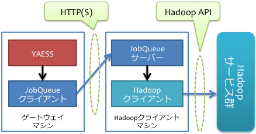
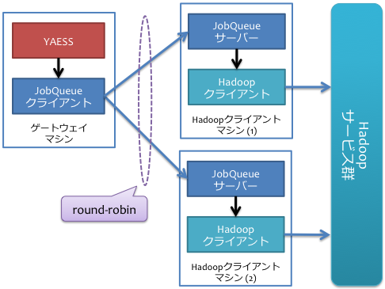

==============
YAESS JobQueue
==============
この文書では、シンプルなHadoopジョブの実行を制御するJobQueueのサーバーおよび、それをYAESSと連携して利用するクライアントプラグイン ``yaess-jobqueue`` の利用方法について解説します。

YAESSがリモートのHadoopと連携する場合に、ネットワークの瞬断に強いなどの利点があります。
そのため、Hadoopのジョブ実行が長時間に渡る場合や、通信路が不安定な場合などに、組み込みで提供されているSSH経由での通信よりも安定した動作が見込めます。

JobQueue
========
JobQueueは主に2つのコンポーネントで構成されています。

JobQueueサーバー
    Hadoopのジョブを実行するサービスです。
    HTTP経由でHadoopジョブ実行リクエストを受け取り、Hadoopコマンドを利用してジョブを起動します。
    また、ジョブ実行リクエストを内部のキューに一度蓄えて、同時に実行可能なジョブ数を制御できます。
    
    このコンポーネントは、Hadoopサービス群と通信するHadoopクライアントマシン上に配置します。

JobQueueクライアントプラグイン
    JobQueueサーバーにHadoopジョブ実行リクエストを送るクライアントで、 :doc:`YAESS <index>` のHadoopジョブハンドラプラグインとして提供されます。
    JobQueueサーバーを経由してYAESSからHadoopジョブを実行できます。
    
    このコンポーネントは、YAESSを実行するマシン上にYAESSのプラグインとして配置します。

JobQueueは以下のような機能を持っています。

同時実行数制御
    JobQueueサーバーから同時に実行可能なHadoopジョブの個数を制限できます。
標準出力の保存
    JobQueueサーバーからジョブを実行した際の標準出力および標準エラー出力を、ジョブごとに保存できます。
HTTPS通信
    HTTPだけでなくHTTPSによる通信も可能です。
ベーシック認証
    JobQueueサーバーとの通信時にHTTPのベーシック認証を利用可能です。
ラウンドロビン処理
    複数のJobQueueサーバーを登録すると、ラウンドロビン方式でバッチ内のHadoopジョブを振り分けて実行します。
    一部のサーバーを利用不可能になった場合、そのサーバーをブラックリストに追加して同一バッチ内で利用しないようにします。

JobQueueを利用する際の構成例
============================
以下はJobQueueを利用する際の構成例です。

単一構成
--------
JobQueueサーバーを一台のマシンにインストールする場合、次のような構成をとります。

Hadoopコマンドを利用できるマシンでJobQueueサーバーを実行し、そこに対してYAESSからJobQueueクライアントプラグインを利用して通信します。

冗長構成
--------
`単一構成`_ ではJobQueueサーバーが単一障害点になるという問題があるため、JobQueueサーバーを複数用意する構成も検討してください。

単一構成と異なるのはJobQueueサーバーの台数で、上図では2台の異なるマシン上でJobQueueサーバーを実行しています。
JobQueueクライアントプラグインに複数のJobQueueサーバーを登録すると、ラウンドロビン方式でそれぞれのJobQueueサーバーに対して交互にジョブ実行のリクエストを発行します。

JobQueueクライアントプラグインが、いずれかのJobQueueサーバーのダウンを検出すると、該当のサーバーをブラックリストに登録し、同一のバッチ内でそのサーバーを利用しないようにします。
JobQueueサーバーがダウンから復旧したら、次回以降のYAESSの実行ではそのサーバーを再度利用するようになります。

JobQueueサーバーの利用方法
==========================
JobQueueサーバーは、Servlet API 3.0に対応したサーブレットコンテナ上のWebアプリケーションとして動作します。
ここでは、Apache Tomcat [#]_ Version 7(以下、Tomcatと表記します)を使ったJobQueueサーバーの利用方法を説明します。

Tomcatの構築手順やSSL、ベーシック認証の設定等は、Tomcatの公式ドキュメント [#]_ 等を参考にしてください。
以降、Tomcatをインストールしたディレクトリを、 ``${CATALINA_HOME}`` と表記します。

..  attention::
     
    Tomcatは *ASAKUSA_USER* から実行するように設定してください。

..  [#] http://tomcat.apache.org
..  [#] http://tomcat.apache.org/tomcat-7.0-doc/index.html

JobQueueサーバー・コンポーネントのインストール
----------------------------------------------
JobQueueサーバーに必要なコンポーネントをダウンロードします。

* http://www.asakusafw.com/download/jobqueue/asakusa-jobqueue-server-0.2.6.tar.gz

ダウンロードが完了したら、以下の例を参考にしてJobQueueサーバーのコンポーネントを ``$ASAKUSA_HOME`` にインストールします
(標準の ``~/Downloads`` にダウンロードした場合の例です)。

..  code-block:: sh
    
    cd ~/Downloads
    cp asakusa-jobqueue-server-0.2.6.tar.gz "$ASAKUSA_HOME"
    cd "$ASAKUSA_HOME"
    tar zxvf asakusa-jobqueue-server-0.2.6.tar.gz
    find "$ASAKUSA_HOME" -name "*.sh" | xargs chmod u+x

JobQueueサーバーの設定
----------------------
JobQueueサーバーの動作に必要な設定を行います。
``${ASAKUSA_HOME}/jobqueue/conf/jobqueue.properties`` をエディタで開き、修正を行なってください。

..  list-table:: JobQueueサーバーの設定
    :widths: 10 15
    :header-rows: 1
    
    * - 名前
      - 値
    * - ``core.worker``
      - 同時実行可能なジョブのスロット数
    * - ``hadoop.log.dir``
      - Hadoopジョブ実行時のログ出力先

Hadoopジョブの設定
------------------
JobQueueサーバーがキックするHadoopジョブに関する環境変数の設定を行います。
``${ASAKUSA_HOME}/jobqueue-hadoop/conf/env.sh`` をエディタで開き、修正を行なってください。

..  list-table:: Hadoopジョブの設定
    :widths: 10 40
    :header-rows: 1
    
    * - 名前
      - 値
    * - ``JQ_HADOOP_PROPERTIES`` 
      - Hadoopジョブに追加のGenericオプションを指定することができます。
    * - ``HADOOP_TMP_DIR``
      - ジョブの実行ごとに指定のディレクトリ以下にHadoopのテンポラリ領域を作成します。

        省略された場合は、Hadoopのデフォルトのテンポラリ領域を使用し、全てのジョブで共有します。

以下は ``${ASAKUSA_HOME}/jobqueue-hadoop/conf/env.sh`` の例です。

..  code-block:: sh
    
    export JQ_HADOOP_PROPERTIES="-D com.example.property=example"
    export HADOOP_TMP_DIR="/tmp/hadoop-${USER}"

..  note::
    
    Tomcat起動時に ``HADOOP_HOME`` 環境変数を設定しない場合には、ここで設定する必要があります。

JobQueueサーバーのデプロイ
--------------------------
``${ASAKUSA_HOME}/webapps/jobqueue.war`` をTomcatにデプロイしてください。

Tomcatにデプロイするには、 ``jobqueue.war`` ファイルを ``${CATALINA_HOME}/webapps`` にコピーするか、
次のようなコンテキスト設定ファイルで ``jobqueue.war`` ファイルのパスを指定してください。

例) ``${CATALINA_HOME}/conf/Catalina/localhost/jobqueue.xml`` 

..  code-block:: xml
    
    <Context docBase="${ASAKUSA_HOME}/webapps/jobqueue.war" />

環境変数の設定
--------------
Tomcat起動時に、JobQueueサーバーの利用に必要となる環境変数を設定します。

``~/.profile`` をエディタで開き、最下行に以下の定義を追加します。

..  code-block:: sh
    
    export JAVA_HOME=/usr/lib/jvm/jdk-6
    export HADOOP_HOME=/usr/lib/hadoop
    export ASAKUSA_HOME=$HOME/asakusa
    export CATALINA_OPTS='-DapplyEvolutions.default=true'

``~/.profile`` を保存した後、設定した環境変数をターミナル上のシェルに反映させるため、以下のコマンドを実行します。

..  code-block:: sh
     
    . ~/.profile

JobQueueサーバーのログ出力
--------------------------
JobQueueサーバーはログ出力にLogback [#]_ を利用しています。

標準ではコンソールに出力されますが、出力先やログレベルを変更する場合にはLogbackの設定を変更する必要があります。
次の例のような設定ファイルを作成してください。

..  code-block:: xml
    
    <configuration>
    
      <conversionRule conversionWord="coloredLevel" converterClass="play.api.Logger$ColoredLevel" />
    
      <appender name="FILE" class="ch.qos.logback.core.FileAppender">
        <file>/tmp/asakusa/log/jobqueue-server.log</file>
        <append>true</append> 
        <encoder>
          <pattern>%d{yyyy/MM/dd HH:mm:ss} %-5level [%thread] %msg%n</pattern>
        </encoder>
      </appender>
    
      <logger name="play" level="INFO" />
      <logger name="application" level="INFO" />
    
      <!-- Off these ones as they are annoying, and anyway we manage configuration ourself -->
      <logger name="com.avaje.ebean.config.PropertyMapLoader" level="OFF" />
      <logger name="com.avaje.ebeaninternal.server.core.XmlConfigLoader" level="OFF" />
      <logger name="com.avaje.ebeaninternal.server.lib.BackgroundThread" level="OFF" />
    
      <root level="INFO">
        <appender-ref ref="FILE" />
      </root>
    
    </configuration>

設定ファイルを指定するため、上記の ``CATALINA_OPTS`` 環境変数に以下のように設定を追加してください。

..  code-block:: sh
    
    export CATALINA_OPTS='-DapplyEvolutions.default=true -Dlogger.file=/path/to/logger.xml'

..  [#] http://logback.qos.ch/

Tomcatの起動
------------
ドキュメントに従ってTomcatを起動してください。

動作確認
--------
デプロイ先のURLのコンテキストルート [#]_ にアクセスして、次のようなJSONが出力されればJobQueueサーバーが正しく動作しています。

..  code-block:: javascript
    
    {"application":"asakusa-jobqueue","configurations":{"ASAKUSA_HOME":"/home/asakusa/asakusa","core.worker":4,"hadoop.log.dir":"/tmp/hadoop-asakusa/logs"}}

..  [#] コンテキストパスを ``jobqueue`` にした場合、 http://localhost:8080/jobqueue にアクセスしてください。

JobQueueクライアントプラグインの利用方法
========================================

プラグインの登録
----------------
このプラグインを利用するには、 ``asakusa-yaess-jobqueue`` というプラグインライブラリをYAESSに登録します。
これは以下のURLからダウンロードできます。

* http://asakusafw.s3.amazonaws.com/maven/releases/com/asakusafw/asakusa-yaess-jobqueue/0.2.6/asakusa-yaess-jobqueue-0.2.6.jar

また、依存ライブラリとして以下のライブラリも必要です。

* `HttpComponents Core <http://hc.apache.org/index.html>`_ ( ``Ver.4.1.4`` で動作確認 )
* `HttpComponents Client <http://hc.apache.org/index.html>`_ ( ``Ver.4.1.3`` で動作確認 )
* `Gson <http://code.google.com/p/google-gson/>`_ ( ``Ver.1.7.1`` で動作確認 )
* `Commons Codec <http://commons.apache.org/codec/>`_ ( ``Ver.1.4`` で動作確認 )
* `Commons Logging <http://commons.apache.org/logging/>`_ ( ``Ver.1.1.1`` で動作確認 )

プラグインライブラリの登録方法は、 :asakusafw:`YAESS本体のマニュアル <yaess/user-guide.html>` を参照してください。

JobQueueを利用したHadoopジョブの実行
------------------------------------
JobQueueを利用してHadoopジョブを実行する場合、構成ファイルの ``hadoop`` セクションに以下の内容を設定します。

..  list-table:: JobQueueを利用する設定
    :widths: 10 15
    :header-rows: 1
    
    * - 名前
      - 値
    * - ``hadoop``
      - ``com.asakusafw.yaess.jobqueue.QueueHadoopScriptHandler``
    * - ``hadoop.1.url``
      - JobQueueサーバーのURL
    * - ``hadoop.1.user``
      - JobQueueサーバーの認証ユーザー名
    * - ``hadoop.1.password``
      - JobQueueサーバーの認証パスワード
    * - ``hadoop.timeout``
      - ジョブ登録時のタイムアウト (ミリ秒)
    * - ``hadoop.pollingInterval``
      - ジョブ状態の問い合わせ間隔 (ミリ秒)

``hadoop.1.url`` には、対象のJobQueueサーバーが動作しているコンテキストパスのルートまでを指定します。
現在のところ、プロトコルにはHTTPとHTTPSを利用可能で、URLに認証情報を含めることはできません。

``hadoop.1.user`` と ``hadoop.1.password`` はそれぞれ上記URLに対する認証情報です。
認証を行わない場合、これらの認証情報は省略可能です。

``hadoop.time`` と ``hadoop.pollingInterval`` はいずれも省略可能です。
省略した場合、タイムアウトは ``10000`` 、問い合わせ間隔は ``1000`` をそれぞれ既定値として利用します。

ラウンドロビン方式でのHadoopジョブの実行
----------------------------------------
複数のJobQueueサーバーを利用してラウンドロビン方式でHadoopジョブを実行する場合、
`JobQueueを利用したHadoopジョブの実行`_ に加えて以下の設定を追加します。

..  list-table:: ラウンドロビン方式を利用する設定
    :widths: 10 20
    :header-rows: 1
    
    * - 名前
      - 値
    * - ``hadoop.<n>.url``
      - JobQueueサーバーのURL
    * - ``hadoop.<n>.user``
      - JobQueueサーバーの認証ユーザー名
    * - ``hadoop.<n>.password``
      - JobQueueサーバーの認証パスワード

上記の ``<n>`` の部分には ``2`` 以上の整数を指定し、それらに対してURL、ユーザー名、パスワードをそれぞれ指定します。
ただし、認証を必要としないJobQueueに対しては、ユーザー名とパスワードを省略可能です。

この ``<n>`` の箇所を ``2`` , ``3`` , ... と次々増やしていくことで、より多くのJobQueueサーバーを登録できます。
これらはバッチ実行の際に、ラウンドロビン方式で順番に利用され、サーバーが動作していない際にはブラックリストに入れられます。

..  attention::
    サーバーが動作していない場合にはラウンドロビンから外されますが、
    ジョブの実行中にサーバーがダウンした場合にはその場でジョブの実行が失敗します。
