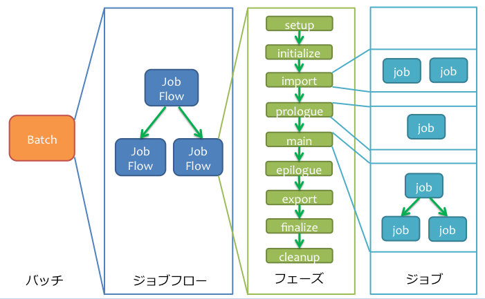

===================
YAESSユーザーガイド
===================

この文書では、YAESSの利用方法について紹介します。

.. _yaess-batch-structure:

Asakusa Frameworkのバッチ構造
=============================

YAESSを利用し、その機能を適切に設定するためにはAsakusa Frameworkのバッチ構造を理解しておく必要があります。

バッチの構成要素
----------------

Asakusa Frameworkのバッチは次のような構造を持ちます。

..  list-table:: バッチの構造
    :widths: 4 6
    :header-rows: 1

    * - 名前
      - 値
    * - バッチ
      - バッチ全体
    * - ジョブフロー
      - バッチ内のトランザクション単位
    * - `フェーズ`_
      - フロー内の処理内容の段階
    * - `ジョブ`_
      - フェーズ内の個々の実行単位

フェーズ
~~~~~~~~

バッチの構成要素のうち、フェーズには以下のようなものがあります。

..  list-table:: フェーズ一覧
    :widths: 2 8
    :header-rows: 1

    * - 名前
      - 処理内容
    * - ``setup``
      - ジョブフローの実行環境をセットアップする [#]_
    * - ``initialize``
      - ジョブフローの処理内容を初期化する [#]_
    * - ``import``
      - ジョブフローの処理に必要なデータを外部システムからインポートする
    * - ``prologue``
      - インポートしたデータを本処理用に加工する
    * - ``main``
      - Hadoopジョブなどの本処理を行う
    * - ``epilogue``
      - 本処理の結果をエクスポート用に加工する
    * - ``export``
      - ジョブフローの処理結果を外部システムにエクスポートする
    * - ``finalize``
      - ジョブフローの処理内容を完了またはロールバックさせる
    * - ``cleanup``
      - ジョブフローの実行環境をクリーンアップする

..  attention::
    ジョブフローが途中で失敗した場合、 ``cleanup`` フェーズは実行されません。
    これは失敗した原因を分析するために、ジョブフローが出力した中間ファイルなどを保持しておくためです。

..  note::
    上記の処理内容はあくまで概要で、これに即した処理が行われるとは限りません。

..  [#] バージョン |version| 時点では使用していません。
..  [#] バージョン |version| 時点では使用していません。

ジョブ
~~~~~~

バッチの構成要素のうち、ジョブには以下のようなものがあります。

..  list-table:: ジョブ一覧
    :widths: 2 8
    :header-rows: 1

    * - 名前
      - 処理内容
    * - Hadoopジョブ
      - HadoopのMapReduceジョブを実行する。1つのHadoopジョブで1つのMapReduceジョブ(ステージ)が実行される。
    * - コマンドラインジョブ
      - Hadoopジョブ以外のジョブの総称。WindGateのインポート処理やエクスポート処理などを実行する。

バッチの構成要素間の関係
------------------------

バッチの各要素は、以下の関係を持っています。

* バッチは複数のジョブフローで構成され、 :ref:`dsl-userguide-batch-dsl` の定義にしたがった実行順序の依存関係を持つ
* 各ジョブフローは各フェーズを上から順に実行する (DSLの定義内容によっては、フェーズの一部がスキップされる)
* 各フェーズは複数のジョブで構成され、 :ref:`dsl-userguide-flow-dsl` の定義などにしたがった実行順序の依存関係を持つ
* ジョブが実行する各処理は、 :ref:`dsl-userguide-flow-dsl` や :ref:`dsl-userguide-operator-dsl` の定義などによって決定される

以下は、上記の内容を俯瞰する図です。

プロファイルセット
==================

YAESSはHadoopクラスターや複数の外部システムなどを組み合わせた複雑な環境上でAsakusa Frameworkのバッチを実行するために設計されています。
YAESSでは、それぞれの環境に対するジョブ起動方法の設定や、YAESSそのものの設定を「プロファイルセット」と呼んでいます。

このプロファイルセットは、 :file:`$ASAKUSA_HOME/yaess/conf/yaess.properties` (以降「構成ファイル」)で管理されています。

構成ファイル
------------

構成ファイル ( :file:`yaess.properties` ) はJavaの一般的なプロパティファイルの文法で、主に下記のセクションから成り立っています。

..  list-table:: プロパティファイルの項目
    :widths: 2 8
    :header-rows: 1

    * - セクション
      - 内容
    * - ``core``
      - `YAESS本体の設定`_ (通常は変更しない)
    * - ``hadoop``
      - `Hadoopジョブの実行`_ に関する設定
    * - ``command``
      - `コマンドラインジョブの実行`_ に関する設定
    * - ``scheduler``
      - `ジョブのスケジューリング`_ に関する設定
    * - ``lock``
      - `バッチ実行のロック`_ に関する設定
    * - ``monitor``
      - `バッチ実行のモニタ`_ に関する設定

プロパティファイルのそれぞれのセクションには、該当するセクション名から始まるキーと、それに対応する値が記述されています。

..  code-block:: properties
    :caption: yaess.properties
    :name: yaess.properties-yaess-user-guide-1

    core = com.asakusafw.yaess.basic.BasicCoreProfile
    core.version = 0.1

    ## file lock
    lock = com.asakusafw.yaess.basic.BasicLockProvider
    lock.scope = world
    lock.directory = ${ASAKUSA_HOME}/yaess/var/lock

    ## ...

環境変数の利用
~~~~~~~~~~~~~~

構成ファイルのいくつかの項目では、項目値の文字列に ``${変数名}`` という形式を指定することで、YAESSを起動した環境の環境変数を含められます。

また、 ``${変数名-デフォルト値}`` のように、 変数名の後に ``-`` を指定して、その後にデフォルト値を記述することで、
YAESSを起動した環境の環境変数が存在しない場合に、ここで指定したデフォルト値を設定することができます。

以下は、デフォルト値を持つ環境変数の利用例です。

..  code-block:: properties
    :caption: yaess.properties
    :name: yaess.properties-yaess-user-guide-2

    scheduler.parallel.hadoop-master = ${YAESS_PARALLEL_HADOOP-3}

YAESS本体の設定
---------------

YAESS本体の設定は、構成ファイル内の ``core`` セクション内に記述します。

..  list-table:: YAESS本体の設定
    :widths: 3 7
    :header-rows: 1

    * - 名前
      - 値
    * - ``core``
      - ``com.asakusafw.yaess.basic.BasicCoreProfile``
    * - ``core.version``
      - ``0.1``

上記の値は変更しないようにしてください。

.. _yaess-profile-hadoop-section:

Hadoopジョブの実行
------------------

Asakusa Frameworkで開発したバッチは、内部的にHadoopのジョブを投入してさまざまな処理を行っています。
YAESS上でHadoopに関する設定を行うには、構成ファイル内の ``hadoop`` セクションの内容を編集します。

同一環境上のHadoopジョブを実行する
~~~~~~~~~~~~~~~~~~~~~~~~~~~~~~~~~~

YAESSを起動したコンピューターと同一のコンピューターにインストールされたHadoopを利用する場合、構成ファイルの ``hadoop`` セクションに以下の内容を設定します。

..  list-table:: 同一環境上のHadoopを実行する際の設定
    :widths: 3 7
    :header-rows: 1

    * - 名前
      - 値
    * - ``hadoop``
      - ``com.asakusafw.yaess.basic.BasicHadoopScriptHandler``
    * - ``hadoop.env.HADOOP_CMD``
      - :program:`hadoop` コマンドのパス [#]_
    * - ``hadoop.env.ASAKUSA_HOME``
      - Asakusa Frameworkのインストール先

上記のうち、先頭の ``hadoop`` を除くすべての項目で `環境変数の利用`_ ができます。

..  [#] この項目はオプションです。また、Hadoopのインストール先は別の設定方法もあります。
        詳しくは `Hadoopを利用する際の環境変数の設定`_ を参照してください

.. _yaess-profile-hadoop-section-ssh:

SSHを経由してHadoopジョブを実行する
~~~~~~~~~~~~~~~~~~~~~~~~~~~~~~~~~~~

YAESSからSSHを経由してリモートコンピューター上のHadoopを利用する場合、構成ファイルの ``hadoop`` セクションに以下の内容を設定します。

..  list-table:: SSHを経由してHadoopを実行する際の設定
    :widths: 3 7
    :header-rows: 1

    * - 名前
      - 値
    * - ``hadoop``
      - ``com.asakusafw.yaess.jsch.SshHadoopScriptHandler``
    * - ``hadoop.ssh.user``
      - ログイン先のユーザー名
    * - ``hadoop.ssh.host``
      - SSHのリモートホスト名
    * - ``hadoop.ssh.port``
      - SSHのリモートポート番号
    * - ``hadoop.ssh.privateKey``
      - ローカルの秘密鍵の位置
    * - ``hadoop.ssh.passPhrase``
      - 秘密鍵のパスフレーズ
    * - ``hadoop.env.HADOOP_CMD``
      - リモートの :program:`hadoop` コマンドのパス [#]_
    * - ``hadoop.env.ASAKUSA_HOME``
      - リモートのAsakusa Frameworkのインストール先

上記のうち、先頭の ``hadoop`` を除くすべての項目で `環境変数の利用`_ ができます。

なお、この仕組みではSSHでの通信に JSch [#]_ を利用しています。

..  [#] この項目はオプションです。
        また、Hadoopのインストール先は別の設定方法もあります。
        詳しくは `Hadoopを利用する際の環境変数の設定`_ を参照してください
..  [#] http://www.jcraft.com/jsch/

Hadoopを利用する際の環境変数の設定
~~~~~~~~~~~~~~~~~~~~~~~~~~~~~~~~~~

Hadoopを利用する際に特別な環境変数が必要な場合、以下の設定を追加します。

..  list-table:: Hadoopを利用する際の環境変数の設定
    :widths: 10 10
    :header-rows: 1

    * - 名前
      - 値
    * - ``hadoop.env.<環境変数名>``
      - 設定する環境変数の値

ここで指定する値には `環境変数の利用`_ ができます。

..  hint::
    ``hadoop.env.HADOOP_CMD`` や ``hadoop.env.ASAKUSA_HOME`` は上記の一部です。
    このうち、 ``ASAKUSA_HOME`` はAsakusa Frameworkの実行に必要であるため、常に指定するようにしてください。

    ``HADOOP_CMD`` は代わりに ``HADOOP_HOME`` を指定することも可能です。
    詳しくは `Hadoopコマンドの検索方法`_ を参照してください。

..  tip::
    ``hadoop.env.<環境変数名>=${<環境変数名>}`` のように書くと、現在の環境変数を対象の環境にそのまま受け渡せます。

Hadoopコマンドの検索方法
~~~~~~~~~~~~~~~~~~~~~~~~

Hadoopを起動する際には、起動する対象の :program:`hadoop` コマンドの配置場所を環境変数を利用して指定する必要があります。
Hadoopのジョブや :doc:`WindGate <../windgate/index>` などを実行する際には、次の手順で :program:`hadoop` コマンドを検索します。

* 環境変数 ``HADOOP_CMD`` が設定されている場合、 ``$HADOOP_CMD`` を :program:`hadoop` コマンドとみなして利用します。
* 環境変数 ``HADOOP_HOME`` が設定されている場合、 :program:`$HADOOP_HOME/bin/hadoop` コマンドを利用します。
* :program:`hadoop` コマンドのパス ( 環境変数 ``PATH`` ) が通っている場合、それを利用します。

上記の手順でHadoopコマンドが見つからない場合、対象処理の実行に失敗します。

Hadoopを利用する際のプロパティの設定
~~~~~~~~~~~~~~~~~~~~~~~~~~~~~~~~~~~~

Hadoopを利用する際に特別なプロパティ [#]_ が必要な場合、以下の設定を追加します。

..  list-table:: Hadoopを利用する際のプロパティの設定
    :widths: 10 10
    :header-rows: 1

    * - 名前
      - 値
    * - ``hadoop.prop.<プロパティ名>``
      - 設定するプロパティの値

ここで指定する値には `環境変数の利用`_ ができます。

..  [#] Javaのシステムプロパティではなく、 :program:`hadoop` コマンドに ``-D <key>=<value>`` で指定するプロパティです。

Hadoopブリッジの設定
~~~~~~~~~~~~~~~~~~~~

`同一環境上のHadoopジョブを実行する`_ 場合や、 `SSHを経由してHadoopジョブを実行する`_ 場合には、Hadoopがインストールされた環境上に「Hadoopブリッジ」が必要です。

Hadoopブリッジは Asakusa Frameworkの :file:`$ASAKUSA_HOME/yaess-hadoop` というディレクトリに含まれており、これにはYAESSがHadoopにジョブを投入する際に利用するツールが格納されています。

YAESSからHadoopを起動する際には、Hadoopが提供するコマンドを直接実行するのではなく、代わりに :program:`$ASAKUSA_HOME/yaess-hadoop/libexec/hadoop-execute.sh` というシェルスクリプトを実行します。
このシェルスクリプトは、最終的にHadoopのコマンドを実行するのですが、その手前でAsakusa Frameworkのための設定をいくつか行っています。

このシェルスクリプトの中では、 :file:`$ASAKUSA_HOME/yaess-hadoop/conf/env.sh` というシェルスクリプトを内部的に実行しています。
これは :program:`hadoop-execute.sh` と同一プロセス内で実行され、ここで環境変数を設定するとHadoop実行時の環境変数を設定できます。

YAESSの構成ファイル側で設定しきれない環境変数等がある場合には、こちらで設定してください。

ジョブフロー中間ファイルのクリーンアップ
~~~~~~~~~~~~~~~~~~~~~~~~~~~~~~~~~~~~~~~~

ジョブフローの実行が完了すると、その実行中に生成された中間ファイルは通常の場合に不要となります。
以下の設定を行うことで、ジョブフローの完了時 [#]_ にクリーンアップを行うかどうかを指定できます。

..  list-table:: ジョブフローのクリーンアップの設定
    :widths: 3 7
    :header-rows: 1

    * - 名前
      - 値
    * - ``hadoop.cleanup``
      - ``true`` でクリーンアップを行う、 ``false`` で行わない

``hadoop.cleanup`` が未指定の場合、クリーンアップを行う( ``true`` が指定されたのと同じ )よう動作します。
なおデフォルトの構成ファイルは ``hadoop.cleanup`` が未指定のため、クリーンアップが行われます。

..  [#] 実際には、これは ``cleanup`` フェーズ内で行われます。
        そのため、ジョブフローの途中で異常終了した場合には、クリーンアップは行われません。

Hadoopジョブ実行への介入
~~~~~~~~~~~~~~~~~~~~~~~~

Hadoopのジョブを起動する際に、YAESSはHadoopがインストールされた環境の :program:`$ASAKUSA_HOME/yaess-hadoop/libexec/hadoop-execute.sh` というシェルスクリプトを実行しています。
このシェルスクリプトを実行する際に、以下の引数を指定しています。

..  list-table:: Hadoopジョブ実行時の引数一覧
    :widths: 2 8
    :header-rows: 1

    * - 位置
      - 内容
    * - 1
      - ジョブクライアントクラス名
    * - 2
      - バッチID
    * - 3
      - フローID
    * - 4
      - 実行ID
    * - 5
      - バッチ実行引数 (文字列形式)
    * - 以降
      - その他のHadoopへの引数一覧

たとえば、ジョブクライアントクラス名が ``Client`` , バッチIDが ``bid`` , フローIDが ``fid`` , 実行IDが ``eid`` である場合、ジョブ実行時のコマンドは、以下のようになります。

..  code-block:: sh

    $ASAKUSA_HOME/yaess-hadoop/libexec/hadoop-execute.sh Client bid fid eid

YAESSでは、このコマンドラインを構成するルールに対して、以下の設定で介入できます。

..  list-table:: コマンドライン介入の設定 (Hadoopジョブ)
    :widths: 10 20
    :header-rows: 1

    * - 名前
      - 値
    * - ``hadoop.command.0``
      - 先頭に挿入されるトークン
    * - ``hadoop.command.1``
      - 2番目に挿入されるトークン
    * - ``hadoop.command.<n>``
      - ``n + 1`` 番目に挿入されるトークン

つまり、 ``hadoop.command.0`` に ``C:\\Cygwin\\bin\\bash.exe`` [#]_  , ``hadoop.command.1`` に ``-r`` と指定した場合、先ほどの例は、以下のようになります。

..  code-block:: sh

    C:\Cygwin\bin\bash.exe -r $ASAKUSA_HOME/yaess-hadoop/libexec/hadoop-execute.sh Client bid fid eid

また、それぞれの値には、 `環境変数の利用`_ の形式で環境変数を、 ``@[位置]`` の形式で元のコマンドラインの指定位置(0起算)のトークンを利用できます。
このとき、 ``@[0]`` は ``$ASAKUSA_HOME/yaess-hadoop/libexec/hadoop-execute.sh`` をさし、 ``@[1]`` はジョブクライアントクラス名をさし、といった具合になります。

..  [#] ``*.properties`` ファイルではバックスラッシュ ``\`` がエスケープ文字となるため、 ``\\`` のように2つつなげて書く必要があります。

.. _yaess-profile-command-section:

コマンドラインジョブの実行
--------------------------

WindGateなどのHadoop以外のジョブを、YAESSでは「コマンドラインジョブ」と総称しています。
YAESS上でコマンドラインジョブの設定を行うには、構成ファイル内の ``command`` セクションの内容を編集します。

コマンドラインジョブにはHadoopのジョブと異なり、「プロファイル」という概念があります。
これは、それぞれのジョブが「どの環境で実行されるか」ということをあらわすもので、WindGateでは「プロファイル名」で指定したものが利用されます。

``command`` セクションでは、プロファイルごとに ``command.<プロファイル名>`` という形式でサブセクションを作成し、その中にプロファイル固有の設定を記述することができます。

プロファイルの引き当て
~~~~~~~~~~~~~~~~~~~~~~

``command.<プロファイル名>`` というサブセクションを記載した場合、 ``<プロファイル名>`` の部分に指定した文字列と同じプロファイルを利用するコマンドラインジョブは、そのサブセクションの構成を利用して実行します。

プロファイルに対応するサブセクションが存在しない場合、そのコマンドラインジョブは ``command.*`` というサブセクションに記載した構成を利用して実行します。

例として、WindGateを利用する際にプロファイル名に `asakusa` を指定した場合、 ``command.asakusa`` というサブセクションで設定した内容が適用されます。
そのサブセクションがない場合には、 ``command.*`` というサブセクションの内容が適用されます。

..  attention::
    上記のいずれのサブセクションも存在しない場合、YAESSはエラーとなります。

同一環境上のコマンドラインジョブを実行する
~~~~~~~~~~~~~~~~~~~~~~~~~~~~~~~~~~~~~~~~~~

YAESSを起動したコンピューターと同一のコンピューターでコマンドラインジョブを実行するには、構成ファイルの ``command.<プロファイル名>`` セクションに以下の内容を設定します。

..  list-table:: 同一環境上でコマンドラインを実行する際の設定
    :widths: 3 7
    :header-rows: 1

    * - 名前
      - 値
    * - ``command.<プロファイル名>``
      - ``com.asakusafw.yaess.basic.BasicCommandScriptHandler``
    * - ``command.<プロファイル名>.env.HADOOP_CMD``
      - :program:`hadoop` コマンドのパス
    * - ``command.<プロファイル名>.env.ASAKUSA_HOME``
      - Asakusa Frameworkのインストール先

上記のうち、先頭の ``command.<プロファイル名>`` を除くすべての項目で `環境変数の利用`_ ができます。

..  hint::
    ``command.<プロファイル名>.env.HADOOP_CMD`` の設定は必須ではありません。
    詳しくは `コマンドラインジョブを実行する際の環境変数の設定`_ を参照してください。

.. _yaess-profile-command-section-ssh:

SSHを経由してコマンドラインジョブを実行する
~~~~~~~~~~~~~~~~~~~~~~~~~~~~~~~~~~~~~~~~~~~

YAESSからSSHを経由し、リモートコンピューター上でコマンドラインジョブを実行するには、構成ファイルの ``command.<プロファイル名>`` セクションに以下の内容を設定します。

..  list-table:: SSHを経由してコマンドラインを実行する際の設定
    :widths: 5 5
    :header-rows: 1

    * - 名前
      - 値
    * - ``command.<プロファイル名>``
      - ``com.asakusafw.yaess.jsch.SshCommandScriptHandler``
    * - ``command.<プロファイル名>.ssh.user``
      - ログイン先のユーザー名
    * - ``command.<プロファイル名>.ssh.host``
      - SSHのリモートホスト名
    * - ``command.<プロファイル名>.ssh.port``
      - SSHのリモートポート番号
    * - ``command.<プロファイル名>.ssh.privateKey``
      - ローカルの秘密鍵の位置
    * - ``command.<プロファイル名>.ssh.passPhrase``
      - 秘密鍵のパスフレーズ
    * - ``command.<プロファイル名>.env.HADOOP_CMD``
      - リモートの ``hadoop`` コマンドのパス
    * - ``command.<プロファイル名>.env.ASAKUSA_HOME``
      - リモートのAsakusa Frameworkのインストール先

上記のうち、先頭の ``command.<プロファイル名>`` を除くすべての項目で `環境変数の利用`_ ができます。

なお、 `SSHを経由してHadoopジョブを実行する`_ 際と同様に、SSHでの通信に JSch を利用しています。

..  hint::
    ``command.<プロファイル名>.env.HADOOP_CMD`` の設定は必須ではありません。
    詳しくは `コマンドラインジョブを実行する際の環境変数の設定`_ を参照してください。

コマンドラインジョブを実行する際の環境変数の設定
~~~~~~~~~~~~~~~~~~~~~~~~~~~~~~~~~~~~~~~~~~~~~~~~

コマンドラインジョブを実行する際に環境変数が必要な場合、以下の設定を追加します。

..  list-table:: コマンドラインジョブを実行する際の環境変数の設定
    :widths: 5 5
    :header-rows: 1

    * - 名前
      - 値
    * - ``command.<プロファイル名>.env.<環境変数名>``
      - 設定する環境変数の値

ここで指定する値には `環境変数の利用`_ ができます。

..  hint::
    ``command.<プロファイル名>.env.ASAKUSA_HOME`` などは上記の一部です。
    ただし、環境変数 ``ASAKUSA_HOME`` はコマンドラインジョブの実行に必要であるため、常に指定するようにしてください。

    また、Asakusa Frameworkが提供するほとんどのコマンドは :program:`hadoop` コマンドを内部で利用しているため、上記で環境変数 ``HADOOP_CMD`` などを明示的に設定しておくことを推奨します。
    Hadoopの位置を知らせる方法は環境変数 ``HADOOP_CMD`` を設定する代わりに ``HADOOP_HOME`` や ``PATH`` に適切な値を指定するなどがあります。

    詳しくは `Hadoopコマンドの検索方法`_ を参照してください。

..  tip::
    ``command.<プロファイル名>.env.<環境変数名>=${<環境変数名>}`` のように書くと、現在の環境変数を対象の環境にそのまま受け渡せます。

コマンドラインジョブ実行への介入
~~~~~~~~~~~~~~~~~~~~~~~~~~~~~~~~

YAESSがコマンドラインジョブを実行する際には、そのジョブのコマンドラインを指定の環境上で直接実行しています [#]_ 。
このコマンドラインに対して、以下の設定で介入できます。

..  list-table:: コマンドライン介入の設定 (コマンドラインジョブ)
    :widths: 10 10
    :header-rows: 1

    * - 名前
      - 値
    * - ``command.<プロファイル名>.command.0``
      - 先頭に挿入されるトークン
    * - ``command.<プロファイル名>.command.1``
      - 2番目に挿入されるトークン
    * - ``command.<プロファイル名>.command.<n>``
      - ``n + 1`` 番目に挿入されるトークン

たとえば、もとのコマンドラインが ``/bin/echo`` , ``hello`` で、 ``command.<プロファイル名>.command.0`` に ``C:\\Cygwin\\bin\\bash.exe`` , ``command.<プロファイル名>.command.1`` に ``-r`` と指定した場合、実際に実行されるコマンドは以下のようになります。

..  code-block:: sh

    C:\Cygwin\bin\bash.exe -r /bin/echo hello

また、それぞれの値には、 `環境変数の利用`_ の形式で環境変数を、 ``@[位置]`` の形式で元のコマンドラインの指定位置(0起算)のトークンを利用できます。
このとき、 ``@[0]`` はコマンドラインの実行可能ファイルパスをさし、 ``@[1]`` はコマンドラインの最初の引数といった具合になります。

..  [#] より詳しく言えば、環境上のコマンドラインシェルに、ジョブのコマンドラインをそのまま渡してプロセスを起動します。

ジョブのスケジューリング
------------------------

YAESSはバッチを実行する際、バッチが構成するジョブの実行順序等を、構成ファイルの ``schedule`` セクションで指定できます。

ジョブのスケジューリングを説明するために、 `Asakusa Frameworkのバッチ構造`_ で説明したバッチ構造の俯瞰図を再掲します。

上図では、バッチは3つのジョブフローから構成されています。
1つめのジョブフローの終了後に実行される2つのジョブフローは依存関係がないため、並列で実行することが可能な構造を持っています。
また、 ``import`` フェーズは2つのジョブから構成されていますが、これらも依存関係がないため、並列で実行することが可能です。
``main`` フェーズについても一部で並列で実行可能な箇所が存在します。

ジョブのスケジューリングはこのような構造を持つバッチに対して、ジョブ実行時にどのような実行順序で実行するかを設定します。

もっとも単純なスケジューリング
~~~~~~~~~~~~~~~~~~~~~~~~~~~~~~

もっとも単純なジョブのスケジューリングでは、それぞれのジョブを依存関係の順に1つずつ実行します。
構成ファイルの ``schedule`` セクションに以下の内容を指定します。

..  list-table:: 単純なジョブのスケジューリングを行う際の設定
    :widths: 3 7
    :header-rows: 1

    * - 名前
      - 値
    * - ``scheduler``
      - ``com.asakusafw.yaess.basic.BasicJobScheduler``

ジョブを並列実行する際のスケジューリング
~~~~~~~~~~~~~~~~~~~~~~~~~~~~~~~~~~~~~~~~

依存関係を考慮しながら複数のジョブを同時に実行する場合、構成ファイルの ``schedule`` セクションに以下の内容を指定します。

..  list-table:: ジョブを並列実行する際の設定
    :widths: 3 7
    :header-rows: 1

    * - 名前
      - 値
    * - ``scheduler``
      - ``com.asakusafw.yaess.paralleljob.ParallelJobScheduler``
    * - ``scheduler.parallel.default``
      - 同時に実行可能なジョブの個数

ジョブの種類ごとに同時に動作させるジョブの個数を設定することも可能です。

YAESSでは、スケジュールを指定するジョブを「リソース」という単位で識別します。
各種ジョブの定義にリソースを示すプロパティを追加しておき、スケジュールの設定では、そのリソースに対して同時に実行するジョブの個数などのスケジュール設定を行います。

リソース単位でスケジュール設定の指定を行う場合、構成ファイルに以下の内容を追加します。

..  list-table:: 種類ごとにジョブを並列実行する際の設定
    :widths: 5 5
    :header-rows: 1

    * - 名前
      - 値
    * - ``hadoop.resource``
      - Hadoopジョブ [#]_ のリソース名
    * - ``command.<プロファイル名>.resource``
      - コマンドラインジョブ [#]_ のリソース名
    * - ``scheduler.parallel.<リソース名>``
      - 指定のリソース名のジョブに対する同時実行可能な数

上記の指定により、たとえばHadoopジョブの並列度を1に設定しながら、WindGateのジョブの並列度を3に設定する、などが可能です。

なお、リソース名に対して ``scheduler.parallel.<リソース名>`` の指定が存在しない場合、代わりに ``scheduler.parallel.default`` の設定を利用します。

..  attention::
    つまり、 ``default`` という名前のリソース名はYAESS内で特別扱いされています。
    通常はこの名前をリソース名に使用しないでください。

..  hint::
    上記ではHadoopジョブの実行とコマンドラインジョブの実行にそれぞれリソースを1つずつ割り当てる設定方法を説明していますが、 :doc:`multi-dispatch` で説明する ``asakusa-yaess-multidispatch`` を使うことで、例えばHadoopジョブの実行の中で複数のリソースを設定し、それぞれ個別のスケジュール設定を行う、といった使い方も可能になっています。

..  [#] `Hadoopジョブの実行`_ を参照
..  [#] `コマンドラインジョブの実行`_ を参照

バッチ実行のロック
------------------

YAESSではバッチを実行する際に、ほかのバッチの実行を抑制するロックの仕組みが用意されています。
YAESS上でHadoopに関する設定を行うには、構成ファイル内の ``lock`` セクションの内容を編集します。

..  note::
    現在のYAESSには、 `同一環境上のバッチ実行を抑制するロック`_ のみが用意されています。

同一環境上のバッチ実行を抑制するロック
~~~~~~~~~~~~~~~~~~~~~~~~~~~~~~~~~~~~~~

YAESSを実行中のコンピューターで、ほかのYAESSの実行を抑制するには、構成ファイルの ``lock`` セクションに以下の内容を指定します。

..  list-table:: 同一環境上のバッチ実行を抑制する際の設定
    :widths: 3 7
    :header-rows: 1

    * - 名前
      - 値
    * - ``lock``
      - ``com.asakusafw.yaess.basic.BasicLockProvider``
    * - ``lock.directory``
      - ロックファイルの保存先パス

上記のうち、 ``lock.directory`` には `環境変数の利用`_ ができます。

ロックのスコープ
~~~~~~~~~~~~~~~~

ロックには実行を抑制する範囲を表す「スコープ」を指定できます。
これには、構成ファイルの ``lock`` セクションに以下の内容を追加します。

..  list-table:: ロックのスコープを指定する際の設定
    :widths: 10 20
    :header-rows: 1

    * - 名前
      - 値
    * - ``lock.scope``
      - スコープの種類

スコープの種類には以下のものがあります。

..  list-table:: ロックスコープの種類
    :widths: 10 60
    :header-rows: 1

    * - スコープ
      - 値
    * - ``world``
      - バッチ実行中は他の任意のバッチを同時に実行しない
    * - ``batch``
      - 同じバッチを同時に2つ以上実行しない
    * - ``flow``
      - 同じジョブフローを同時に2つ以上実行しない
    * - ``execution``
      - 同じ実行IDのジョブフローを同時に2つ以上実行しない

なお、スコープの指定がない場合、 ``execution`` が指定された場合と同様の動きをします。

バッチ実行のモニタ
------------------

YAESSには、実行中のバッチの進捗状況を監視したり、またはその実行をキャンセルしたりするためのモニターの機能が提供されています。
このモニタに関する設定を行うには、構成ファイル内の ``monitor`` セクションの内容を編集します。

進捗ログを出力するモニタ
~~~~~~~~~~~~~~~~~~~~~~~~

バッチ内のそれぞれのフェーズの進捗状況をログに出力するには、構成ファイルの ``monitor`` セクションに以下の内容を設定します。

..  list-table:: 進捗ログを出力するモニタを利用する際の設定
    :widths: 3 7
    :header-rows: 1

    * - 名前
      - 値
    * - ``monitor``
      - ``com.asakusafw.yaess.basic.BasicMonitorProvider``
    * - ``monitor.stepUnit``
      - ログを出力する進捗の単位 (0.0 ~ 1.0)

``monitor.stepUnit`` は、フェーズの進捗度が変化した際に、ログに出力する単位です。
この値は0以上1以下で指定し、進捗度が指定された単位を超えた際にログに状態を出力します (0が指定された場合にはログを出力しません)。
たとえば、この値に ``0.05`` と指定した場合、進捗ログは最低でも5%単位になります。

このモニタは、YAESS本体のログ設定を利用してログを出力しています。
YAESS本体のログ設定は `YAESSのログ設定`_ を参照してください。

ジョブフローごとに進捗状況を個別ファイルに出力するモニタ
~~~~~~~~~~~~~~~~~~~~~~~~~~~~~~~~~~~~~~~~~~~~~~~~~~~~~~~~

バッチ内のそれぞれのジョブフローの進捗状況を個別のファイルに出力するには、 ``asakusa-yaess-flowlog`` プラグインを利用します。
プラグインについては `プラグインライブラリの管理`_ を参照してください。

このモニタを利用するには、構成ファイルの ``monitor`` セクションに以下の内容を設定します。

..  list-table:: ジョブフローごとに進捗状況を個別ファイルに出力する際の設定
    :widths: 10 15 20
    :header-rows: 1

    * - 名前
      - 既定値
      - 値
    * - ``monitor``
      - (なし)
      - ``com.asakusafw.yaess.flowlog.FlowLoggerProvider``
    * - ``monitor.directory``
      - (なし)
      - ファイルの出力先ディレクトリ
    * - ``monitor.encoding``
      - ``UTF-8``
      - ファイル出力時のエンコーディング
    * - ``monitor.stepUnit``
      - ``0.0``
      - ログを出力する進捗の単位 (0.0 ~ 1.0)
    * - ``monitor.dateFormat``
      - ``yyyy-MM-dd HH:mm:ss``
      - 時刻の形式
    * - ``monitor.reportJob``
      - ``true``
      - ジョブの進捗状況もファイルに出力する
    * - ``monitor.deleteOnSetup``
      - ``true``
      - ジョブフロー開始時にファイルを削除する
    * - ``monitor.deleteOnCleanup``
      - ``true``
      - ジョブフロー正常終了時にファイルを削除する

``monitor.directory`` は、出力先のディレクトリです。
:file:`<出力先ディレクトリ>/<バッチID>/logs/<フローID>` というファイルに進捗状況を書き出します。

``monitor.stepUnit`` は、フェーズの進捗度が変化した際にファイルに途中経過を出力する単位です。
`進捗ログを出力するモニタ`_ と同様の設定を行えます。

``monitor.dateFormat`` は ``SimpleDateFormat`` [#]_ と同様の形式を指定します。
ここで指定された日時の形式を利用してファイルにそれぞれの状況を記録します。

``monitor.reportJob`` は ``true`` または ``false`` の形式で指定します。
``false`` が指定された場合には、ジョブフロー内のそれぞれのフェーズに関する進捗状況がファイルに記録されます。
``true`` が指定された場合にはさらにそれぞれのジョブの開始と終了も併せてファイルに記録されます。
ただし、ジョブ内で発生したエラーはいずれの設定でも記録されます。

``monitor.deleteOnSetup`` は ``true`` または ``false`` の形式で指定します。
``true`` が指定された場合には ``setup`` フェーズ開始直前に対応する進捗状況のファイルを削除します。
``false`` が指定された場合には ``setup`` フェーズ開始時にファイルを削除せず、追記モードでファイルを開きます。

``monitor.deleteOnCleanup`` は ``true`` または ``false`` の形式で指定します。
``true`` が指定された場合には ``cleanup`` フェーズ正常終了時に進捗状況のファイルを削除します。
``false`` が指定された場合には ``cleanup`` フェーズ正常終了時にファイルを
:file:`<出力先ディレクトリ>/<バッチID>/cleanup/<フローID>` に移動します。

上記のうち、 ``monitor.directory`` には `環境変数の利用`_ ができます。

..  hint::
    ``cleanup`` フェーズはジョブフローが途中で失敗した際には実行されません。
    そのため、ジョブフロー内で任意のエラーが発生した場合、設定によらず ``<出力先ディレクトリ>/<バッチID>/logs/<フローID>`` というファイルが残った状態になります。
    それぞれのジョブフローがどこまで進んだかを把握したい場合、このモニタが有効です。

..  hint::
    `進捗ログを出力するモニタ`_ とは異なり、上記のモニタはYAESS本体のログ設定に影響されません。

それぞれの進捗状況は ``<日時> [<レベル>:<コード>] <メッセージ>...`` の形式でファイル内に記載されます。
``<レベル>`` は 情報レベルを表す ``INFO`` , 警告レベルを表す ``WARN`` , エラーレベルを表す ``ERROR`` のいずれかで、 ``<コード>`` は状況に応じて以下のいずれかを利用します。

..  list-table:: ジョブフローごとに進捗状況を個別ファイルに出力するモニタのログコード
    :widths: 5 5
    :header-rows: 1

    * - コード
      - 概要
    * - ``START-<フェーズ名>-PHASE``
      - `<フェーズ名>` のフェーズが開始した
    * - ``STEP-<フェーズ名>-PHASE``
      - `<フェーズ名>` のフェーズが一定以上進捗した
    * - ``FINISH-<フェーズ名>-PHASE``
      - `<フェーズ名>` のフェーズが終了した
    * - ``START-<フェーズ名>-JOB``
      - `<フェーズ名>` 内でジョブが開始した
    * - ``FINISH-<フェーズ名>-JOB``
      - `<フェーズ名>` 内でジョブが終了した

それぞれのフェーズについて詳しくは `ジョブのスケジューリング`_ を参照してください。

..  [#] ``java.text.SimpleDateFormat``

その他のYAESSの設定
===================

構成ファイルのほかにも、いくつかYAESSの実行に関する設定があります。

YAESSの環境変数設定
-------------------

YAESSの実行に特別な環境変数を利用する場合、 :file:`$ASAKUSA_HOME/yaess/conf/env.sh` 内でエクスポートして定義できます。

YAESSを利用する場合、以下の環境変数が必要です。

..  list-table:: YAESSの実行に必要な環境変数
    :widths: 10 60
    :header-rows: 1

    * - 名前
      - 備考
    * - ``ASAKUSA_HOME``
      - Asakusaのインストール先パス。

特別な理由がない限り、 ``ASAKUSA_HOME`` はYAESSを実行する前にあらかじめ定義しておいてください。
:file:`$ASAKUSA_HOME/yaess/conf/env.sh` では、その他必要な環境変数を定義するようにしてください。

また、特別な環境変数として以下を利用できます。

..  list-table:: YAESSで利用可能な環境変数
    :widths: 10 60
    :header-rows: 1

    * - 名前
      - 備考
    * - ``YAESS_OPTS``
      - YAESSを実行するJava VMの追加オプション。

YAESSのログ設定
---------------

YAESSは内部のログ表示に ``SLF4J`` [#]_ 、およびバックエンドに ``Logback`` [#]_ を利用しています。
ログの設定を変更するには、 :file:`$ASAKUSA_HOME/yaess/conf/logback.xml` を編集してください。

また、YAESSの実行時には以下の値がシステムプロパティとして設定されます。

..  list-table:: YAESS実行時のシステムプロパティ
    :widths: 10 15
    :header-rows: 1

    * - 名前
      - 値
    * - ``com.asakusafw.yaess.log.batchId``
      - バッチID

Logback以外のログの仕組みを利用する場合、 :file:`$ASAKUSA_HOME/yaess/lib` にあるLogback関連のライブラリを置換した上で、設定ファイルを :file:`$ASAKUSA_HOME/yaess/conf` などに配置します (ここは実行時にクラスパスとして設定されます)。

..  attention::
    YAESSから起動されるHadoopや、WindGateなどは、それぞれのログ設定を利用します。
    ここでの設定は、あくまでYAESS本体のみのものです。

..  [#] http://www.slf4j.org/
..  [#] http://logback.qos.ch/

プラグインライブラリの管理
--------------------------

YAESSのいくつかの機能を利用するには、追加のプラグインライブラリが必要になる場合があります。
そのような機能を利用する場合、必要なライブラリを :file:`$ASAKUSA_HOME/yaess/plugin` ディレクトリ直下に配置してください。

標準的なプラグインはYAESS導入時に自動的にプラグインが追加されますが、その他のプラグインは拡張モジュールとして提供されるため、必要に応じて拡張モジュールを導入してください。

..  seealso::
    拡張モジュールの一覧やその導入方法については、 :doc:`../application/gradle-plugin` や :doc:`../administration/deployment-guide` を参照してください。

標準プラグインライブラリ
~~~~~~~~~~~~~~~~~~~~~~~~

Asakusa Frameworkのデプロイメントアーカイブには、デフォルトのYAESS用プラグインライブラリとして、あらかじめ以下のプラグインライブラリと、プラグインライブラリが使用する依存ライブラリが同梱されています。

..  list-table:: YAESS標準プラグインライブラリ
    :widths: 4 6
    :header-rows: 1

    * - プラグインライブラリ
      - 説明
    * - ``asakusa-yaess-paralleljob``
      - ジョブを並列実行のためのプラグイン
    * - ``asakusa-yaess-jsch``
      - SSH経由でジョブを起動するためのプラグイン
    * - ``jsch``
      - ``asakusa-yaess-jsch`` が依存するSSH接続用ライブラリ
    * - ``asakusa-yaess-flowlog``
      - ジョブフローごとに進捗状況を個別ファイルに出力するためのプラグイン
    * - ``asakusa-yaess-multidispatch``
      - ジョブの実行クラスターの振り分けを行うためのプラグイン

YAESSによるバッチの実行
=======================

YAESSの `プロファイルセット`_ を作成し終えたら、それを利用してバッチアプリケーションを実行します。

バッチアプリケーションのデプロイ
--------------------------------

YAESSを利用してバッチアプリケーションを実行する場合、YAESSを実行する環境上に同アプリケーションをデプロイする必要があります。

..  seealso::
    運用環境のデプロイメントに関しては、 :doc:`../administration/deployment-guide` を参照してください。

実行計画の確認
--------------

バッチアプリケーション用のデプロイメントアーカイブには、バッチアプリケーション毎にYAESS用のワークフロー記述としてYAESSスクリプト ( :file:`<バッチID>/etc/yaess-script.properties` )というファイルが含まれます。
YAESSはYAESSスクリプトの定義内容に基づいてバッチアプリケーションを実行します。

YAESSスクリプトはバッチ全体のワークフローの構造をYAESS向けに表しています。
YAESSスクリプトの内容を確認するには、コマンドラインから :program:`$ASAKUSA_HOME/yaess/bin/yaess-explain.sh <YAESSスクリプトのパス>` と入力します。

なお、YAESSスクリプトのパスは、通常 :file:`$ASAKUSA_HOME/batchapps/<バッチID>/etc/yaess-script.properties` です。
また、アプリケーションの配置前であれば、 :file:`<コンパイラの出力先ディレクトリ>/<バッチID>/etc/yaess-script.properties` を指定してください。

このコマンドは、バッチの構造をフェーズの単位まで分解して、JSON形式で表示します。
通常、バッチは複数のジョブフローと、さらに複数のフェーズから構成されています。

以下はコマンドの出力結果の例です。

..  code-block:: json
    :caption: yaess-script.properties
    :name: yaess-script.properties-yaess-user-guide-1

    {
      "id": "example.summarizeSales",
      "jobflows": [
        {
          "id": "byCategory",
          "blockers": [],
          "phases": [
            "setup",
            "import",
            "main",
            "epilogue",
            "export",
            "finalize",
            "cleanup"
          ]
        }
      ]
    }

JSONオブジェクトのトップレベルはバッチ全体を表していて、以下のような構造になっています。

..  list-table:: 実行計画の構造 (バッチ)
    :widths: 10 40
    :header-rows: 1

    * - 名前
      - 値
    * - ``id``
      - バッチID
    * - ``jobflows``
      - バッチ内のジョブフローの一覧

また、それぞれのジョブフロー ( ``jobflows`` ) は以下のような構造になっています。

..  list-table:: 実行計画の構造 (ジョブフロー)
    :widths: 10 60
    :header-rows: 1

    * - 名前
      - 値
    * - ``id``
      - フローID
    * - ``blockers``
      - このジョブフローの実行の前提となるジョブフローのID一覧
    * - ``phases``
      - このジョブフローに含まれるフェーズ一覧。

バッチ全体の実行
----------------

バッチアプリケーション全体を実行するには、コマンドラインから :program:`$ASAKUSA_HOME/yaess/bin/yaess-batch.sh <バッチID>` と入力します。
また、バッチに起動引数を指定する場合、コマンドラインの末尾に ``-A <変数名>=<値>`` のように記述します。

..  code-block:: sh

    $ASAKUSA_HOME/yaess/bin/yaess-batch.sh example.summarizeSales -A date=2011-04-01

出力の最後に ``Finished: SUCCESS`` と表示されればバッチ処理は成功です。
なお、バッチ処理の結果はコマンドの終了コードでも確認できます。
YAESSではUnixの方式に従い、正常終了の場合は ``0`` , それ以外の場合は ``0`` でない終了コードを返します。

..  code-block:: sh

    Starting YAESS
         Profile: /home/asakusa/asakusa/yaess/conf/yaess.properties
          Script: /home/asakusa/asakusa/batchapps/example.summarizeSales/etc/yaess-script.properties
        Batch ID: example.summarizeSales
    ...

    Finished: SUCCESS

なお、各ジョブフローの ``initialize`` フェーズから ``finalize`` フェーズまでに例外が発生した場合、YAESSは即座に ``finalize`` フェーズの実行を試みた後、バッチの実行を異常終了させます。
``finalize`` フェーズではアプリケーションが不安定にならないようにロールバックなどの処理が行われますが、ここでも失敗した場合には `フェーズ単位の実行`_ で ``finalize`` フェーズを個別に実行する必要があります。

ジョブフローのスキップ
~~~~~~~~~~~~~~~~~~~~~~

バッチに含まれる一部のジョブフローの実行を省略してバッチを実行したい場合、コマンドライン引数の末尾に ``-D skipFlows=<フローID>`` のように、省略したいジョブフローのフローIDを指定します。
複数のジョブフローを省略する場合、カンマ区切りで  ``-D skipFlows=<フローID>,<フローID>,...`` のようにそれぞれ指定します。

以下はコマンドラインの例です。
バッチ ``ex`` 全体を実行しますが、ジョブフロー ``first`` と ``second`` の実行を省略します。

..  code-block:: sh

    $ASAKUSA_HOME/yaess/bin/yaess-batch.sh ex -A code=123 -D skipFlows=first,second

..  hint::
    上記の機能は、バッチの途中で一部のジョブフローの処理が失敗した際に、途中からバッチを実行する際に利用できます。

ジョブフロー単位の実行
----------------------

バッチをジョブフロー単位で部分的に実行するには、コマンドラインから :program:`$ASAKUSA_HOME/yaess/bin/yaess-flow.sh <バッチID> <フローID> <実行ID>` と入力します。
また、 `バッチ全体の実行`_ と同様に、 ``-A <変数名>=<値>`` という形式で引数をいくつも指定できます。

それぞれの値は次のような意味を持ちます。

バッチID
  バッチのID。
  Asakusa DSL内で ``@Batch(name = "...")`` [#]_ として指定した名前を利用する。

フローID
  ジョブフローのID。
  Asakusa DSL内で ``@JobFlow(name = "...")`` [#]_ として指定した名前を利用する。

実行ID
  ジョブフローの実行ごとのID。
  ワーキングディレクトリの特定や、ロングランニングトランザクションのIDとして利用する。
  同じジョブフローのそれぞれのフェーズで同じものを利用する必要があるが、同じジョブフローでも実行のたびに異なるものを指定する必要がある。

上記のうち実行IDを除いては、 `実行計画の確認`_ のものと同様です。

..  [#] :javadoc:`com.asakusafw.vocabulary.batch.Batch`
..  [#] :javadoc:`com.asakusafw.vocabulary.flow.JobFlow`

フェーズ単位の実行
------------------

バッチをフェーズ単位で部分的に実行するには、コマンドラインから :program:`$ASAKUSA_HOME/yaess/bin/yaess-phase.sh <バッチID> <フローID> <フェーズ名> <実行ID>` と入力します。
また、 `バッチ全体の実行`_ と同様に、 ``-A <変数名>=<値>`` という形式で引数をいくつも指定できます。

それぞれの値は次のような意味を持ちます。

バッチID
  バッチのID。
  Asakusa DSL内で ``@Batch(name = "...")`` として指定した名前を利用する。

フローID
  ジョブフローのID。
  Asakusa DSL内で ``@JobFlow(name = "...")`` として指定した名前を利用する。

フェーズ名
  ジョブフロー内のフェーズ名 [#]_ 。

実行ID
  ジョブフローの実行ごとのID。
  ワーキングディレクトリの特定や、ロングランニングトランザクションのIDとして利用する。
  同じジョブフローのそれぞれのフェーズで同じものを利用する必要があるが、同じジョブフローでも実行のたびに異なるものを指定する必要がある。

上記のうち実行IDを除いては、 `実行計画の確認`_ のものと同様です。

..  attention::
    フェーズ単位でバッチを実行する場合、 `同一環境上のバッチ実行を抑制するロック`_ が実行のたびに取得され、実行終了時に開放されます。
    実行と実行の間にほかのバッチに割り込まれてしまう可能性がありますので、これより上位の仕組みでの排他制御が必要になるかもしれません。

..  hint::
    `フェーズ単位の実行`_ 機能は、ほかのジョブ管理システムとの連携を企図しています。
    そのため、バッチ全体を手動で実行する場合には、基本的に `バッチ全体の実行`_ を行ってください。

..  [#] :program:`yaess-phase.sh` で指定できるフェーズは1つのみです。
        複数のフェーズを部分的に実行したい場合は、 :program:`yaess-phase.sh` に異なるフェーズを指定して複数回実行してください。

その他の実行に関する機能
------------------------

シミュレーションモード
~~~~~~~~~~~~~~~~~~~~~~

実際の処理を実行せず、環境構成や設定の確認のみを行いたい場合、コマンドライン引数の末尾に ``-D dryRun`` と指定します。

以下はコマンドラインの例です。

..  code-block:: sh

    $ASAKUSA_HOME/yaess/bin/yaess-batch.sh ex -A code=123 -D dryRun

シミュレーションモードでは、HadoopやWindGateをシミュレーションモードで実行します。
シミュレーションモードの動作はそれぞれ異なりますが、基本的には設定や引数を確認した後、データの入出力を行わずに終了します。

..  attention::
    引数 ``-D dryRun`` は ``-D dryRun=true`` の省略記法です。
    いずれの場合でも、 ``-D`` と ``dryRun`` は離して入力してください。

アプリケーションの検証
~~~~~~~~~~~~~~~~~~~~~~

バッチアプリケーションをYAESSで実行すると、HadoopやWindGateなどそれぞれの環境においてアプリケーションライブラリの検証を行います。

以下の内容についての検証が行われます。

* YAESSを起動した際のアプリケーションと、各環境で実行しようとしているアプリケーションのライブラリが一致するか
* 各環境で実行しようとしているアプリケーションと、その環境にインストールされたランタイムライブラリのバージョンが一致するか

..  tip::
    アプリケーションの検証では、ジョブフローのJARファイルに含まれる ``META-INF/asakusa/application.properties`` というファイルの情報を利用します。

アプリケーションの検証に失敗した場合、 ``InconsistentApplicationException`` [#]_ という例外がスローされてプログラムが終了します。

上記の検証を利用しない場合、コマンドライン引数の末尾に ``-D verifyApplication=false`` と指定します。
上記の指定がない場合、常にアプリケーションの検証を行います。

..  attention::
    アプリケーションの検証は常に有効にしておくことを強く推奨します。
    現在のAsakusa Frameworkでは、同一のAsakusa DSLのソースコードに対してもバッチコンパイルの結果生成されるバッチアプリケーションの実行計画は不定です。
    実行計画が異なるアプリケーションを異なる環境に配置して実行した場合、予期しない動作をする可能性が高いです。

..  [#] :javadoc:`com.asakusafw.runtime.core.context.InconsistentApplicationException`

プロファイルセットの指定
~~~~~~~~~~~~~~~~~~~~~~~~

コマンドラインの引数に ``-D profile=<プロファイル名>`` と指定することで、``$ASAKUSA_HOME/yaess/conf/`` 配下に配置した任意の構成ファイルを使用することができます。

以下は、 ``$ASAKUSA_HOME/yaess/conf/custom-profile.properties`` という構成ファイルを使ってバッチを実行する例です。

..  code-block:: sh

    $ASAKUSA_HOME/yaess/bin/yaess-batch.sh ex -A code=123 -D profile=custom-profile

このオプションを指定しない場合、 ``$ASAKUSA_HOME/yaess/conf/yaess.properties`` が標準の構成ファイルとして使用されます。

環境変数の指定
~~~~~~~~~~~~~~

コマンドラインの引数に ``-V <key>=<value>`` と指定することで、コマンドライン経由で環境変数を指定することができます。

この機能は、プロファイルセットで `環境変数の利用`_ を使って定義した項目値に対して、コマンドライン経由でその値を設定するといった場合に利用します。

例えば、 プロファイルセット内で、Hadoopジョブの並列度を ``scheduler.parallel.hadoop-master = ${YAESS_PARALLEL_HADOOP}`` のように設定した場合、コマンドラインからこの値を指定するには以下のように実行します。

..  code-block:: sh

    $ASAKUSA_HOME/yaess/bin/yaess-batch.sh ex -A code=123 -V YAESS_PARALLEL_HADOOP=4

実行結果の確認
--------------

YAESSの実行結果を確認するには `YAESSのログ設定`_ で設定した内容に基づいて出力されたログを確認します。

YAESSのログ内容については、 :doc:`log-table` も参照してください。

また、YAESSのログの概要を把握するためのツールとして、YAESS Log Analyzerツールが提供されています。
詳しくは、 :doc:`../application/yaess-log-visualization` を参照してください。

